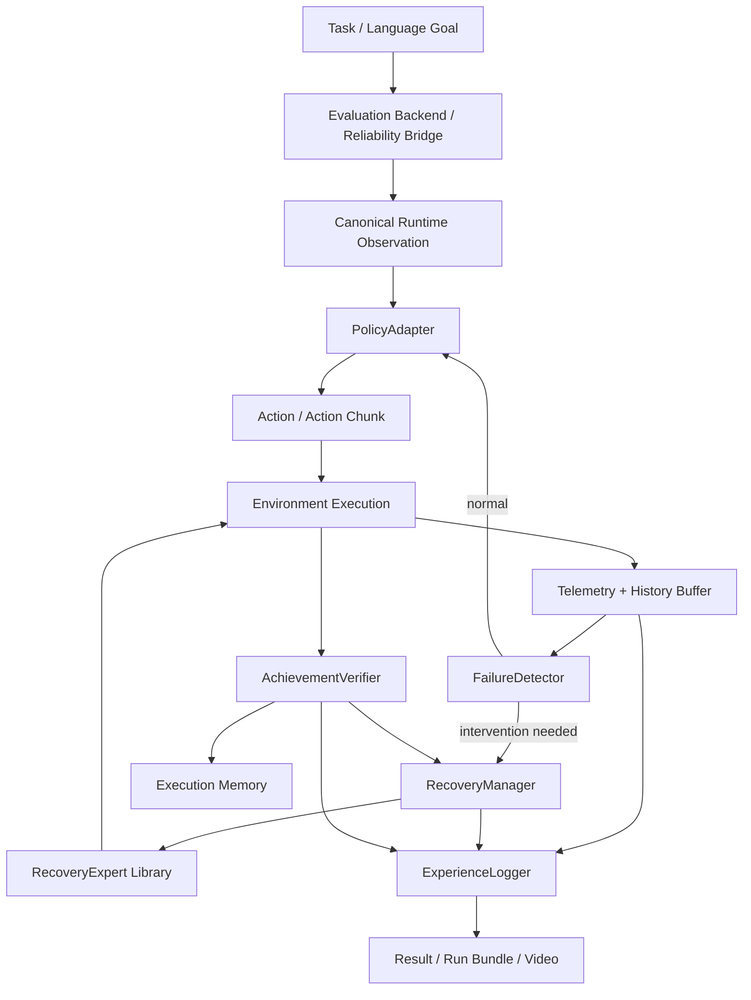

# Architecture Specification: LeRobot Reliability Lab

> System architecture and engineering contracts for runtime failure detection, recovery, outcome verification, and reproducible evaluation in embodied AI manipulation.

Reference: [`docs/LEROBOT_RELIABILITY_LAB_TECHNICAL_REPORT.md`](docs/LEROBOT_RELIABILITY_LAB_TECHNICAL_REPORT.md) (Frozen v1.0).

---

## 1. Architectural Philosophy & Separation of Concerns

The repository operates on three strict separations:



1. **Policy Separation**: The recovery system does not know whether the base policy is ACT, SmolVLA, MolmoAct2, or $\pi_{0.5}$. The policy exposes capabilities (chunking, queue reset, candidate sampling) via a standard `PolicyAdapter`.
2. **Benchmark Separation**: Benchmark execution reuses upstream frameworks (primarily AllenAI `vla-evaluation-harness`) while presenting a uniform `RuntimeBenchmarkAdapter` to the reliability layer.
3. **Mechanism Separation**: Failure detection, recovery proposal/selection, intervention execution, and achievement verification are decoupled components.

---

## 2. Epistemological Boundaries & System Invariants

1. **Runtime vs. Oracle Boundary**:
   - `RuntimeBenchmarkAdapter`: Only exposes benchmark-native sensors (RGB cameras, depth, proprioception, instruction).
   - `EvaluationOracle`: Offline/audit surface only (ground-truth object positions, exact fault onset, privileged contact graphs). Strictly prohibited from influencing the runtime recovery loop.
2. **Physical Achievement Invariant**:
   $$\text{commanded action} \neq \text{achieved state}, \quad \text{attempted recovery} \neq \text{successful recovery}$$
   An action is never logged as an outcome until physically verified. The `AchievementVerifier` supports `"achieved"`, `"not_achieved"`, and `"uncertain"` as first-class states.
3. **Action Space Non-Invertibility**:
   `CanonicalActionView` is an analysis projection only. Heterogeneous policies cannot be assumed to share invertible action representations without explicit adapter capability declarations.
4. **Fail-Closed Integrity**:
   Mismatched weights, missing normalization stats, or unexpected processor configurations immediately abort the run rather than executing silently corrupted evaluations.

---

## 3. Evaluation Substrate Strategy

1. **Preferred: `VlaEvalBackend`**:
   Reuses AllenAI `vla-evaluation-harness` (`vla-eval`) for benchmark containerization (Docker), model servers, standard LIBERO, LIBERO-plus, and RoboCasa evaluation.
2. **Fallback: `DirectRuntimeBackend`**:
   Direct LeRobot/native stepping used only when fine-grained reliability intervention cannot be achieved through the upstream harness (e.g. immediate action-chunk queue flushing, intra-chunk action injection).
3. **Backend Provenance**:
   Every run records an `evaluation_backend_manifest.yaml` stating the exact backend, revision SHA, container digest, and explicit justification if the direct fallback was used.

---

## 4. Run-Bundle Specification

Every evaluation run produces an immutable, fully reproducible bundle:

```text
outputs/evaluations/<timestamp>_<benchmark>_<policy>_<recovery>_seed<seed>/
├── experiment.yaml                   # Exact experiment configuration
├── environment.lock.json             # Python and library freeze
├── policy_manifest.yaml              # Weights, preprocessor, and normalization hashes
├── benchmark_manifest.yaml           # Task IDs, seed set, observation contracts
├── evaluation_backend_manifest.yaml  # vla-eval vs direct backend provenance
├── compute_manifest.yaml             # GPU specs, peak VRAM, latency profiles
├── episode_results.jsonl             # Episode-level outcomes
├── failure_events.jsonl              # Failure detection events with monotonic timestamps
├── recovery_events.jsonl             # Intervention proposals, costs, and verified outcomes
├── telemetry.parquet                 # High-frequency sensor and metric timeseries
├── summary.json                      # Aggregated task and recovery metrics
└── videos/
    ├── raw.mp4                       # Clean environment render
    └── hud.mp4                       # Telemetry overlay (detector probability, active expert, status)
```

---

## 5. Dual-Compute Infrastructure

- **Local Machine**: AMD/Intel CPU, 32 GB RAM, NVIDIA RTX 3070 (8 GB VRAM).
  - Scope: Code authoring, type checking, unit testing, fast lightweight sandbox integration.
- **Remote Workstation (`workstation`)**: `umcai-workstation`, NVIDIA RTX 4090 (24 GB VRAM), driver 550.163.01 / CUDA 12.4.
  - Scope: VLA inference (SmolVLA, MolmoAct2, $\pi_{0.5}$), Dockerized `vla-eval` benchmarks, long rollouts, Parquet telemetry collection.
  - Bridge: `scripts/sync_worker.py` → `/home/umcai/lerobot-reliability` (created on first `--push`; no environment provisioned yet).

---

## 6. Known Deviations from Frozen TR §22

The frozen Technical Report predates the concrete repository layout. Where they
differ, this file and the on-disk tree are authoritative for engineering; the
frozen document is not edited.

| TR §22 illustration | Actual repository |
|---|---|
| `LEROBOT_RELIABILITY_LAB_TECHNICAL_REPORT.md`, `FRONTIER_RESEARCH_SUPPORT.md` at repo root | live under `docs/` |
| `env/stable.lock`, `env/experimental.lock` | single `uv.lock` (+ `pyproject.toml`) — `uv` is the sole dependency tool |
| audit artifacts `docs/frontier_claim_ledger.md`, `docs/threat_register.md`, `docs/baseline_reproduction.md` | not yet created (tracked for a later phase) |
