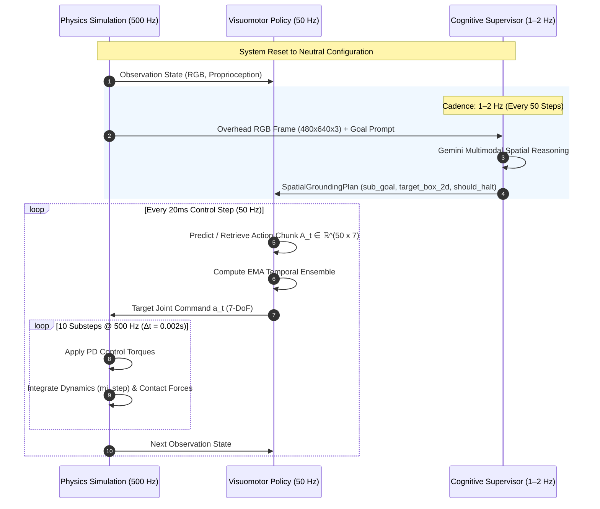

# Architecture Specification: `lerobot-agentic`

Welcome to the architectural specification for **`lerobot-agentic`**, a state-of-the-art Embodied AI manipulation engine bridging Google Gemini Robotics Embodied Reasoning with Hugging Face LeRobot visuomotor policies (`ACTPolicy`, `SmolVLA-450M`, `DiffusionPolicy`) and DeepMind MuJoCo physics simulation.

---

## 1. System Vision & Core Philosophy

Robotic manipulation traditionally faces a critical frequency dilemma:
- **Semantic Intelligence (1–2 Hz)**: Vision-Language Models (VLMs) excel at open-world semantic perception, task decomposition, and commonsense reasoning, but exhibit high latency ($\sim 500\text{--}1000\,\text{ms}$) and lack high-frequency physical dynamics.
- **Visuomotor Dexterity (50 Hz)**: Imitation Learning policies (e.g., ACT, Diffusion) excel at millimeter-precision continuous motor control, but are blind to high-level semantic shifts, open-world instructions, and strategic recovery from anomalies.
- **Physical Dynamics (500 Hz)**: Contact physics, impact impulses, and joint constraints require deterministic numerical integration at sub-millisecond timesteps ($\Delta t = 2\,\text{ms}$).

`lerobot-agentic` unifies these three regimes into an **asynchronous hierarchical control topology**:

```
+-------------------------------------------------------------------------------------------------+
|                              TIER 1: COGNITIVE SUPERVISORY TIER (1–2 Hz)                         |
|         Google Gemini Robotics ER (gemini-robotics-er-2-preview) / Gemini 2.5 Flash             |
|                                                                                                 |
|   • Multimodal visual scene understanding & zero-shot spatial affordance grounding               |
|   • Normalized 2D bounding box regression [ymin, xmin, ymax, xmax] in [0, 1000]                 |
|   • High-level task decomposition into atomic sub-goals (reach, grasp, lift, transport, place)   |
|   • Closed-loop visual anomaly detection & emergency halt verification (should_halt)            |
+-----------------------------------------------+-------------------------------------------------+
                                                | Structured Pydantic Plan (SpatialGroundingPlan)
                                                v
+-------------------------------------------------------------------------------------------------+
|                              TIER 2: VISUOMOTOR POLICY TIER (50 Hz)                              |
|           Hugging Face LeRobot (ACTPolicy / SmolVLA-450M / Diffusion Policy Engine)             |
|                                                                                                 |
|   • Multi-camera visual perception (overhead table view + wrist eye-in-hand view)                |
|   • Action Chunking with Transformers (K=50 steps, 1.0 second lookahead horizon)                 |
|   • Exponential Moving Average (EMA) temporal ensembling across overlapping action horizons     |
|   • Fallback quintic minimum-jerk affordance trajectory engine                                  |
+-----------------------------------------------+-------------------------------------------------+
                                                | Target Joint Position Commands (50 Hz)
                                                v
+-------------------------------------------------------------------------------------------------+
|                              TIER 3: DETERMINISTIC SIMULATION TIER (500 Hz)                      |
|                  DeepMind MuJoCo 3.x with Headless EGL GPU Acceleration                         |
|                                                                                                 |
|   • 6-DoF articulated arm + 1-DoF symmetric parallel-jaw gripper                                 |
|   • Contact physics, Coulomb friction dynamics, and non-penetrating constraints                  |
|   • Safe named joint indexing via model.jnt_qposadr (immune to freejoint offsets)               |
|   • Offscreen EGL rendering pipeline for overhead and wrist camera sensors                      |
+-------------------------------------------------------------------------------------------------+
```

---

## 2. Dual-Rate Asynchronous Loop

The system operates across three synchronized execution cadences:
1. **Supervisory Cadence (1–2 Hz)**: Every 50 simulation steps, the Cognitive Supervisor inspects the scene, checks for task progress or anomalies, and updates the spatial plan.
2. **Policy Cadence (50 Hz)**: Every 20 ms, the Visuomotor Policy generates or indexes into the current action chunk, applying temporal ensembling.
3. **Physics Cadence (500 Hz)**: The physics environment executes 10 numerical integration substeps ($\Delta t = 2\,\text{ms}$) per policy control step.



---

## 3. Subsystem Breakdown Directory

For exhaustive algorithmic formulations, data contracts, and implementation details, refer to the dedicated subsystem specifications:

| Subsystem | Specification Document | Primary Focus |
| :---: | :--- | :--- |
| **01** | [**Cognitive Supervisory Tier**](./docs/subsystem/01_cognitive_supervisory_tier.md) | Gemini Robotics ER, Gemini 2.5 Flash, OpenCV fallback, Pydantic schemas, 2D bounding boxes $[0, 1000]$, sub-goal state machine, visual anomaly detection. |
| **02** | [**Visuomotor Policy Tier**](./docs/subsystem/02_visuomotor_policy_tier.md) | Hugging Face LeRobot ACTPolicy, SmolVLA-450M, Diffusion Policy, Action Chunking ($K=50$), CVAE transformer, dual-camera fusion, EMA temporal ensembling, quintic minimum-jerk splines. |
| **03** | [**Physics Simulation Tier**](./docs/subsystem/03_physics_simulation_tier.md) | DeepMind MuJoCo 3.x, 500 Hz physics / 50 Hz control, headless EGL GPU rendering, 6-DoF arm + parallel gripper, contact dynamics, safe `jnt_qposadr` indexing. |
| **04** | [**Dataset & Evaluation Tier**](./docs/subsystem/04_dataset_and_evaluation_tier.md) | Synthetic demonstration harvester ($\approx 500\,\text{FPS}$), Hugging Face `LeRobotDataset` v2.0 (Parquet + chunked MP4), automated evaluator (GSR, PR, TTC, Jerk $\mathcal{J}$), telemetry HUD recording. |
| **Index** | [**Subsystems Master Index**](./docs/subsystem/README.md) | Cross-tier interface contracts, data schemas, and timing synchronization matrix. |

---

## 4. Hardware Deployment Profiles

The architecture is explicitly designed for dual-tier compute deployment, separating high-end training clusters from cost-effective edge execution:

| Deployment Profile | Hardware Platform | Roles & Responsibilities | VRAM Consumption |
| :--- | :--- | :--- | :--- |
| **Cloud Cognitive Tier** | Google Cloud / Gemini API | Multimodal spatial reasoning, zero-shot bounding boxes, anomaly verification | 0 GB local VRAM |
| **Server Training Node** | NVIDIA GeForce RTX 4090 (24GB) | Full-scale policy training, parallel demonstration synthesis, multi-task LoRA fine-tuning | $\approx 4.8\text{--}18.4\,\text{GB}$ |
| **Local Edge / Workstation** | NVIDIA GeForce RTX 3070 (8GB) | Headless MuJoCo EGL simulation ($>200\,\text{FPS}$), real-time ACT / SmolVLA 50 Hz inference | $\approx 1.2\text{--}1.5\,\text{GB}$ |

---

## 5. Architectural Invariants & Safety Rules

All extensions, modifications, and autonomous agent contributions must uphold four architectural invariants:

1. **Safe Kinematic Addressing (`jnt_qposadr`)**:
   Never slice `data.qpos[:7]` directly. Floating manipulands (e.g., `<freejoint>`) alter array offsets dynamically. Joint indices must always be resolved via:
   ```python
   addr = model.jnt_qposadr[model.joint(name).id]
   ```
2. **Type-Safe Contract Enforcement**:
   All inter-agent communication, cognitive directives, and spatial affordances must strictly validate through Pydantic schemas defined in [`lerobot_agentic.cognitive.schemas`](./src/lerobot_agentic/cognitive/schemas.py).
3. **Headless EGL GPU Rendering**:
   Ensure `MUJOCO_GL=egl` is exported before initializing any OpenGL or MuJoCo context to prevent headless crashes in non-display Linux environments.
4. **Action Chunk Continuity**:
   Actuator setpoints must be smoothed via EMA temporal ensembling or minimum-jerk trajectory interpolation to prevent high-frequency joint jerk and mechanical wear.
