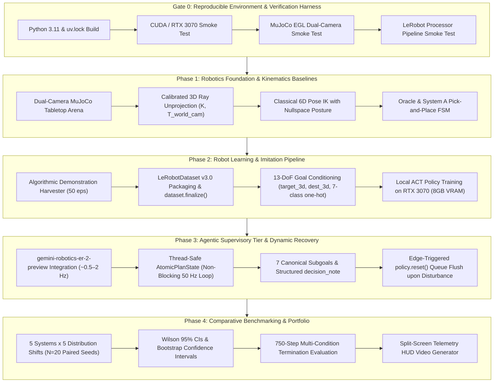

# `ROADMAP.md`: Agile Systems Roadmap for `lerobot-agentic` 🦾🤖

> **Status:** Active Project Roadmap (Aligned with Industrial Review & Architectural Scaffold)  
> **Target Architecture:** Dual-Rate Hierarchical Manipulation (~0.5–2 Hz Cognitive ER + 50 Hz LeRobot Visuomotor ACT + 500 Hz MuJoCo Physics)  
> **Target Hardware:** NVIDIA GeForce RTX 3070 (8GB VRAM Ampere) / Linux x86_64  
> **Frameworks:** Google Gemini Robotics ER (`gemini-robotics-er-2-preview`), Hugging Face `lerobot` (v0.6+ / `uv.lock`), DeepMind MuJoCo 3.12+ (Headless EGL)

---

## 🎯 Executive Overview & Purpose

This roadmap outlines the implementation of **`lerobot-agentic`** across **Gate 0 and 4 discrete, portfolio-grade phases**.

To prevent context drift, avoid unverified architectural renovations, and guarantee continuous empirical validation, each phase defines:
1. **Goal**: Concrete, focused robotics and machine learning engineering objective.
2. **Prerequisites (Input for Start)**: What must be installed, configured, or verified prior to starting.
3. **Tangible Deliverables (Outputs)**: Specific modules, configuration files, checkpoints, and schemas created or modified.
4. **Definition of Success**: Objective numerical criteria and copy-pasteable terminal verification command.
5. **Guardrails & Boundaries (What NOT to do)**: Hard constraints, scope boundaries, and anti-patterns to avoid.
6. **Execution Strategy (How)**: Step-by-step implementation plan and architectural details.

---

## 🗺️ Architectural Pipeline & Phase Topology



---

## 📊 Phase Progress Dashboard

| Phase / Gate | Focus Area | Status | Deliverable Gate |
| :--- | :--- | :---: | :--- |
| **Gate 0** | Reproducible Environment & Verification Harness | 🟢 Verified | Deterministic `uv.lock` build, CUDA RTX 3070, MuJoCo EGL dual rendering, LeRobot processor pipeline verified, 20/20 test suite passing. |
| **Phase 1** | Robotics Foundation & Kinematics Baselines | 🟢 Verified | 6-DoF arm + single-actuated parallel gripper, calibrated 3D unprojection, 6D Pose IK with downward constraint and nullspace projection, Oracle and System A FSM. |
| **Phase 2** | Robot Learning & Imitation Pipeline | 🟡 Up Next | 50 verified episodes harvested into `LeRobotDataset v3.0` with `dataset.finalize()`, 13-DoF goal conditioning, local ACT training on RTX 3070 with `peak_vram_mb` logging. |
| **Phase 3** | Agentic Supervisory Tier & Dynamic Recovery | 🟢 Scaffold Ready | Asynchronous `gemini-robotics-er-2-preview` supervisor, `AtomicPlanState` concurrency, 7 canonical primitives, edge-triggered `policy.reset()` queue flush. |
| **Phase 4** | Comparative Benchmarking & Portfolio Polish | ⚪ Pending P2/P3 | 5 systems evaluated across 5 distribution shifts ($N=20$ paired seeds), Wilson 95% CIs, scenario manifest logging, split-screen HUD video export. |

---

## 🛡️ Gate 0: Reproducible Environment & Verification Harness

### 1. Goal
Establish a deterministic, reproducible local execution environment with locked dependencies (`uv.lock`), verify CUDA acceleration on the NVIDIA RTX 3070, validate headless EGL dual-camera rendering in MuJoCo 3.12+, smoke-test LeRobot 0.6+ pre/post processors, and guarantee 100% pass rate on the unit test suite.

### 2. Input for Start (Prerequisites)
- NVIDIA Driver 550+ / 570+ with CUDA 12.4+ operational.
- Existing repository structure: `szcai1998/lerobot-agentic`.
- Python 3.11 virtual environment (`.venv`).
- Authoritative dependency specification in `pyproject.toml` and `uv.lock`.

### 3. Output of Stage (Tangible Deliverables)
- **Deterministic Lockfile (`uv.lock`)**: Pinning Hugging Face `lerobot` (v0.6.4), `torch>=2.6.0`, `mujoco>=3.12.0`, `google-genai>=2.0.0`.
- **Pre/Post Processor Smoke Test**: Verification script testing `make_pre_post_processors` on dummy observation dictionaries.
- **Unit Test Suite**: 20 automated tests in `tests/test_controllers.py`, `tests/test_env.py`, `tests/test_metrics.py`, and `tests/test_schemas.py`.

### 4. Definition of Success (Objective Criteria & Verification Command)
- `torch.cuda.is_available()` evaluates to `True`.
- MuJoCo renders a $640 	imes 480$ RGB frame in headless EGL mode with zero X11 server dependency.
- `ruff check .` returns 0 linting errors.
- `pytest tests/ -v` passes 100% (20/20 passed).

```bash
# Gate 0 Verification Command:
uv pip install -e ".[lerobot,dev]"
ruff check .
pytest tests/ -v
python -c "
import torch, mujoco, lerobot
assert torch.cuda.is_available(), 'CUDA not available!'
print(f'✅ Gate 0 Verified: PyTorch {torch.__version__} (CUDA: {torch.cuda.get_device_name(0)}), MuJoCo {mujoco.__version__}, LeRobot {lerobot.__version__}')
"
```

### 5. Boundaries & Guardrails
- ❌ **DO NOT alter pinned versions without lockfile rebuild**: Use `uv` exclusively.
- ❌ **DO NOT bypass EGL**: Headless servers must set `MUJOCO_GL=egl`.
- ❌ **DO NOT weaken test assertions**: All 20 tests must pass unconditionally.

---

## 🦾 Phase 1: Robotics Foundation & Kinematics Baselines

### 1. Goal
Provide the verified dynamical foundation for robotic manipulation: establish the authentic 6-DoF articulated arm with single-actuated parallel gripper in MuJoCo, implement calibrated 3D pinhole camera unprojection ($K, T_{world\_cam}$), develop a damped least-squares 6D Pose IK controller with nullspace posture projection, and build the 7-stage Pick-and-Place state machine for Oracle and System A.

### 2. Input for Start (Prerequisites)
- Gate 0 verified and passing.
- Model definition in `src/lerobot_agentic/sim/models/embodied_arm.xml`.
- Environment interface in `src/lerobot_agentic/sim/env.py`.

### 3. Output of Stage (Tangible Deliverables)
- **Authentic MJCF Model (`embodied_arm.xml`)**:
  - 6-DoF revolute arm + single-actuated sliding finger (`finger_joint1`, range $[-0.025, 0.025]\,	ext{m}$) with rigid opposing contact finger (`finger_right`).
  - Attached in-hand camera (`wrist_cam`) and end-effector tracking site (`ee_site`) on `<body name="gripper_base">`.
  - Static overhead perspective camera (`overhead_cam`) positioned at $[0.65, 0.0, 0.9]\,	ext{m}$.
- **Kinematics & Control Engine (`src/lerobot_agentic/controllers/ik.py`)**:
  - `ClassicalIKController` implementing full 6D Pose IK ($J = [J_p; J_r]$) with downward orientation constraint ($R \in SO(3)$) and posture nullspace projection $(I - J^\dagger J)(q_{\text{nom}} - q)$.
  - 7-stage Pick-and-Place finite state machine: `PREGRASP` $\to$ `APPROACH` $\to$ `GRASP` $\to$ `LIFT` $\to$ `TRANSPORT` $\to$ `PLACE` $\to$ `RETREAT`.
- **Dynamic Camera Geometry**:
  - `CameraGeometry` deriving intrinsics $K$ from MuJoCo `cam_fovy` and extrinsics from `cam_xpos` / `cam_xmat`, with explicit `InvalidDepthError` handling.

### 4. Definition of Success (Objective Criteria & Verification Command)
- Oracle controller completes pick-and-place with 0 divergence across randomized initial positions.
- End-effector maintains downward vertical orientation throughout trajectory execution.
- Unit tests in `tests/test_controllers.py` pass 100%.

```bash
# Phase 1 Verification Command:
pytest tests/test_controllers.py -v
python -c "
import numpy as np
from lerobot_agentic.sim.env import MuJoCoRobotEnv
from lerobot_agentic.controllers.ik import ClassicalIKController
env = MuJoCoRobotEnv()
obs = env.reset()
ctrl = ClassicalIKController(env.model, env.data)
cube_pos = env.get_cube_position()
action, stage, done = ctrl.step_pick_and_place(cube_pos, np.array([0.32, -0.15, 0.43]))
assert action.shape == (7,)
print(f'✅ Phase 1 Verified: IK Step stage={stage}, action={action[:3]}...')
"
```

### 5. Boundaries & Guardrails
- ❌ **DO NOT hardcode joint slicing as `qpos[:7]`**: Always resolve via `model.jnt_qposadr`.
- ❌ **DO NOT assume 3D position IK is sufficient**: Gripper requires downward orientation alignment to grasp cubes without collision.
- ❌ **DO NOT use fabricated depth fallbacks**: Invalid depth must raise `InvalidDepthError`.

---

## 📦 Phase 2: Robot Learning & Imitation Pipeline

### 1. Goal
Collect 50 high-quality expert pick-and-place demonstration episodes into the official **Hugging Face `LeRobotDataset` v3.0** format with explicit `dataset.finalize()` lifecycle management, construct the **13-DoF goal conditioning vector**, and train an Action Chunking with Transformers (`ACTPolicy`) locally on the NVIDIA RTX 3070 within the 8GB VRAM envelope.

### 2. Input for Start (Prerequisites)
- Phase 1 completed: Oracle controller verified to achieve 100% pick-and-place success.
- `LeRobotDataset` and `ACTPolicy` available in active `.venv`.

### 3. Output of Stage (Tangible Deliverables)
- **Demonstration Harvester CLI (`scripts/record_dataset.py`)**:
  - Executes 50 Oracle rollouts with paired seed randomization.
  - Generates synchronized chunked H.264 MP4 videos (`observation.images.top`, `observation.images.wrist`), proprioception `observation.state` (7-DoF), and 13-DoF goal conditioning vector `observation.environment_state`.
  - Invokes `dataset.finalize()` to construct global indices, video manifests, and dataset-wide normalization statistics (`meta/stats.json`).
- **Dataset Artifact (`data/lerobot_embodied_arm/`)**:
  - 50 validated episodes in standard LeRobotDataset v3.0 format.
- **Local ACT Training Script (`scripts/train_policy.py`)**:
  - Dual ResNet-18 vision backbones + CVAE Transformer ($K=50$, lookahead horizon 1.0s).
  - Ingests `observation.environment_state` via native `encoder_env_state_input_proj`.
  - Automatic mixed precision (`torch.cuda.amp`), AdamW optimizer, cosine annealing schedule.
  - Logs `peak_vram_mb`, `steps_per_second`, and training loss curves.
- **Trained Checkpoint Artifact (`outputs/checkpoints/act_embodied_arm/`)**:
  - SafeTensors checkpoint containing model weights, pre/post processor configurations, and statistics.

### 4. Definition of Success (Objective Criteria & Verification Command)
- `scripts/record_dataset.py` records 50 consecutive valid episodes without corruption.
- `dataset.finalize()` generates valid `meta/stats.json` and `meta/info.json`.
- Policy training converges without CUDA OOM (peak VRAM $<5.5\,	ext{GB}$).
- Restored `GoalConditionedACTPolicyExecutor` loads checkpoint via `make_pre_post_processors` and executes dummy forward pass.

```bash
# Phase 2 Verification Command:
python scripts/record_dataset.py --episodes 50 --output-dir data/lerobot_embodied_arm
python scripts/train_policy.py --dataset-dir data/lerobot_embodied_arm --steps 5000 --batch-size 16 --device cuda
python -c "
import numpy as np
from lerobot_agentic.policy.executor import GoalConditionedACTPolicyExecutor
executor = GoalConditionedACTPolicyExecutor(pretrained_policy_path='outputs/checkpoints/act_embodied_arm')
obs_top = np.zeros((480, 640, 3), dtype=np.uint8)
obs_wrist = np.zeros((480, 640, 3), dtype=np.uint8)
proprio = np.zeros(7, dtype=np.float32)
goal_vec = np.zeros(13, dtype=np.float32)
action = executor.select_action(obs_top, obs_wrist, proprio, goal_vector=goal_vec)
assert action.shape == (7,)
print('✅ Phase 2 Verified: Pre/post processor pipeline restored and action emitted successfully!')
"
```

### 5. Boundaries & Guardrails
- ❌ **DO NOT batch tensors at the environment boundary**: Emit unbatched `(3, H, W)`, `(7,)`, `(13,)` tensors so LeRobot's `AddBatchDimensionProcessorStep` owns batching.
- ❌ **DO NOT exceed 8GB VRAM**: Keep batch size $\le 16$ and backbone to ResNet-18.
- ❌ **DO NOT omit dataset.finalize()**: Unfinalized v3.0 datasets cannot be read by LeRobot data loaders.

---

## 🧠 Phase 3: Agentic Supervisory Tier & Dynamic Recovery

### 1. Goal
Establish the asynchronous Cognitive Supervisory Tier: connect Google `gemini-robotics-er-2-preview` to provide high-level semantic grounding across the 7 canonical manipulation primitives, decouple the cloud reasoning loop (~0.5–2 Hz) from the 50 Hz execution loop via thread-safe `AtomicPlanState` and `LatestFrameBuffer`, and implement edge-triggered closed-loop dynamic recovery (`policy.reset()`).

### 2. Input for Start (Prerequisites)
- Phase 2 completed: Trained ACT policy available for goal-conditioned execution.
- Google Gemini API key configured in `.env` (`GEMINI_API_KEY`).
- Pydantic schemas in `src/lerobot_agentic/cognitive/schemas.py`.

### 3. Output of Stage (Tangible Deliverables)
- **Cognitive Supervisor Client (`src/lerobot_agentic/cognitive/supervisor.py`)**:
  - Standardized on `gemini-robotics-er-2-preview` with deterministic exponential backoff retries and explicit `SupervisorAPIError` (no silent model fallback).
  - Pydantic schema enforcement via `SpatialGroundingPlan`:
    - `sub_goal: Literal["reach", "grasp", "lift", "transport", "place", "retreat", "recover"]`.
    - `decision_note`: Structured chain-of-thought rationale.
    - `should_halt`: Advisory software-level stop flag.
  - Offline OpenCV HSV fallback for air-gapped development and CI.
- **Asynchronous Concurrency Infrastructure (`src/lerobot_agentic/policy/executor.py`)**:
  - `LatestFrameBuffer`: Thread-safe buffer isolating MuJoCo rendering contexts to the simulation thread while streaming immutable frame copies to the supervisor.
  - `AtomicPlanState`: Thread-safe plan exchange with edge-triggered anomaly tracking via monotonically increasing `replan_id`.
- **Dynamic Recovery Semantics**:
  - When an anomaly or displacement perturbation occurs, supervisor emits `replan_id + 1`.
  - Control loop detects transition via `check_and_consume_replan()`, flushes the action queue via `policy.reset()`, and triggers immediate policy re-inference.

### 4. Definition of Success (Objective Criteria & Verification Command)
- Control loop maintains consistent 50 Hz pacing without blocking on cloud network latency.
- Physical disturbance mid-trajectory triggers single, edge-triggered `policy.reset()` queue flush.
- Unit tests in `tests/test_schemas.py` and concurrency tests in `tests/test_metrics.py` pass 100%.

```bash
# Phase 3 Verification Command:
pytest tests/test_schemas.py tests/test_metrics.py -v
python scripts/run_rollout.py --steps 100 --goal "Grasp the red cube and lift it into the workspace"
```

### 5. Boundaries & Guardrails
- ❌ **DO NOT execute Gemini API calls synchronously inside the 50 Hz loop**: Supervisor must run in a dedicated background thread.
- ❌ **DO NOT access MjData from background threads**: MuJoCo context is strictly single-threaded; use `LatestFrameBuffer`.
- ❌ **DO NOT confuse software halt with hardware safety**: `should_halt` is a trajectory stop request, not a hardware-rated E-stop.

---

## 📈 Phase 4: Comparative Benchmarking & Portfolio Polish

### 1. Goal
Execute a comprehensive scientific benchmark evaluating all 5 manipulation systems across 5 distribution shifts ($N=20$ paired scenario seeds per condition), compute statistical confidence intervals (Wilson 95% CI for success rates, bootstrap CI for continuous metrics), log full scenario manifests, render side-by-side telemetry HUD videos, and package the repository into an industry-grade portfolio asset.

### 2. Input for Start (Prerequisites)
- Phase 1, Phase 2, and Phase 3 completed.
- Trained ACT checkpoint and verified supervisor operational.

### 3. Output of Stage (Tangible Deliverables)
- **Comparative Benchmark Harness (`scripts/evaluate.py`)**:
  - Evaluates 5 discrete systems:
    1. **Oracle**: Ground-truth MuJoCo state $\to$ 6D Pose IK.
    2. **System A**: Classical RGB-D perception $\to$ calibrated unprojection $\to$ 6D Pose IK.
    3. **System B**: Unconditioned ACT visuomotor policy.
    4. **System C**: Gemini ER 2 + Goal-conditioned ACT policy.
    5. **System D**: Gemini ER 2 + Goal-conditioned ACT policy + dynamic recovery.
  - Evaluates 5 distribution shift conditions:
    1. *IID Baseline* (standard workspace)
    2. *Geometric OOD* (unseen table coordinates)
    3. *Visual Clutter* (distractor cylinders and spheres)
    4. *Appearance / Lighting Shift* (lighting angles and table textures)
    5. *Physical Disturbance* (mid-trajectory displacement at $t=2.0\text{s}$)
  - Enforces **750-step (15.0s @ 50 Hz)** timeout with multi-condition termination (`task_complete`, `unrecoverable_failure`, `timeout`, `software_halt`).
- **Statistical Benchmark Manifest & Reports**:
  - `scenario_manifest.jsonl`: Comprehensive audit log recording `seed`, `cube_initial_pose`, `target_zone_pose`, `distractor_poses`, `disturbance_vector`, `checkpoint_hash`, and `git_commit`.
  - `eval_results.json`: Summary table with Wilson 95% Score CIs and bootstrap continuous metrics.
- **Enriched Telemetry Video Generator (`src/lerobot_agentic/utils/recorder.py`)**:
  - Split-screen video `[Overhead Cam | Wrist Cam]` with HUD overlay (subgoal, bounding boxes, instant trajectory jerk, lift state).
  - High-efficiency H.264 MP4 export to `outputs/videos/rollout.mp4`.
- **Comprehensive Documentation Package**:
  - Formatted benchmark summary in `docs/BENCHMARKS.md`.
  - Synchronized `README.md`, `ARCHITECTURE.md`, `MEMORY.md`.

### 4. Definition of Success (Objective Criteria & Verification Command)
- All 5 systems execute across 20 paired seeds with complete manifest logging.
- Wilson 95% confidence intervals computed for all success rates.
- System D demonstrates statistically significant recovery over System B and C under physical disturbance.
- Side-by-side HUD video renders cleanly at 25+ FPS without artifacting.

```bash
# Phase 4 Verification Command:
python scripts/evaluate.py --episodes 20 --systems oracle,system_a,system_b,system_c,system_d --video
python -c "
import json
with open('outputs/benchmarks/eval_results.json') as f:
    res = json.load(f)
print('✅ Phase 4 Benchmark Completed Successfully')
print(f'Evaluated Systems: {list(res.keys())}')
"
```

### 5. Boundaries & Guardrails
- ❌ **DO NOT use unpaired random seeds**: Every system must be evaluated on the exact same seed sequence.
- ❌ **DO NOT report unhedged point estimates**: All success rates must include Wilson 95% CIs.
- ❌ **DO NOT claim jerk is direct mechanical wear**: Jerk is a proxy for motion smoothness and aggressive command variation.

---

## 🛠️ Developer Protocol & Engineering Working Agreement

To maintain code hygiene, scientific rigor, and prevent context degradation:

1. **Gate Discipline**: Gate 0 must remain 100% green before, during, and after every milestone.
2. **Deterministic Tooling**: Package management is governed exclusively by `uv` and `uv.lock`.
3. **Reproduction-First Debugging**: If a failure occurs, write a reproducing unit test before modifying code.
4. **Kinematic Safety Invariant**: Always resolve joint addresses through `model.jnt_qposadr`; clip actuator targets to physical limits.
5. **Living Documentation Sync**: Synchronize `README.md`, `ARCHITECTURE.md`, and `MEMORY.md` in the exact same commit as code changes.
