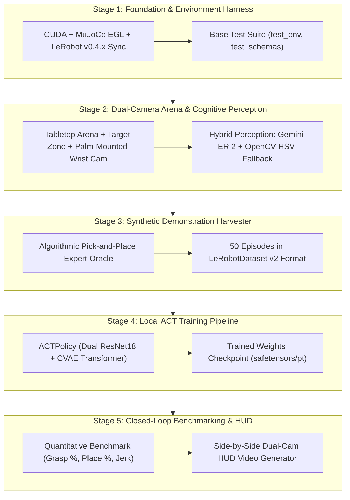

# `ROADMAP.md`: Agile Systems Roadmap for `lerobot-agentic` 🦾🤖

> **Status:** Active Project Roadmap  
> **Target Architecture:** Dual-Rate Hierarchical Manipulation (1–2 Hz Cognitive ER + 50 Hz LeRobot Visuomotor ACT + 500 Hz MuJoCo Physics)  
> **Target Hardware:** NVIDIA GeForce RTX 3070 (8GB VRAM Ampere) / Linux x86_64  
> **Frameworks:** Google Gemini Robotics ER (`gemini-robotics-er-2-preview`), Hugging Face `lerobot` (v0.4.x / PyTorch), DeepMind MuJoCo 3.x (Headless EGL)

---

## 🎯 Executive Overview & Purpose

This roadmap breaks down the implementation of **`lerobot-agentic`** into **5 discrete, bite-sized, portfolio-grade stages**. 

Instead of executing everything in a single monolithic sweep that risks breaking feedback loops, each stage is isolated with:
1. **Goal**: Concrete, focused engineering objective.
2. **Prerequisites (Input for Start)**: What must be installed, configured, or verified prior to starting.
3. **Tangible Deliverables (Outputs)**: Specific modules, configuration files, checkpoints, and schemas created or modified.
4. **Definition of Success**: Objective numerical criteria and copy-pasteable terminal verification command.
5. **Guardrails & Boundaries (What NOT to do)**: Hard constraints, scope boundaries, anti-patterns to avoid.
6. **Execution Strategy (How)**: Step-by-step implementation plan and architectural details.

This guarantees tight developer oversight, continuous verification, deterministic rollback boundaries, and portfolio-ready documentation at every checkpoint.

---

## 🗺️ Architectural Pipeline & Stage Topology



---

## 📊 Stage Progress Dashboard

| Stage | Focus Area | Status | Deliverable Gate |
| :--- | :--- | :---: | :--- |
| **Stage 1** | Foundation, Environment Harness & Verification | 🟢 Completed | CUDA (RTX 3070), MuJoCo EGL, LeRobot 0.4.4 verified; test suite 100% passing. |
| **Stage 2** | Dual-Camera Arena & Cognitive Perception | 🟡 Ready / Up Next | Top + in-hand wrist camera streams; Gemini ER + offline CV fallback. |
| **Stage 3** | Synthetic Demonstration Harvester | ⚪ Pending | 50 verified expert pick-and-place demonstration episodes in LeRobot v2 format. |
| **Stage 4** | Local ACT Policy Training on RTX 3070 | ⚪ Pending | CVAE ACT policy trained with ResNet18 backbones on 8GB VRAM; checkpoint saved. |
| **Stage 5** | Closed-Loop Benchmarking & Telemetry HUD | ⚪ Pending | 20-episode randomized evaluation report (success %, jerk) + dual-camera MP4 HUD. |

---

## 🚀 Stage 1: Foundation, Environment Harness & Verification

### 1. Goal
Establish and verify the core Python 3.11 environment, CUDA GPU acceleration (NVIDIA RTX 3070 8GB), DeepMind MuJoCo 3.x headless EGL rendering, and integrate Hugging Face `lerobot` dependencies cleanly without version conflicts, ensuring all existing unit tests pass.

### 2. Input for Start (Prerequisites)
- NVIDIA Driver 595.84+ and CUDA runtime operational.
- Existing repository structure in `/home/aivise/Documents/antigravity/lerobot-agentic`.
- Active virtual environment (`.venv` with Python 3.11.15).
- Base test suite in `tests/test_env.py` and `tests/test_schemas.py`.

### 3. Output of Stage (Tangible Deliverables)
- **Updated [`pyproject.toml`](pyproject.toml)**: Dependency bounds configured with `lerobot>=0.4.0,<0.7.0`, `einops`, `safetensors`, and `huggingface-hub`.
- **Synchronized Virtual Environment**: `.venv` with `lerobot` and sub-dependencies installed cleanly via `uv`.
- **Environment Verification Test**: New assertion in `tests/test_env.py` confirming LeRobot import, PyTorch CUDA availability, and MuJoCo EGL headless context creation.

### 4. Definition of Success (Objective Criteria & Verification Command)
- `torch.cuda.is_available()` evaluates to `True`.
- `import lerobot` succeeds with version `0.4.x`+.
- MuJoCo renders a 640x480 RGB frame in headless EGL mode without X11 server errors.
- `pytest tests/` runs with 100% pass rate.

```bash
# Verification Command:
uv pip install -e ".[lerobot,dev]"
pytest tests/ -v
python -c "
import torch, mujoco, lerobot
assert torch.cuda.is_available(), 'CUDA not available!'
print(f'✅ Foundation Verified: PyTorch {torch.__version__} (CUDA: {torch.cuda.get_device_name(0)}), MuJoCo {mujoco.__version__}, LeRobot {lerobot.__version__}')
"
```

### 5. Boundary & Constraints (What NOT to do / Guardrails)
- ❌ **DO NOT switch to Python 3.12 or recreate `.venv`**: Hugging Face `lerobot>=0.4.0,<0.7.0` runs flawlessly on Python 3.11. Destroying `.venv` risks breaking pre-configured CUDA/MuJoCo binary paths.
- ❌ **DO NOT alter XML physics models or environment logic yet**: Keep Stage 1 strictly focused on the build harness and dependencies.
- ❌ **DO NOT invoke remote APIs**: Stage 1 must pass purely offline without network access.

### 6. Execution Strategy (How to Implement)
1. Edit `pyproject.toml` to specify `lerobot>=0.4.0,<0.7.0`, `einops>=0.8.0`, `safetensors>=0.4.3`.
2. Execute `uv pip install -e ".[lerobot,dev]"` to compile and link editable package.
3. Add a test case `test_lerobot_and_cuda_harness()` into `tests/test_env.py`.
4. Run `pytest tests/` to confirm green status before advancing.

---

## 📷 Stage 2: Dual-Camera Simulation Arena & Cognitive Perception

### 1. Goal
Upgrade the MuJoCo simulation arena to support dual camera perspectives (`top` overhead camera and `wrist` in-hand camera fixed to `gripper_base`), add a randomized table workspace with a target drop zone, and implement a hybrid Cognitive Supervisor combining Google Gemini Robotics ER (`gemini-robotics-er-2-preview`) with an offline OpenCV local affordance fallback.

### 2. Input for Start (Prerequisites)
- Stage 1 completed and verified.
- Existing physics model `src/lerobot_agentic/sim/models/embodied_arm.xml`.
- Existing environment wrapper `src/lerobot_agentic/sim/env.py`.
- Cognitive schemas in `src/lerobot_agentic/cognitive/schemas.py`.

### 3. Output of Stage (Tangible Deliverables)
- **Updated `embodied_arm.xml`**:
  - `wrist_cam` repositioned inside `<body name="gripper_base">` for true eye-in-hand visual servoing.
  - Target drop receptacle zone with visual green boundary cylinder on table.
- **Updated `env.py`**:
  - Observation dictionary exposing:
    - `"observation.images.top"`: `(480, 640, 3)` uint8 RGB.
    - `"observation.images.wrist"`: `(480, 640, 3)` uint8 RGB.
    - `"observation.state"`: `(7,)` float32 proprioceptive joint positions.
  - `randomize_cube_position(x_range, y_range)` method for table domain randomization.
  - Accurate spatial check functions: `is_cube_grasped()`, `is_cube_lifted()`, `is_cube_placed()`.
- **Updated `supervisor.py`**:
  - `_local_cv_grounding(rgb_image, natural_language_goal) -> SpatialGroundingPlan`: Offline HSV segmentation detecting red manipuland cube and green target zone, emitting normalized `[0, 1000]` bounding boxes.
  - Graceful fallback: If `GEMINI_API_KEY` is not present or rate-limited, automatically invokes local CV grounding.
- **New Unit Tests**: `tests/test_perception_and_sim.py` validating dual camera shapes, domain randomization limits, and offline perception accuracy.

### 4. Definition of Success (Objective Criteria & Verification Command)
- MuJoCo renders both `top` and `wrist` camera views simultaneously with zero artifacting.
- Moving the robot arm moves the `wrist_cam` perspective dynamically while `overhead_cam` remains static.
- Offline CV affordance detector identifies the red cube bounding box with IoU > 0.7 against ground truth projection.
- `SpatialGroundingPlan` validation passes under both Gemini ER and offline CV mode.

```bash
# Verification Command:
pytest tests/test_perception_and_sim.py -v
python -c "
from lerobot_agentic.sim.env import MuJoCoRobotEnv
from lerobot_agentic.cognitive.supervisor import CognitiveSupervisor
env = MuJoCoRobotEnv()
obs = env.reset()
assert 'observation.images.top' in obs and 'observation.images.wrist' in obs
assert obs['observation.images.top'].shape == (480, 640, 3)
assert obs['observation.images.wrist'].shape == (480, 640, 3)
sup = CognitiveSupervisor()
plan = sup.plan_and_ground(obs['observation.images.top'], 'Pick up red cube and place in zone')
assert plan.target_box_2d is not None and len(plan.target_box_2d) == 4
print(f'✅ Dual-Camera & Perception Verified: SubGoal={plan.sub_goal}, Box={plan.target_box_2d}')
"
```

### 5. Boundary & Constraints (What NOT to do / Guardrails)
- ❌ **DO NOT hardcode joint indexing as `qpos[:7]`**: Always resolve via `model.jnt_qposadr[model.joint(name).id]` to protect against freejoint address offsets.
- ❌ **DO NOT mandate internet access or GEMINI_API_KEY for tests**: Local CV fallback MUST work 100% offline so CI and local development never block.
- ❌ **DO NOT start recording datasets or training policies**: Keep Stage 2 strictly scoped to the physical arena and dual-camera perception.

### 6. Execution Strategy (How to Implement)
1. Modify `embodied_arm.xml`: nest `<camera name="wrist_cam" ...>` inside `<body name="gripper_base">` with forward pitch tilt. Add `<body name="target_zone">` with green visual cylinder.
2. Update `MuJoCoRobotEnv`: configure dual render passes, standardize keys to LeRobot naming conventions (`observation.images.*`), and add randomized cube reset.
3. In `supervisor.py`: implement HSV color filtering (`cv2.inRange`) for red cube and green target, compute contour bounding boxes, normalize to `[0, 1000]`, and map distance heuristics to sub-goals (`reach_cube`, `grasp_cube`, `lift_cube`, `transport_to_zone`).
4. Write and execute `tests/test_perception_and_sim.py`.

---

## 📦 Stage 3: Synthetic Demonstration Harvester

### 1. Goal
Implement an algorithmic expert pick-and-place oracle policy and an automated demonstration harvester CLI that collects 50 verified, high-quality manipulation episodes directly into the official Hugging Face `LeRobotDataset` v2 format.

### 2. Input for Start (Prerequisites)
- Stage 2 completed: Dual-camera simulation arena and randomized cube placement verified.
- LeRobot v0.4.x installed and operational in `.venv`.

### 3. Output of Stage (Tangible Deliverables)
- **New Module `src/lerobot_agentic/dataset/expert_oracle.py`**:
  - 7-stage analytical trajectory generator:
    1. Pre-grasp overhead approach
    2. Vertical descent to cube
    3. Gripper finger closure
    4. Vertical lift
    5. Transit to receptacle target zone
    6. Descend and release gripper
    7. Return to neutral ready pose
  - Quintic minimum-jerk spline smoothing between waypoints.
- **New Module `src/lerobot_agentic/dataset/generator.py`**:
  - `DemonstrationHarvester` class wrapping `lerobot.common.datasets.lerobot_dataset.LeRobotDataset`.
  - Episode-level validation gate: only records episodes where cube is successfully lifted and deposited in target zone; automatically discards failed rollouts.
- **New CLI `scripts/record_dataset.py`**:
  - User-facing script with arguments: `--episodes 50`, `--output-dir data/lerobot_embodied_arm`, `--fps 50`.
- **Dataset Artifact `data/lerobot_embodied_arm/`**:
  - 50 episodes containing synchronized `observation.images.top`, `observation.images.wrist`, `observation.state`, `action`, `reward`, `timestamp`.

### 4. Definition of Success (Objective Criteria & Verification Command)
- `scripts/record_dataset.py` runs and records 50 consecutive valid episodes without crashing.
- `LeRobotDataset` natively loads the recorded folder and parses all episode metadata.
- 100% of saved episodes achieve successful grasp and placement (verified by oracle assertions).

```bash
# Verification Command:
python scripts/record_dataset.py --episodes 50 --output-dir data/lerobot_embodied_arm
python -c "
from lerobot.common.datasets.lerobot_dataset import LeRobotDataset
ds = LeRobotDataset('data/lerobot_embodied_arm')
print(f'✅ Dataset Verified: {ds.num_episodes} episodes, {ds.num_frames} total frames')
assert ds.num_episodes >= 50, 'Insufficient episodes recorded!'
sample = ds[0]
assert 'observation.images.top' in sample
assert 'observation.images.wrist' in sample
assert 'action' in sample and sample['action'].shape[-1] == 7
print('✅ LeRobotDataset v2 schema inspection passed!')
"
```

### 5. Boundary & Constraints (What NOT to do / Guardrails)
- ❌ **DO NOT save failed or partial demonstrations**: Quality > quantity. The harvester must strictly discard any rollout where the grasp slips or the cube is dropped.
- ❌ **DO NOT use custom/proprietary file formats**: Data must be stored in standard `LeRobotDataset` format (Parquet metadata, video/image streams, safetensors) so any Hugging Face LeRobot tool can inspect it.
- ❌ **DO NOT launch neural network policy training in this stage**: Keep data collection decoupled from policy optimization.

### 6. Execution Strategy (How to Implement)
1. Write `expert_oracle.py`: derive closed-form or differential inverse kinematics / joint waypoints for the 6-DOF arm targeting dynamic `cube_pos` and `target_zone`.
2. Interpolate waypoints using quintic polynomial $s(t) = 10t^3 - 15t^4 + 6t^5$ to prevent jerky acceleration spikes.
3. In `generator.py`, initialize `LeRobotDataset.create()` with schema features matching `top`, `wrist`, `state` (7-DoF), and `action` (7-DoF).
4. Build `scripts/record_dataset.py` with `tqdm` progress monitoring, seed randomization, and automated integrity validation upon completion.

---

## 🧠 Stage 4: Local ACT Policy Training on RTX 3070

### 1. Goal
Construct and execute an end-to-end PyTorch training pipeline for Action Chunking with Transformers (`ACTPolicy`), conditioning on dual ResNet18 camera backbones (`top` and `wrist`) and 7-DoF state, optimized specifically for local execution on an NVIDIA GeForce RTX 3070 (8GB VRAM) without out-of-memory errors, and export deployable policy checkpoints.

### 2. Input for Start (Prerequisites)
- Stage 3 completed: 50 episodes stored in `data/lerobot_embodied_arm`.
- PyTorch CUDA acceleration operational with 8GB VRAM headroom.
- `lerobot.common.policies.act` available in `.venv`.

### 3. Output of Stage (Tangible Deliverables)
- **New Training Script `scripts/train_policy.py`**:
  - Integrates `LeRobotDataset` with PyTorch `DataLoader`.
  - Configures `ACTPolicy` with dual ResNet18 visual backbones, 4 encoder layers, 7 decoder layers, chunk size $K=50$, action dimension 7.
  - VRAM optimization: Mixed Precision (`torch.cuda.amp.autocast`), batch size 8 (or 16 with gradient accumulation), gradient clipping.
  - Optimizers: AdamW ($\beta_1=0.9, \beta_2=0.95$, weight decay $10^{-4}$), CosineAnnealingLR.
  - Loss function: CVAE L1 action reconstruction loss + $\beta$-weighted KL divergence.
- **Updated `src/lerobot_agentic/policy/executor.py`**:
  - `VisuomotorPolicyExecutor` updated to directly load local checkpoint weights (`safetensors`/`pt`), handle dual image inputs, and execute rolling action chunks.
- **Trained Checkpoint Artifact `outputs/checkpoints/act_embodied_arm/`**:
  - Checkpoint files containing model weights, tokenizer/config JSON, and training metrics log.

### 4. Definition of Success (Objective Criteria & Verification Command)
- Training pipeline runs to completion on local RTX 3070 GPU without CUDA OOM errors (peak VRAM < 7.5 GB).
- Total training loss (L1 + KL) decreases steadily across epochs.
- Checkpoint is serialized and can be loaded into `VisuomotorPolicyExecutor` to generate valid `(50, 7)` action chunks.

```bash
# Verification Command:
# 1. Run local training (e.g., 2000 steps smoke test / full run)
python scripts/train_policy.py --dataset-dir data/lerobot_embodied_arm --steps 2000 --batch-size 8 --device cuda

# 2. Verify checkpoint loading and inference
python -c "
import torch, numpy as np
from lerobot_agentic.policy.executor import VisuomotorPolicyExecutor
executor = VisuomotorPolicyExecutor(pretrained_policy_path='outputs/checkpoints/act_embodied_arm')
dummy_top = np.zeros((480, 640, 3), dtype=np.uint8)
dummy_wrist = np.zeros((480, 640, 3), dtype=np.uint8)
dummy_state = np.zeros(7, dtype=np.float32)
chunk = executor.predict_action_chunk(dummy_top, dummy_state, rgb_wrist=dummy_wrist)
assert chunk.shape == (50, 7), f'Unexpected chunk shape: {chunk.shape}'
print(f'✅ ACT Policy Verified: Successfully loaded checkpoint and produced action chunk {chunk.shape}')
"
```

### 5. Boundary & Constraints (What NOT to do / Guardrails)
- ❌ **DO NOT exceed 8GB VRAM**: Do NOT increase batch size above 16. Do NOT use heavy vision backbones (e.g. ResNet50/ViT-Large). Keep backbones to ResNet18 with pretrained ImageNet weights.
- ❌ **DO NOT introduce multi-GPU or distributed DDP dependencies**: Keep execution strictly single-GPU optimized for the local RTX 3070.
- ❌ **DO NOT evaluate closed-loop task success in this stage**: Focus strictly on training convergence, loss curves, and checkpoint serializability.

### 6. Execution Strategy (How to Implement)
1. Write `scripts/train_policy.py`: configure `ACTConfig` matching environment observation keys (`observation.images.top`, `observation.images.wrist`, `observation.state`).
2. Implement training loop with automatic mixed precision (`torch.cuda.amp.GradScaler`), periodic checkpoint saving, and loss logging.
3. Enhance `VisuomotorPolicyExecutor` in `src/lerobot_agentic/policy/executor.py` to seamlessly accept `rgb_wrist` observations and invoke `policy.select_action(batch)`.
4. Verify inference on GPU with dummy tensors before proceeding to benchmarking.

---

## 📈 Stage 5: Closed-Loop Benchmarking & Telemetry HUD

### 1. Goal
Implement a rigorous closed-loop evaluation harness and telemetry video generator that benchmarks the trained ACT policy against the algorithmic expert across 20 randomized initial conditions, calculating quantitative metrics (grasp rate, placement rate, cycle time, trajectory jerk) and rendering side-by-side MP4 videos with an enriched HUD.

### 2. Input for Start (Prerequisites)
- Stage 4 completed: Trained ACT checkpoint at `outputs/checkpoints/act_embodied_arm/`.
- Stage 2 completed: Dual-camera simulation arena with table domain randomization.
- Stage 3 completed: Algorithmic expert oracle available as baseline benchmark.

### 3. Output of Stage (Tangible Deliverables)
- **New Evaluation CLI `scripts/evaluate.py`**:
  - Runs $N=20$ randomized rollouts evaluating policy performance against baseline.
  - Computes and logs:
    - **Grasp Success Rate (%)**: Successful object closure and lift.
    - **Task Placement Success Rate (%)**: Deposit within green receptacle zone.
    - **Mean Execution Time (s)**: Wall-clock and simulation time to task completion.
    - **Trajectory Smoothness (mean joint jerk $\frac{d^3 q}{dt^3}$ in $\text{rad}/\text{s}^3$)**: Proxy for motion smoothness and aggressive actuator-command variation (validate against baseline).
    - **Inference Latency (ms/chunk)**: 50Hz control loop budget adherence.
  - Saves machine-readable results to `outputs/benchmarks/eval_results.json`.
- **Enriched HUD Video Recorder `src/lerobot_agentic/utils/recorder.py`**:
  - Horizontal split-screen rendering: `[ Top Overhead Camera | Wrist In-Hand Camera ]`.
  - Telemetry HUD overlay: Active sub-goal, bounding box annotations, instant joint jerk, grasp state indicator, step count.
  - Side-by-side video export to `outputs/videos/benchmark_act_eval.mp4`.
- **Benchmark Summary Document `docs/BENCHMARKS.md`**:
  - Formatted comparison table comparing Trained ACT Policy vs. Algorithmic Expert Oracle.

### 4. Definition of Success (Objective Criteria & Verification Command)
- `scripts/evaluate.py` runs across 20 randomized seeds without failure.
- JSON benchmark summary is generated at `outputs/benchmarks/eval_results.json`.
- Side-by-side video `outputs/videos/benchmark_act_eval.mp4` renders cleanly at 25+ FPS.
- Trained ACT Policy achieves $\ge 70\%$ grasp success rate on randomized cube placements.

```bash
# Verification Command:
python scripts/evaluate.py --policy-path outputs/checkpoints/act_embodied_arm --episodes 20 --video
python -c "
import json
with open('outputs/benchmarks/eval_results.json') as f:
    res = json.load(f)
print('================ BENCHMARK RESULTS ================')
print(f'Grasp Success Rate:     {res[\"grasp_success_rate\"]:.1f}%')
print(f'Placement Success Rate: {res[\"placement_success_rate\"]:.1f}%')
print(f'Mean Episode Duration:  {res[\"mean_duration_sec\"]:.2f}s')
print(f'Mean Trajectory Jerk:   {res[\"mean_jerk\"]:.4f} rad/s^3')
print('===================================================')
assert 'placement_success_rate' in res
print('✅ Stage 5 Closed-Loop Evaluation Verified!')
"
```

### 5. Boundary & Constraints (What NOT to do / Guardrails)
- ❌ **DO NOT test only on fixed initial cube positions**: Evaluation MUST use randomized cube locations ($x \in [0.25, 0.35], y \in [-0.08, 0.12]$) to assess generalization.
- ❌ **DO NOT modify network weights during evaluation**: Policy evaluation must be strictly frozen in `eval()` mode with `torch.no_grad()`.
- ❌ **DO NOT output giant raw video files**: Use H.264 compression via `imageio-ffmpeg` to keep video files portable and compact.

### 6. Execution Strategy (How to Implement)
1. Calculate discrete third derivatives of joint positions for jerk measurement: $j_t = \frac{q_{t} - 3q_{t-1} + 3q_{t-2} - q_{t-3}}{\Delta t^3}$.
2. In `recorder.py`, tile `top` and `wrist` frames horizontally (`np.hstack`), draw alpha-blended HUD banner, bounding boxes, and live metrics.
3. In `evaluate.py`, run multi-episode loop, aggregate metrics, and serialize JSON and video outputs.
4. Document the quantitative findings in `docs/BENCHMARKS.md` and update `README.md`.

---

## 🛠️ Developer Protocol & Working Agreement

To ensure smooth pair programming and keep human developers firmly in the loop:

1. **One Stage at a Time**: Never begin implementing code for Stage $N+1$ until Stage $N$ is verified with its corresponding verification command.
2. **Deterministic Verification**: Every stage concludes with an automated terminal verification command that exits with code `0`.
3. **Git Milestone Commits**: Commit code immediately after a stage passes verification with a descriptive semantic commit (e.g. `feat(sim): complete stage 2 dual-camera arena and offline perception`).
4. **Safety First**: Maintain physics safety guardrails (joint addressing via `model.jnt_qposadr`) and memory limits (RTX 3070 8GB VRAM).

---
*Roadmap maintained by szcai1998 & Antigravity AI Engineering Team.*
