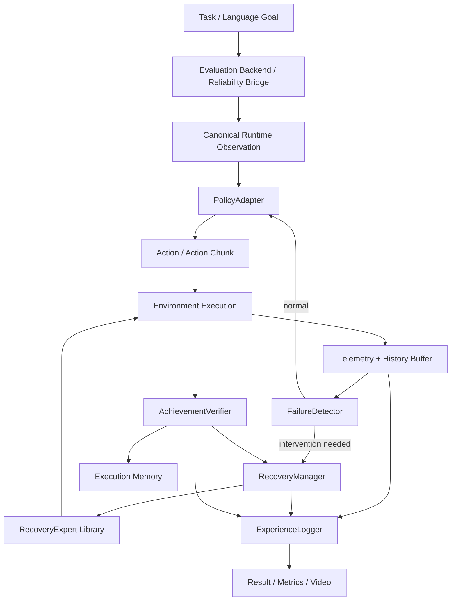

# LeRobot Reliability Lab — Technical Report
## A Reproducible Reliability and Recovery Layer for Modern Robot Policies on a Single RTX 4090

**Document role:** Stable technical description of the engineering project  
**Companion research document:** `FRONTIER_RESEARCH_SUPPORT.md` — frozen landscape snapshot v1.0 (2026-09-08)  
**Project type:** Independent embodied-AI research-engineering portfolio project  
**Primary artifact:** Public GitHub repository  
**Secondary artifact:** Technical report / arXiv-style preprint  
**Hardware target:** 1 × NVIDIA RTX 4090, 24 GB VRAM for all mandatory experiments  
**Status:** **FROZEN v1.0 — engineering architecture approved 2026-09-08**; research novelty remains optional and separately gated

---

## Executive Summary

Modern robot policies can achieve strong nominal performance while remaining fragile under execution-time failures: objects move, grasps slip, observations become stale, action chunks continue after the world has changed, semantic plans become invalid, or the policy simply enters a state from which its next actions are unlikely to recover. The engineering problem is therefore not only how to train a better policy, but how to **observe, diagnose, compare, and recover from failures at runtime** in a way that is reproducible across multiple robot-policy families and benchmark environments.

**LeRobot Reliability Lab** is designed as a reusable reliability layer around modern robot policies rather than as another foundation-model project. It does not attempt to train a new VLA from scratch, reproduce every recovery paper, or claim that generic VLA orchestration is new. Instead, it assembles a coherent engineering system around the Hugging Face LeRobot ecosystem with five central capabilities:

1. **Shared integration contracts across heterogeneous robot policies.**
2. **Shared reliability semantics across benchmark adapters.**
3. **Standardized runtime failure and recovery telemetry** under a shared event schema.
4. **Composable recovery mechanisms** behind one interface, allowing fair comparison without rewriting the experiment stack.
5. **Strict reproducibility and integrity controls** for checkpoints, preprocessing, actions, benchmarks, compute, and reported results.

The system is intentionally designed so that the engineering repository remains valuable even if the optional research hypothesis fails. The core contribution is therefore best understood as a **reliability laboratory and comparative systems framework for LeRobot policies**, not as a single recovery algorithm.

The companion file `FRONTIER_RESEARCH_SUPPORT.md` provides the research landscape: current models, benchmarks, failure detectors, recovery systems, world-model methods, memory methods, and novelty threats. This technical report uses that landscape to choose what to build. It does not duplicate the literature review.

---

# 1. Project Thesis

## 1.1 The engineering problem

A robot policy typically maps an observation and task specification to an action or short action sequence:

\[
\pi_\theta : (o_t, g) \rightarrow a_t \quad \text{or} \quad A_{t:t+K}.
\]

High nominal task success does not imply runtime reliability. Once the policy begins interacting with the environment, the realized state can diverge from the state implicitly assumed when the action was generated. Examples include:

- the target object moves after the action chunk is predicted;
- the gripper closes without securing the object;
- an object is displaced into an unusual configuration;
- the camera observation is delayed relative to the executed action history;
- the destination is no longer where the policy expected;
- an action chunk continues even though its early actions already invalidated its later actions;
- a semantic plan remains syntactically valid but physically impossible;
- the policy repeatedly attempts a recovery that already failed.

A reliable system therefore requires an execution loop richer than:

```text
observation -> policy -> action -> environment
```

The project instead treats policy execution as:

```text
observe
  -> infer action
  -> execute
  -> monitor
  -> estimate progress/failure
  -> decide whether intervention is needed
  -> recover if necessary
  -> verify physical outcome
  -> continue
  -> record everything
```

The engineering problem is to make this loop **modular, reproducible, comparable, and policy-agnostic wherever possible**.

## 1.2 What the project is not

This project is not:

- a new foundation VLA;
- a new general-purpose agent framework;
- a claim that monitoring + replanning is novel;
- a new robot simulator;
- a new general manipulation benchmark;
- a full reproduction suite for all recovery literature;
- a leaderboard-maximization exercise;
- a physical-robot deployment project in its core form;
- a cloud-scale training project.

The project deliberately stands on existing models, benchmarks, and research methods documented in `FRONTIER_RESEARCH_SUPPORT.md`.

## 1.3 Why the project deserves to exist

The project only deserves to exist if it reduces real engineering and evaluation work. Its durable value must come from the following:

- one reliability contract across multiple LeRobot policy families;
- one failure/recovery event schema across multiple benchmark families;
- fail-closed checkpoint integrity;
- explicit action/observation normalization contracts;
- comparable recovery mechanisms;
- standardized telemetry and video;
- outcome verification rather than action-attempt logging;
- single-RTX-4090 reproducibility;
- public APIs and CLIs that other users can run without understanding internal implementation details.

If upstream LeRobot or another maintained framework eventually provides all of these capabilities at equal or greater quality, the correct response is to reuse that upstream infrastructure or narrow the project—not to manufacture novelty.

## 1.4 Intended engineering differentiation

The project does not assume that any individual component is new. Its intended differentiation is the **assembly contract**: current robot policies, failure detectors, recovery mechanisms, verification, and benchmark environments are made interoperable under one reliability-oriented runtime and evaluation model.

That differentiation is meaningful only if it produces practical consequences:

- a recovery method can be moved from one supported policy to another with limited adapter work;
- a benchmark can be changed without rewriting the recovery stack;
- failure and recovery events have the same semantics across runs;
- checkpoint and preprocessing mistakes are surfaced before evaluation;
- runtime cost is reported alongside success;
- a third party can reproduce a run from manifests rather than from undocumented notebook state;
- the complete mandatory path is accessible on a prosumer 24 GB GPU.

The project should therefore be judged less by whether it contains a never-before-seen module and more by whether it **turns fragmented current research components into a reliable, inspectable, reusable experimental system**. If it does not achieve that reduction in complexity and ambiguity, the project has not earned its engineering claim.

### 1.5 Adjacent infrastructure that constrains the claim

The project is intentionally narrower than several already-existing systems:

- **RoboBRIDGE** already provides modular VLA-agent orchestration with monitoring, perception, planning, control, asynchronous scene updates, and hierarchical recovery.
- **EmbodiedSkills** already provides guarded executable-skill orchestration with prerequisite checks, bounded low-level VLA execution, post-action outcome verification, structured trajectories, recovery, and low-level policy replacement/adaptation under a fixed interface.
- **LeRobot FAR** already extends LeRobot with asynchronous pipeline measurement and failure-aware recovery for SmolVLA/π0.5 in LIBERO and SO-101.
- **AllenAI VLA Evaluation Harness** already aggregates and executes evaluation across a broad set of VLA simulation benchmarks.
- **ROEP** already formalizes deployment-facing VLA evaluation around runtime-interface fidelity, checkpoint provenance, perturbation repeatability, failure semantics, and recovery/shield-support evidence.
- **SO-101 failure/recovery benchmarking** already demonstrates structured VLA failure taxonomy and recovery-aware evaluation metrics on a low-cost physical robot.

Therefore LeRobot Reliability Lab does **not** claim generic orchestration, guarded executable-skill execution, prerequisite checking, outcome verification as a concept, a fixed swappable VLA-agent interface, first LeRobot recovery tooling, first cross-benchmark VLA evaluation, first runtime-fidelity/provenance protocol, first structured failure taxonomy, or first recovery-aware metrics. Its engineering target is the narrower **executable runtime reliability lifecycle**: integrate/extend upstream evaluation, enforce fail-closed model/processor integrity in the actual execution path, separate runtime and oracle capabilities by API, instrument failure-to-recovery events, execute interchangeable recovery interventions, verify achieved physical outcomes (including uncertainty), retain raw cost/latency usage, and export reproducible reliability run bundles across heterogeneous policies and benchmarks.

---

# 2. Relationship Between the Two Project Documents

The project intentionally separates **research navigation** from **engineering synthesis**.

## 2.1 `FRONTIER_RESEARCH_SUPPORT.md`

This is the changing research landscape. It answers:

- What models and benchmarks are current?
- Which recovery ideas already exist?
- Which papers or repositories are direct novelty threats?
- Which source claims have verified code, weights, or data?
- Which research components should be treated as baselines?
- Which candidate questions remain open enough to investigate?

It may change weekly.

## 2.2 `LEROBOT_RELIABILITY_LAB_TECHNICAL_REPORT.md`

This document answers:

- What system are we building?
- Why is the architecture structured this way?
- What interfaces and invariants must the system maintain?
- How do policies, benchmarks, detectors, recovery experts, and verifiers interact?
- What information is observable at runtime?
- What gets logged?
- How is reproducibility guaranteed?
- What does the RTX 4090 constraint mean technically?
- What constitutes meaningful engineering success?

This document should be more stable than the research-support file.

## 2.3 Change propagation rule

A new paper does **not** automatically change the architecture.

A research update affects this technical report only if it changes one of the following:

- a required policy role;
- a required benchmark role;
- the validity of a recovery interface;
- the validity of the optional research question;
- a major compute assumption;
- a reproducibility or correctness requirement.

This prevents the project from being redesigned every time the field moves.

---

# 3. Design Principles

## 3.1 Engineering first

The repository must remain useful without a successful research result.

The intended balance is approximately:

```text
systems / research engineering    65%
rigorous experimentation          25%
candidate research contribution   10%
```

This is not a scoring formula. It is a scope-control principle.

## 3.2 Reuse before reinvention

Existing implementations are preferred for:

- base policies;
- benchmark environments;
- failure detectors;
- recovery methods;
- reward/progress models;
- world models;
- dataset formats.

Custom code should concentrate on the missing integration layer:

- adapters;
- manifests;
- reliability state;
- recovery interfaces;
- outcome verification;
- telemetry;
- evaluation;
- experience logging;
- reproducibility.

## 3.3 Upstream evaluation substrate before custom benchmark infrastructure

The project must not rebuild generic VLA benchmark/model decoupling that already exists upstream. **AllenAI `vla-evaluation-harness` (`vla-eval`) is the preferred evaluation substrate where its protocol and benchmark integration are sufficient.** It already provides benchmark Docker isolation, model-server separation, sync/live runners, episode recording, sharding, and broad benchmark support.

LeRobot Reliability Lab should therefore contribute a **reliability extension layer**, not a competing generic evaluation harness. The preferred execution order is:

```text
existing vla-eval benchmark/model integration
    -> reliability instrumentation / intervention bridge
    -> failure detector
    -> recovery lifecycle
    -> achievement verification
    -> reliability telemetry + run manifest extension
```

A direct/native benchmark path is justified only when one of the required reliability controls cannot be expressed through the upstream protocol, such as:

- fine-grained action-chunk invalidation or queue reset;
- direct policy-state reset;
- recovery action injection unavailable through the runner;
- policy-specific candidate sampling or hidden-feature ablation;
- deterministic disturbance hooks required for a controlled reliability experiment.

When a direct path is required, it should reuse upstream benchmark code/protocol semantics where practical and document exactly why the upstream harness was insufficient.

## 3.4 Observable at runtime, privileged for audit only

The system must distinguish between:

1. **runtime-observable information**, which a deployable recovery system may consume; and
2. **audit/oracle information**, which may be used only for validation, disturbance injection, labels, and upper bounds.

The primary runtime path must not silently depend on simulator object coordinates, privileged contact graphs, disturbance identities, or ground-truth success variables unless the corresponding real sensor modality is explicitly part of the observation contract.

## 3.5 Attempted state is not achieved state

The system must never treat an issued command as evidence that the intended physical outcome occurred.

```text
commanded grasp      != achieved grasp
commanded placement  != achieved placement
attempted recovery   != successful recovery
```

This distinction affects memory, evaluation, experience logging, and optional recovery learning.

## 3.6 Fail closed

If the system cannot prove that a checkpoint, processor, benchmark revision, or normalization mapping is correct, the experiment should fail rather than continue with a plausible-looking configuration.

## 3.7 Single-GPU reproducibility

Every mandatory experiment must be runnable on a single RTX 4090 24 GB or equivalent 24 GB CUDA device.

This constraint shapes model roles and discourages unnecessary retraining of large foundation policies.

---

# 4. High-Level System Architecture



The system is organized around three separations:

### Policy separation

The recovery system should not need to know whether the base policy is ACT, SmolVLA, MolmoAct2, π0.5, or another supported policy beyond capabilities explicitly exposed by the `PolicyAdapter`.

### Benchmark separation

The runtime reliability system should not be rewritten when switching from LIBERO to RoboCasa. Where possible, benchmark execution and isolation are delegated to `vla-eval`; the reliability layer consumes a stable runtime bridge. Direct benchmark adapters are fallback implementations for reliability controls that the upstream harness cannot expose.

### Mechanism separation

Failure detection, recovery selection, recovery execution, outcome verification, and logging are separate responsibilities. This is important for ablations and fair comparison.

---

# 5. Runtime Data Model

## 5.1 Canonical observation

A benchmark-native observation is transformed into a canonical runtime structure.

Illustrative schema:

```python
@dataclass
class CanonicalObservation:
    timestamp_ns: int
    instruction: str
    images: dict[str, Tensor]        # named RGB views
    depth: dict[str, Tensor] | None
    proprioception: Tensor
    gripper_state: Tensor | None
    benchmark_features: dict[str, Any]
```

The canonical observation should preserve semantic names instead of silently flattening all inputs into positional tensors.

The policy adapter may then transform this canonical observation into the exact format required by the model.

## 5.2 Canonical action

Different robot policies and benchmarks may use different action representations:

- joint positions;
- joint deltas;
- end-effector deltas;
- rotation vectors;
- Euler representations;
- gripper scalar conventions;
- action chunks of different length.

Every executed action must therefore have both:

```text
native representation
canonical comparison representation
```

A canonical action representation should include enough metadata to avoid ambiguous comparison:

```python
@dataclass
class CanonicalActionView:
    # Analysis/comparison projection only. Fields may be unavailable.
    translation_delta_m: Tensor | None
    rotation_delta: Tensor | None
    joint_delta: Tensor | None
    gripper_command: float | None
    frame: str | None
    control_mode: str
    horizon_index: int | None

@dataclass
class ExecutableAction:
    # This is what is actually sent to the benchmark/robot controller.
    native_action: Tensor
    native_space: str
    canonical_view: CanonicalActionView | None
```

The canonical view is primarily for telemetry, comparison, detector/recovery features, and analysis. It is **not assumed to be losslessly invertible**. Converting between joint-space, Cartesian-space, absolute, delta, velocity, or other control modes may require current state, frames, kinematics, IK, or controller-specific assumptions.

The project must never compare raw action vectors from heterogeneous policies as if dimensions have identical semantics, and it must never reconstruct an executable native action from a canonical view unless the adapter explicitly declares and tests that conversion capability.

## 5.3 Execution history

The reliability layer maintains a bounded execution history:

\[
H_t = \{o_{t-L:t}, a_{t-L:t}, \hat A_{t-L:t}, r_{t-L:t}, e_{t-L:t}\}
\]

where:

- \(o\): observations;
- \(a\): native actions actually executed, each optionally paired with a canonical analysis view;
- \(\hat A\): predicted action chunks when available;
- \(r\): progress/reward/verifier traces;
- \(e\): runtime events.

This history is the input to failure detection and optional recovery-state estimation.

---

# 6. Evaluation Backend and Benchmark Reliability Bridge

## 6.1 Preferred backend strategy

The project supports two execution backends:

1. **`VlaEvalBackend` — preferred.** Reuse `vla-eval` for benchmark containers, model-server transport, episode execution, recording, and existing benchmark integrations. Add reliability hooks/events around its live/step loop.
2. **`DirectRuntimeBackend` — fallback.** Use direct LeRobot/native benchmark access only when required reliability interventions cannot be expressed through the upstream harness.

Both expose the same internal reliability bridge:

```python
class RuntimeBenchmarkAdapter(Protocol):
    def reset(self, seed: int) -> CanonicalObservation: ...
    def step(self, action: ExecutableAction) -> StepResult: ...
    def instruction(self) -> str: ...
    def runtime_observation(self) -> CanonicalObservation: ...
    def native_to_canonical_view(self, action) -> CanonicalActionView | None: ...

class EvaluationOracle(Protocol):
    # Offline/evaluation-only privileged surface.
    def success(self) -> bool: ...
    def privileged_labels(self) -> dict[str, Any]: ...
    def failure_onset(self) -> int | None: ...
    def disturbance_identity(self) -> str | None: ...
```

The runtime adapter and evaluation oracle are separate objects/capabilities. The `RecoveryManager`, `FailureDetector`, and runtime `AchievementVerifier` receive only the runtime surface. This makes privileged leakage harder by construction rather than relying only on developer discipline.

If a benchmark must expose an invertible action conversion for a specific recovery expert, that capability is declared explicitly and contract-tested; it is not part of the universal benchmark interface.

### Backend provenance

Every run records which execution substrate was used:

```yaml
evaluation_backend:
  type: vla_eval | direct_native
  version: ...
  revision_sha: ...
  benchmark_container_digest: ...
  reason_for_direct_backend: null | ...
```

A direct backend is not chosen merely because custom code is easier. If `vla-eval` already provides a correct integration, the direct path must justify the additional maintenance and reproducibility burden.

## 6.2 Benchmark roles

### Custom MuJoCo microbenchmark

Purpose:

- debug kinematics;
- validate control loops;
- verify queue-reset semantics;
- create deterministic disturbance tests;
- verify logging and telemetry;
- test Oracle behavior;
- support unit and integration testing.

It is a systems sandbox, not the main scientific benchmark.

### Standard LIBERO

Preferred execution: existing `vla-eval`/upstream benchmark integration when compatible.

Purpose:

- checkpoint sanity;
- observation preprocessing validation;
- action decoding validation;
- upstream baseline reproduction.

The project should not derive broad intelligence claims from small differences in standard LIBERO success.

### LIBERO-plus

Preferred execution: existing `vla-eval`/upstream integration when compatible; do not maintain a redundant fork solely for standard evaluation.

Purpose:

- controlled robustness testing;
- static distribution-shift analysis;
- regression testing under standardized perturbations.

### LIBERO-RECOVER

Purpose:

- primary community recovery evaluation if official assets, code, and licensing are verified.

If official assets cannot be used reproducibly, the project must not block. A clearly labeled `libero_recover_inspired` stress path may be used for engineering development while official integration remains pending.

### RoboCasa365

Preferred execution: reuse the existing `vla-eval`/official RoboCasa integration if it matches the frozen task protocol; use direct integration only for required reliability hooks not available upstream.

Purpose:

- non-LIBERO confirmation;
- broader environment diversity;
- atomic and composite manipulation tasks;
- protection against overfitting the entire project to one benchmark family.

The project should use a frozen representative subset rather than attempting all available tasks.

## 6.3 Benchmark manifest

Every benchmark run must write a manifest:

```yaml
benchmark_name: ...
benchmark_version: ...
source_repo: ...
revision_sha: ...
dataset_revision: ...
task_ids: [...]
seed_set: [...]
camera_names: [...]
image_resolution: ...
action_space: ...
control_frequency_hz: ...
reset_semantics: ...
timeout_steps: ...
success_definition: ...
privileged_fields_exposed_to_runtime: []
```

The manifest is part of the result, not auxiliary documentation.

---

# 7. Policy Abstraction

## 7.1 `PolicyAdapter`

```python
class PolicyAdapter(Protocol):
    def reset(self) -> None: ...
    def select_action(self, obs: CanonicalObservation) -> PolicyOutput: ...
    def reset_or_truncate(self) -> None: ...
    def native_action_to_canonical_view(self, action) -> CanonicalActionView | None: ...
    def capabilities(self) -> PolicyCapabilities: ...
    def metadata(self) -> PolicyManifest: ...
```

The adapter must explicitly report capabilities such as:

```python
@dataclass
class PolicyCapabilities:
    supports_chunking: bool
    supports_queue_reset: bool
    supports_candidate_sampling: bool
    supports_language_goal: bool
    exposes_policy_features: bool
    supports_async_inference: bool
    supports_canonical_to_native_recovery_actions: bool
```

Recovery modules must not assume a capability unless the adapter declares it.

## 7.2 Policy roles

### ACT

Role: historical/local engineering baseline.

ACT is retained because action chunking, queue semantics, and deterministic local training make it useful for debugging recovery infrastructure. It is not the modern scientific ceiling.

### SmolVLA

Role: mandatory modern modifiable VLA.

SmolVLA provides a practical policy on which the project can test:

- language conditioning;
- modern VLA preprocessing;
- local inference;
- lightweight adaptation when feasible;
- detector/recovery integration;
- optional recovery-state learning.

### Strong frozen VLA

Role: modern high-capacity reference and cross-policy test target.

Candidate selection is feasibility-driven rather than ideology-driven. Preferred candidates are:

1. MolmoAct2;
2. π0.5;
3. another strong current LeRobot-supported policy if integration is materially cleaner.

The project needs **one** strong frozen reference, not every available VLA.

---

# 8. 4090-First Compute Architecture

## 8.1 Hardware contract

All mandatory experiments target:

```text
GPU: NVIDIA RTX 4090
VRAM: 24 GB
mandatory peak VRAM: <= 24 GB
```

The hardware constraint is a reproducibility feature, not merely a limitation.

The 24 GB ceiling applies to the **end-to-end mandatory runtime configuration**, not only to the base policy in isolation. If the policy, detector, verifier, simulator renderer, and recovery components cannot coexist within the budget, the system must use explicit scheduling/offload/sequential loading and report the resulting latency. A model fitting alone is not sufficient evidence that the mandatory system fits.

## 8.2 Model strategy

### ACT

Expected role:

- local training;
- local inference;
- frequent smoke testing.

### SmolVLA

Expected role:

- local inference;
- local fine-tuning only if measured feasible;
- primary modifiable modern policy.

### MolmoAct2

Expected role:

- frozen local inference if measured stable;
- optional action-expert adaptation if memory headroom is sufficient;
- no mandatory full-model fine-tuning.

The companion research-support file records official reference memory measurements. Those numbers are not treated as 4090 guarantees.

### π0.5

Expected role:

- frozen inference if it fits cleanly;
- optional expert-only adaptation;
- no required full fine-tuning.

## 8.3 Compute isolation

Simulation rendering, model inference, semantic API calls, and telemetry should not share one uncontrolled synchronous path.

Recommended execution architecture:

```text
Simulation / environment thread
        │
        ├── latest observation buffer
        │
        ├── policy inference worker
        │
        ├── optional semantic recovery worker
        │
        └── telemetry writer
```

The environment thread owns benchmark stepping and rendering contexts. External recovery reasoning should consume copied observations rather than directly manipulating simulator state.

On a single-GPU host, simulator rendering and model inference must not be assumed to coexist safely or efficiently. When the evaluation backend supports it, prefer CPU/software rendering or otherwise isolate/schedule rendering so the RTX 4090 budget is available to the policy/reliability stack. Any such choice is recorded because it affects wall-clock timing. `vla-eval` already exposes CPU-rendering paths for supported benchmarks and should be reused rather than reimplemented.

## 8.4 Performance manifest

Every executed policy configuration records:

```yaml
gpu: RTX 4090 24GB
policy: ...
revision_sha: ...
dtype: ...
batch_size: ...
peak_vram_mb: ...
inference_p50_ms: ...
inference_p95_ms: ...
recovery_overhead_p50_ms: ...
recovery_overhead_p95_ms: ...
control_frequency_hz: ...
```

---

# 9. Checkpoint and Processor Integrity

A surprisingly dangerous failure mode in ML systems is not poor model performance but accidentally evaluating the wrong model, wrong processor, wrong normalization, or partially loaded weights.

The project therefore treats checkpoint integrity as a first-class subsystem.

## 9.1 Policy manifest

```yaml
policy_class: ...
source_repo: ...
revision_sha: ...
config_hash: ...
weight_hash: ...
parameter_count: ...
preprocessor_hash: ...
postprocessor_hash: ...
normalization_stats_hash: ...
camera_mapping: ...
action_mapping: ...
load_warnings: []
known_output_smoke_test: pass
```

## 9.2 Fail-closed rule

An experiment aborts if:

- expected weights do not load;
- processor restoration fails;
- normalization metadata is missing or mismatched;
- camera mappings differ from the configured benchmark contract;
- output dimensionality does not match the action adapter;
- a model silently falls back to random initialization;
- an unexpected checkpoint warning is emitted.

## 9.3 Known-output smoke tests

Each supported policy should have at least one small deterministic or tolerance-bounded smoke test:

```text
known input fixture
    -> preprocessing
    -> policy forward
    -> postprocessing
    -> action schema validation
```

The purpose is not to demand bitwise equality across devices, but to catch obviously incorrect checkpoint or preprocessing states before expensive evaluation.

---

# 10. Failure Model

The project needs an internal failure taxonomy for logging and analysis. Structured VLA failure taxonomies and recovery-aware metrics already exist in current evaluation work; this taxonomy is therefore an interoperability schema, **not** a new benchmark or taxonomy contribution.

## 10.1 Runtime failure families

### Perceptual failure

Examples:

- temporary occlusion;
- wrong target localization;
- object identity confusion;
- visually ambiguous state.

### Contact / grasp failure

Examples:

- empty grasp;
- slip after lift;
- unstable object contact;
- premature gripper closure.

### Spatial / state-shift failure

Examples:

- target moves after planning;
- destination moves;
- object enters an unusual pose;
- environment configuration changes.

### Temporal failure

Examples:

- stale observation;
- delayed inference;
- action chunk no longer aligned with current scene;
- asynchronous planning result arrives too late.

### Execution failure

Examples:

- dropped command;
- delayed actuator response;
- corrupt action;
- queue continues after invalidation.

### Semantic / task-progress failure

Examples:

- wrong subgoal;
- task order becomes invalid;
- policy repeatedly pursues an already completed or impossible subgoal;
- intended task progress is not physically achieved.

## 10.2 Failure event schema

```yaml
failure_event_id: ...
timestamp_ns: ...
scenario_id: ...
policy: ...
detector: ...
failure_probability: ...
failure_type_distribution: ...
trigger_source: ...
trigger_threshold: ...
history_window_ref: ...
privileged_label: ...        # offline/audit only
```

The detector output and the privileged audit label are intentionally separate.

---

# 11. Failure Detection Layer

## 11.1 Detector interface

```python
class FailureDetector(Protocol):
    def reset(self) -> None: ...
    def score(self, history: ExecutionHistory) -> FailureEstimate: ...
```

```python
@dataclass
class FailureEstimate:
    score: float                       # detector-native score/anomaly/value signal
    trigger: bool
    probability: float | None = None  # only if calibrated/meaningful
    type_distribution: dict[str, float] | None = None
    confidence: float | None = None
    diagnostic: dict[str, Any] = field(default_factory=dict)
```

A detector is never forced to manufacture a calibrated probability or failure-type distribution. Calibration and typed classification are explicit detector capabilities and are evaluated only when the method actually provides them.

## 11.2 Engineering baseline

A simple observable heuristic remains useful as a floor because it is:

- transparent;
- cheap;
- easy to debug;
- useful for validating event plumbing.

It must not rely on simulator-only contact forces unless those are explicitly available to the runtime observation contract.

## 11.3 Learned detector

The project integrates one current learned detector selected from the research-support landscape according to compatibility, code availability, and reproducibility.

The reliability framework should allow the detector to be swapped without changing policy or benchmark code.

## 11.4 Detector metrics

The detector is evaluated independently of recovery using:

- AUROC;
- AUPRC;
- precision/recall/F1 at the configured operating point;
- false-positive rate on nominal trajectories;
- time to detect;
- calibration error where appropriate.

A detector that detects failure well does not automatically produce good recovery.

---

# 12. Recovery Architecture

## 12.1 Recovery is a library of interventions

The project treats recovery mechanisms as interchangeable experts rather than as one monolithic algorithm.

```python
class RecoveryExpert(Protocol):
    def is_applicable(self, state: RecoveryState) -> bool: ...
    def propose(self, state: RecoveryState, memory: ExecutionMemory) -> RecoveryProposal: ...
    def estimated_cost(self, proposal: RecoveryProposal) -> RecoveryCost: ...
    def execute(self, proposal: RecoveryProposal, context: RuntimeContext) -> RecoveryExecution: ...
```

## 12.2 Core recovery families

### Reset / re-infer

Mechanism:

- flush stale policy action state;
- obtain a fresh action or chunk from the latest observation.

Purpose:

- trivial reliability floor;
- validate that queue state is a meaningful source of failure.

### Detect / truncate / correct

Mechanism:

- detect deviation;
- invalidate the remainder of an action chunk;
- optionally shorten execution horizon;
- obtain a corrected action sequence.

Purpose:

- representative modern corrective-inference path.

### Retry / backoff or residual recovery

Mechanism:

- retreat or back off;
- perturb/retry grasp or approach;
- optionally use a local residual action policy.

Purpose:

- representative physical recovery path.

### Test-time candidate / value repair

Mechanism:

- generate multiple candidate actions or local repairs;
- score with a value/progress/world-model verifier;
- execute the best candidate.

Purpose:

- representative test-time computation path.

This path is optional unless required by the final comparison.

### Semantic high-level recovery

Mechanism:

- use a high-level multimodal reasoner to reinterpret the scene;
- choose a revised subgoal or recovery instruction;
- return control to the low-level policy.

Purpose:

- high-cost semantic baseline;
- test whether expensive reasoning adds value beyond local recovery.

Gemini Robotics ER 2 may be used as one implementation, but the project is not defined by Gemini.

## 12.3 Recovery proposal schema

```yaml
proposal_id: ...
expert_id: ...
recovery_type: ...
preconditions: ...
expected_achievement: ...
expected_latency_ms: ...
expected_compute_cost: ...
expected_api_usage: ...
expected_api_cost_snapshot: ...
expected_disruption: ...
payload: ...
```

---

# 13. Recovery Manager

The recovery manager is responsible for intervention lifecycle, not for inventing every recovery action itself.

Responsibilities:

1. receive a failure estimate;
2. construct a recovery state;
3. identify applicable recovery experts;
4. select a configured expert or policy;
5. invalidate stale policy state if required;
6. execute the intervention;
7. request outcome verification;
8. decide whether to resume, escalate, or terminate;
9. emit telemetry.

The base engineering mode can use a fixed configured recovery policy:

```text
failure type -> selected recovery expert
```

The optional research layer can replace fixed selection with a learned or adaptive router.

This separation is essential: the repository remains useful without the adaptive router.

---

# 14. Achievement Verification

## 14.1 Purpose

A recovery system must know whether an intervention changed the physical world in the intended way. Post-action verification itself is not a novel concept; current systems such as EmbodiedSkills already make outcome verification part of the agent loop. Here it is an **engineering invariant and reliability evidence source** used to close recovery events consistently.

Examples:

- Did the gripper actually acquire the object?
- Did the object remain held after lift?
- Did the target reach the destination?
- Did backoff restore a recoverable configuration?
- Did the semantic replan produce measurable task progress?

## 14.2 Verifier interface

```python
class AchievementVerifier(Protocol):
    def verify(
        self,
        history: ExecutionHistory,
        instruction: str,
        expected_achievement: AchievementSpec,
    ) -> AchievementResult: ...
```

```python
@dataclass
class AchievementResult:
    status: Literal["achieved", "not_achieved", "uncertain"]
    confidence: float | None
    evidence: dict[str, Any]
    timestamp_ns: int
```

`uncertain` is a first-class result. The verifier must not convert missing or ambiguous evidence into a false claim of success or failure. The `RecoveryManager` configuration must declare how uncertainty is handled—for example, gather another observation, use a stronger verifier, escalate recovery, or terminate conservatively.

## 14.3 Verification sources

Possible runtime-verifiable sources include:

- image/video evidence;
- proprioception;
- gripper aperture/state;
- externally computed reward/progress signal;
- learned value/progress model;
- world-model consistency;
- task-specific visual relation checks.

Simulator ground truth may be used to audit verifier quality but must not leak into the primary runtime path.

---

# 15. Execution Memory

Execution memory records **verified history**, not merely commands.

Illustrative structure:

\[
M_t = \{(z_i, r_i, c_i, y_i, a_i^{\text{achieved}})\}_{i=1}^{N_t}
\]

where:

- \(z_i\): recovery context;
- \(r_i\): recovery intervention;
- \(c_i\): realized cost;
- \(y_i\): outcome;
- \(a_i^{achieved}\): verified achievement state.

The base engineering system can use memory for:

- preventing repeated identical failed recovery attempts;
- telemetry;
- analysis;
- outcome-conditioned escalation.

A learned memory-dependent router belongs to the optional research layer.

---

# 16. Experience and Telemetry Model

## 16.1 `ExperienceLogger`

Every episode should create one immutable top-level episode record plus event-level logs.

### Episode record

```yaml
scenario_id: ...
benchmark: ...
benchmark_manifest_hash: ...
task_id: ...
seed: ...
base_policy: ...
policy_manifest_hash: ...
detector: ...
recovery_configuration: ...
start_time: ...
end_time: ...
task_success: true | false
termination_reason: ...
peak_vram_mb: ...
video_path: ...
telemetry_path: ...
```

### Recovery event

```yaml
recovery_event_id: ...
failure_event_id: ...
timestamp_ns: ...
state_ref: ...
selected_expert: ...
proposal_ref: ...
queue_flushed: true | false
latency_ms: ...
gpu_time_ms: ...
api_usage_ref: ...
api_cost_snapshot: ...
pricing_snapshot_date: ...
achievement_before: ...
achievement_after: ...
verification_status: achieved | not_achieved | uncertain
verified_outcome: success | partial | fail | unresolved
final_task_success: true | false
```

## 16.2 Event timing

Every event should use the same monotonic clock domain so that time-to-detect and time-to-recover are meaningful.

Suggested definitions:

\[
TTD = t_{trigger} - t_{failure\_onset}
\]

for benchmark scenarios where failure onset is known offline, and:

\[
TTR = t_{verified\_recovery} - t_{trigger}.
\]

For real/non-scripted failures where exact onset is not known, the system should avoid inventing a ground-truth TTD.

## 16.3 Video telemetry

Rollout videos should optionally overlay:

- task instruction;
- timestep;
- active policy;
- detector probability;
- active action-chunk position;
- failure trigger;
- recovery expert;
- recovery status;
- achievement verification;
- task success/termination reason.

The video is a debugging artifact and public demonstration, not a substitute for machine-readable evaluation.

---

# 17. Runtime Observability Contract

## 17.1 Allowed runtime inputs

The primary reliability path may use only signals available under the declared observation contract, for example:

- benchmark-exposed RGB cameras;
- benchmark-exposed depth if explicitly enabled;
- proprioception;
- gripper state;
- executed action history;
- task instruction;
- policy output/action chunk;
- policy-independent external progress/value signals;
- verified execution memory.

## 17.2 Privileged audit inputs

Examples:

- object world coordinates;
- exact fault onset time;
- disturbance identity;
- hidden simulator collision graph;
- ground-truth task predicates;
- privileged contact information not exposed as a sensor.

These may support:

- scenario construction;
- offline labeling;
- Oracle upper bounds;
- verifier auditing;
- metric calculation.

They may not silently influence the deployed detector or recovery decision.

## 17.3 Policy-specific hidden features

Policy hidden features may be useful for detector ablations or specialized methods. They must be labeled explicitly.

The primary cross-policy research experiment, if executed, must not depend on a feature space available only to Policy A.

---

# 18. Recovery Cost Model

A recovery method that succeeds by calling a large remote model at every timestep is not equivalent to a local recovery with the same success rate.

The system therefore logs cost dimensions separately.

```python
@dataclass
class RecoveryCost:
    wall_clock_ms: float
    gpu_ms: float | None
    api_calls: int
    intervention_steps: int
    queue_disruption: int
    api_usage: dict[str, Any] | None   # raw provider/model/billed-unit usage
    api_cost_snapshot: float | None   # cost under a dated pricing snapshot
```

When an external API is used, store raw billable usage separately from monetary cost, for example:

```yaml
provider: ...
model: ...
request_count: ...
input_tokens: ...
output_tokens: ...
video_seconds: ...
other_billed_units: ...
currency: ...
pricing_snapshot_date: YYYY-MM-DD
calculated_cost: ...
```

Provider pricing changes over time; raw usage is the reproducible quantity, while monetary cost is a dated derived value.

A scalar cost may be defined for a specific experiment:

\[
C(i) = \lambda_t T_i + \lambda_g G_i + \lambda_a A_i + \lambda_d D_i,
\]

but raw dimensions must always be retained so conclusions are not dependent on one arbitrary weighting.

---

# 19. Evaluation Semantics

## 19.1 Primary engineering metrics

These metrics are engineering/reporting semantics, not claimed inventions. Current deployment-facing evaluation protocols and low-cost-robot VLA benchmarks already report runtime fidelity, failure semantics, recovery support, and recovery-aware metrics. LeRobot Reliability Lab standardizes the subset required by its executable recovery lifecycle and run-bundle contract.

### Task success rate

\[
SR = \frac{N_{successful}}{N_{episodes}}.
\]

### Recovery success rate

A recovery event is successful only when its expected achievement is verified or it leads to a preregistered recovery criterion.

### Failure detection performance

- precision;
- recall;
- F1;
- AUROC/AUPRC where applicable;
- false-positive rate on nominal rollouts;
- time to detect.

### Recovery latency

- time from trigger to intervention start;
- time from trigger to verified recovery;
- recovery p50/p95 latency.

### Nominal degradation

Recovery machinery should not materially reduce success on nominal/no-failure episodes.

### Compute

- peak VRAM;
- inference latency;
- recovery compute overhead;
- semantic API calls/cost.

## 19.2 Comparative evaluation

The project should use matched seeds/scenarios where possible.

The same failure scenario should be replayed across comparable recovery conditions when benchmark semantics allow it.

## 19.3 Statistical reporting

For the optional research report:

- confidence intervals for binary success rates;
- paired bootstrap intervals for paired differences;
- McNemar-style paired tests when appropriate;
- hierarchical models when task/scenario heterogeneity matters;
- effect sizes and uncertainty, not only p-values.

The engineering repository should expose raw result files so analysis can be rerun.

---

# 20. Representative Reliability Matrix

The repository should support a matrix conceptually like:

| Policy | Benchmark | Detector | Recovery | Outcome Verifier | Purpose |
|---|---|---|---|---|---|
| ACT | Custom MuJoCo | heuristic | reset/re-infer | scripted/visual | engineering sanity |
| SmolVLA | LIBERO | heuristic/learned | none | benchmark success | checkpoint compatibility |
| SmolVLA | LIBERO-plus | learned | correct/retry | observable verifier | robustness study |
| SmolVLA | recovery benchmark | learned | representative recovery | achievement verifier | main engineering recovery evidence |
| strong frozen VLA | same recovery benchmark | same contract | same recovery family | same verifier contract | cross-policy comparability |
| SmolVLA + strong VLA | RoboCasa subset | same reliability API | selected methods | benchmark-compatible verifier | non-LIBERO confirmation |

The matrix is a framework, not a requirement to exhaustively cross every factor.

---

# 21. Minimal Recovery Comparison Set

The project should avoid becoming a reproduction museum.

## Mandatory engineering floor

- no recovery;
- reset/re-infer;
- one current learned failure detector;
- one detect/truncate/correct path;
- one semantic recovery path.

## Choose at least one extended family

- retry/backoff or residual recovery; **or**
- test-time value/sample/world-model repair.

A second extended family is only required if needed for a specific research question.

The adaptive cross-policy recovery layer is optional and must not block public release.

---

# 22. Software Architecture

Recommended repository structure:

```text
lerobot-reliability-lab/
├── README.md
├── LEROBOT_RELIABILITY_LAB_TECHNICAL_REPORT.md
├── FRONTIER_RESEARCH_SUPPORT.md
├── ARCHITECTURE.md
├── ROADMAP.md
├── AGENTS.md
├── MEMORY.md
│
├── docs/
│   ├── frontier_claim_ledger.md
│   ├── threat_register.md
│   ├── benchmark_validity.md
│   ├── baseline_reproduction.md
│   ├── compute_manifest.md
│   └── publication_notes.md
│
├── env/
│   ├── stable.lock
│   └── experimental.lock
│
├── configs/
│   ├── benchmark/
│   ├── policy/
│   ├── detector/
│   ├── recovery/
│   └── experiment/
│
├── src/lerobot_reliability/
│   ├── backends/
│   │   ├── vla_eval.py
│   │   └── direct_runtime.py
│   ├── adapters/
│   │   ├── reliability_bridge/
│   │   └── policies/
│   ├── detectors/
│   ├── recovery/
│   │   ├── experts/
│   │   ├── manager.py
│   │   ├── state.py
│   │   ├── memory.py
│   │   ├── achievement.py
│   │   ├── outcome.py
│   │   └── router.py
│   ├── experience/
│   ├── telemetry/
│   ├── integrity/
│   ├── sim/
│   └── analysis/
│
├── scripts/
│   ├── verify_checkpoint.py
│   ├── lock_benchmark.py
│   ├── reproduce_policy.py
│   ├── evaluate_reliability.py
│   ├── evaluate_recovery.py
│   ├── collect_experience.py
│   ├── evaluate_cross_policy.py
│   ├── evaluate_robocasa.py
│   └── render_rollout.py
│
├── tests/
├── outputs/
│   ├── manifests/
│   ├── evaluations/
│   ├── videos/
│   └── reports/
│
├── DATASET_CARD.md
├── MODEL_CARD.md
└── REPORT.md
```

`ROADMAP.md` should contain the implementation sequence. This technical report intentionally does not.

---

# 23. Configuration Model

Experiments should be config-driven rather than encoded in scripts.

Illustrative experiment configuration:

```yaml
experiment:
  id: libero_plus_smolvla_corrector_v1
  seed_set: [2000, 2001, 2002]

benchmark:
  name: libero_plus
  task_ids: [...]
  revision: ...

policy:
  name: smolvla
  checkpoint: ...
  revision: ...
  dtype: bfloat16

failure_detector:
  name: learned_detector
  config: configs/detector/learned.yaml

recovery:
  expert: truncate_correct
  max_attempts: 2

verification:
  achievement_verifier: observable_progress

logging:
  save_video: true
  save_event_jsonl: true
  save_policy_manifest: true
  save_benchmark_manifest: true
```

Every generated result should point back to the exact config and manifest hashes.

---

# 24. Public Developer Experience

The framework should be usable without reading the internal source tree.

## 24.1 Python API

Target ergonomics:

```python
from lerobot_reliability import RecoverablePolicy
from lerobot_reliability.policies import load_policy
from lerobot_reliability.benchmarks import load_benchmark
from lerobot_reliability.detectors import load_detector
from lerobot_reliability.recovery import load_recovery

policy = load_policy("smolvla", checkpoint="...")
env = load_benchmark("libero_plus", task="...", backend="vla_eval")
detector = load_detector("learned", config="...")
recovery = load_recovery("truncate_correct", config="...")

agent = RecoverablePolicy(
    policy=policy,
    detector=detector,
    recovery=recovery,
)

result = agent.rollout(env, seed=2000)
print(result.summary())
```

## 24.2 CLI

```bash
lerobot-reliability verify-checkpoint \
  --policy smolvla \
  --checkpoint ...

lerobot-reliability evaluate \
  --config configs/experiment/libero_plus_smolvla.yaml

lerobot-reliability render \
  --run outputs/evaluations/run_001
```

## 24.3 Expected outputs

A single run directory should contain:

```text
run_001/
├── experiment.yaml
├── policy_manifest.yaml
├── benchmark_manifest.yaml
├── evaluation_backend_manifest.yaml
├── compute_manifest.yaml
├── episode_results.jsonl
├── recovery_events.jsonl
├── telemetry.parquet
├── summary.json
└── videos/
```

This run-bundle design is central to reproducibility and third-party usability.

---

# 25. Testing Strategy

The reliability framework requires more than unit tests for neural modules.

## 25.1 Unit tests

Examples:

- action-space conversion round trips;
- manifest hashing;
- event serialization;
- queue reset behavior;
- threshold/hysteresis logic;
- achievement-state transitions;
- cost accounting.

## 25.2 Contract tests

Every `PolicyAdapter` must pass the same contract suite.

Every reliability benchmark bridge must pass the same runtime contract suite; both `VlaEvalBackend` and any `DirectRuntimeBackend` implementation must pass equivalent reliability-facing tests. `EvaluationOracle` is tested separately to prevent privileged/runtime API collapse.

Every `RecoveryExpert` must return a valid proposal and emit complete telemetry.

## 25.3 Integration tests

Examples:

- one deterministic MuJoCo episode;
- one standard LIBERO compatibility episode;
- one recovery event from detection through verification;
- one complete run-bundle export.

## 25.4 Reproducibility tests

Given:

```text
same environment lock
same checkpoint hash
same benchmark revision
same config
same seed
```

the run should be reproducible within the expected stochastic tolerance of the policy/environment.

---

# 26. Optional Research Extension: Cross-Policy Outcome-Adaptive Recovery

The engineering system enables a narrow research question without depending on it.

## 26.1 Candidate question

> Can a recovery layer learned or calibrated around one VLA retain useful recovery-selection competence when transferred to a second heterogeneous VLA using only policy-independent observable execution history and verified outcomes?

This question remains candidate research and may be invalidated by future work tracked in the research-support file.

## 26.2 Recovery state

A policy-independent state may be constructed as:

\[
Z_t = f_\phi(O_{t-L:t}, A_{t-L:t}, G, R_{t-L:t}, M_t),
\]

where:

- \(O\): observable image/proprioception history;
- \(A\): canonical executed actions;
- \(G\): task instruction;
- \(R\): policy-independent progress/value traces;
- \(M_t\): verified execution memory.

The primary transfer condition must not require Policy-A-specific hidden tensors.

## 26.3 Outcome model

A recovery outcome model may estimate:

\[
\hat P(y=1 \mid Z_t, i, M_t),
\]

for recovery intervention \(i\).

The raw recovery costs are retained separately.

## 26.4 Transfer protocol

```text
Policy A: SmolVLA
    -> collect recovery experience
    -> train/calibrate recovery state + outcome model/router
    -> freeze recovery layer

Policy B: strongest locally feasible frozen VLA
    -> no Policy-B-specific hidden features in primary condition
    -> held-out recovery scenarios
    -> compare transferred recovery vs fixed baselines
```

The second policy is chosen after measured 4090 feasibility.

## 26.5 Research interpretations

### Positive transfer

Evidence would suggest some recovery-selection competence can be represented above the policy-specific internal feature level.

### Partial transfer

The transfer gap may reveal which failure/recovery classes are policy-specific versus reusable.

### Negative transfer

A negative result is still useful if the experiment is rigorous: it would suggest that recovery infrastructure may need policy-specific calibration even when the engineering interface is shared.

None of these outcomes invalidates the repository.

---

# 27. Research-to-Engineering Boundary

The project must preserve a strict boundary:

```text
research landscape
    -> selects representative methods and warns about claims

engineering system
    -> provides stable interfaces and evaluation

optional research extension
    -> uses the stable system to test one question
```

A new research paper should ideally change:

```text
which detector plugin is selected
which recovery baseline is strongest
which benchmark is preferred
which candidate claim is allowed
```

rather than forcing changes to:

```text
manifest schema
policy adapter contract
benchmark adapter contract
telemetry contract
checkpoint integrity
run-bundle structure
```

This is what makes the project resilient to a fast-moving field.

---

# 28. Engineering Impact

## 28.1 Portfolio impact

A successful repository demonstrates competence in:

- robotics simulation;
- control and action representations;
- modern VLA integration;
- multimodal inference;
- asynchronous systems;
- runtime monitoring;
- recovery architecture;
- benchmark engineering;
- experiment design;
- reproducibility;
- ML systems debugging;
- telemetry and analysis;
- research judgment.

This is substantially broader than a single model fine-tuning project.

## 28.2 Open-source impact

The repository is useful if a third party can answer questions such as:

- How does this LeRobot policy fail under controlled perturbations?
- Does queue reset help?
- Does a learned detector trigger early enough?
- Which recovery family works for which failures?
- How much latency does semantic recovery add?
- Does the same recovery mechanism behave similarly on another VLA?
- Can I reproduce the exact run with the same checkpoint and benchmark revision?

## 28.3 Research impact

The engineering framework can support comparative recovery studies **by extending, not replacing, existing VLA evaluation infrastructure**. Where `vla-eval` already solves benchmark/model execution, LeRobot Reliability Lab should add reliability semantics and recovery lifecycle instrumentation on top of it rather than rebuilding the harness.

The optional cross-policy study may add a research result, but the repository should not depend on this outcome.

---

# 29. Failure Modes of the Project Itself

The project should be reconsidered if any of the following becomes true.

## 29.1 Thin-wrapper failure

If most of the repository becomes trivial wrappers around LeRobot, `vla-eval`, or recovery papers with no meaningful new reliability lifecycle, integrity, verification, telemetry, or comparative capability, it does not justify its maintenance cost.

## 29.2 Upstream duplication

If LeRobot, `vla-eval`, RoboBRIDGE, EmbodiedSkills, LeRobot FAR, or another maintained project releases the equivalent complete reliability lifecycle—integrity, failure events, recovery interventions, achievement verification, recovery telemetry, cost accounting, and reproducible reliability runs—the project should reuse upstream functionality or pivot toward gaps that remain.

## 29.3 Benchmark-maintenance failure

If maintaining many benchmark versions dominates the project, reduce the benchmark set.

## 29.4 Research-scope failure

If the optional research question starts forcing large new models, major retraining, or unrelated infrastructure, the research question should be narrowed or removed.

## 29.5 Compute failure

If the mandatory path cannot be reproduced on a single RTX 4090, model roles should be changed before relaxing the hardware contract.

## 29.6 Toy-result failure

If useful behavior appears only in the custom MuJoCo sandbox and disappears on community benchmarks, the project should not make broad reliability claims.

---

# 30. Security, Independence, and Data Boundaries

The core project should remain independently reproducible using public resources.

Use:

- public datasets;
- public benchmarks;
- public checkpoints;
- public repositories;
- personal/local compute and accounts.

Do not require:

- private hospital data;
- medical PhD datasets;
- confidential university infrastructure;
- unpublished supervisor assets;
- employer proprietary code.

This separation keeps the project technically portable and avoids making its reproducibility dependent on institutional access.

---

# 31. Publication and Public Communication

## 31.1 Primary artifact

The GitHub repository is the main deliverable.

## 31.2 Technical report

A later public report should explain:

1. the reliability problem;
2. the engineering architecture;
3. supported policy and benchmark roles;
4. recovery middleware;
5. telemetry and reproducibility contracts;
6. representative recovery comparisons;
7. compute/latency results;
8. optional cross-policy case study;
9. negative results and limitations;
10. claim audit against the current research landscape.

## 31.3 Claims discipline

The repository may describe itself as:

- a LeRobot-centered reliability/evaluation framework;
- a 4090-first reproducible engineering system;
- a comparative recovery testbed;
- a reliability extension layer integrating current policies and recovery mechanisms across upstream-supported and direct benchmark backends.

It must not claim:

- SOTA recovery without direct evidence;
- first VLA recovery system;
- first adaptive horizon;
- first failure detector;
- first recovery router;
- first guarded VLA-agent execution or outcome-verification interface;
- general policy-agnostic recovery without transfer evidence;
- broad benchmark generalization without non-LIBERO evidence.

The research-support file remains the authority for external prior-art and novelty constraints.

---

# 32. System Invariants

The following are architectural invariants.

1. **No silent checkpoint failure.**
2. **No silent processor/normalization mismatch.**
3. **No silent action-space conversion.**
4. **Runtime benchmark access and privileged evaluation/oracle access are separate interfaces; no privileged simulator state enters the primary runtime recovery path.**
5. **No command is treated as an achieved physical state without verification.**
6. **All mandatory experiments fit on one RTX 4090.**
7. **Every result is linked to policy, benchmark, config, and compute manifests.**
8. **Every recovery intervention emits machine-readable telemetry.**
9. **The same recovery API can be exercised around at least two policy families.**
10. **The same evaluation contract can be exercised on at least one LIBERO-family benchmark and one non-LIBERO benchmark.**
11. **The repository remains useful if the optional research router is deleted.**
12. **New literature changes plugins and claims before it changes stable core contracts.**
13. **Generic model/benchmark evaluation infrastructure is reused upstream where available; custom backends require a documented reliability-specific reason.**

---

# 33. Engineering Completion Criteria

The engineering project is complete when the repository can demonstrate all of the following:

- the complete mandatory path runs on one RTX 4090;
- ACT plus two modern policy roles are represented, with at least two genuinely different policy families exercised end-to-end;
- standard LIBERO compatibility is reproduced;
- at least one robustness/recovery benchmark path is integrated through the preferred upstream evaluation backend or a justified direct reliability backend;
- a non-LIBERO benchmark result is included;
- checkpoint and benchmark revisions are locked and inspectable;
- multiple recovery strategies share one common interface;
- recovery telemetry is standardized;
- achievement verification is part of the runtime loop and can represent uncertainty explicitly;
- evaluation produces reproducible run bundles that record the upstream/direct backend provenance;
- public videos demonstrate both successful and failed recoveries;
- a clean-environment quickstart succeeds;
- the README clearly differentiates the project from generic orchestration (e.g. RoboBRIDGE), LeRobot-specific recovery work (e.g. LeRobot FAR), and generic multi-benchmark evaluation harnesses;
- the optional research layer can be removed without breaking the core repository.

A research claim is a bonus, not a prerequisite for engineering success.

---

# 34. Freeze Audit Record

The technical report was red-teamed again on **2026-09-08** after the final interface corrections. The audit attacked:

- duplication by adjacent infrastructure;
- hidden privileged-state leakage;
- invalid assumptions about action-space invertibility;
- fake detector calibration;
- false certainty in achievement verification;
- API-cost non-reproducibility;
- end-to-end RTX 4090 feasibility;
- optional-research dependency;
- stale cross-document references.

The external collision check reconfirmed that RoboBRIDGE and LeRobot FAR occupy adjacent orchestration/recovery territory, **EmbodiedSkills** occupies guarded executable-skill orchestration with post-action verification and swappable low-level VLA policies, AllenAI `vla-evaluation-harness` already solves a substantial portion of generic model/benchmark decoupling, Docker isolation, live evaluation, recording, and cross-benchmark execution, ROEP already covers deployment-facing runtime-fidelity/provenance/recovery-support evaluation, and the SO-101 benchmark already uses structured failure taxonomy and recovery-aware metrics. The architecture was therefore corrected to **reuse `vla-eval` as the preferred evaluation substrate where compatible**. These findings narrow the engineering claim but do not duplicate the proposed reliability lifecycle/evidence contract.

The corrected architecture passes the freeze test because the repository remains independently useful with the optional router removed and because its stable contribution is defined by **reliability-specific extensions to existing execution infrastructure**: integrity, observability boundaries, failure/recovery lifecycle events, outcome verification, recovery cost, and comparable reliability semantics. It no longer requires rebuilding a generic cross-benchmark harness to justify itself.

Freeze decision: `PASS — FROZEN v1.0`.

---

# 35. Final Technical Position

LeRobot Reliability Lab should be understood as a **systems project for runtime reliability in modern embodied AI**.

Its value comes from assembling current models, detectors, and recovery mechanisms into a coherent reliability layer **on top of existing evaluation infrastructure where possible**, with strict integrity, observable runtime contracts, comparable interventions, achievement-grounded outcomes, reproducible run bundles, and practical single-GPU accessibility.

The project does not need to win a leaderboard to be successful.

It needs to make a difficult class of embodied-AI experiments **easier to run correctly, easier to compare, easier to inspect, and easier to reproduce**.

That is the engineering contribution worth building.

---

# Appendix A — Example Run Bundle

```text
outputs/evaluations/2026-09-08_libero_plus_smolvla_corrector_seed2000/
├── experiment.yaml
├── environment.lock.json
├── policy_manifest.yaml
├── benchmark_manifest.yaml
├── evaluation_backend_manifest.yaml
├── compute_manifest.yaml
├── episode.json
├── failure_events.jsonl
├── recovery_events.jsonl
├── telemetry.parquet
├── summary.json
└── videos/
    ├── raw.mp4
    └── hud.mp4
```

---

# Appendix B — Example Failure-to-Recovery Timeline

```text
00.000  benchmark reset
00.320  policy inference
00.500  action chunk begins
01.420  object state diverges
01.520  detector probability = 0.71
01.560  trigger fired
01.561  remaining action chunk invalidated
01.565  recovery expert = truncate_correct
01.740  corrected chunk returned
01.760  execution resumes
02.420  achievement verifier = recovered
02.421  recovery event closed: success
05.880  task complete
```

---

# Appendix C — Example Policy Manifest

```yaml
policy:
  name: smolvla
  implementation: lerobot
  policy_class: ...
  checkpoint_repo: ...
  revision_sha: ...
  weight_hash: ...
  config_hash: ...
  preprocessor_hash: ...
  postprocessor_hash: ...
  normalization_hash: ...
  parameter_count: ...
  dtype: bfloat16
  device: cuda:0
  camera_mapping:
    observation.images.image: agentview
  capabilities:
    chunking: true
    queue_reset: true
    candidate_sampling: false
    language_goal: true
  load_warnings: []
  smoke_test: pass
```

---

# Appendix D — Example Benchmark Manifest

```yaml
benchmark:
  name: libero_plus
  source_repo: ...
  revision_sha: ...
  dataset_revision: ...
  suite: ...
  task_ids: [...]
  seeds: [...]
  observation_contract:
    rgb_views: [...]
    depth_views: []
    proprioception: true
  action_contract:
    native_space: delta_ee
    frequency_hz: ...
  reset_semantics: hard
  timeout_steps: ...
  success_definition: upstream
  privileged_runtime_fields: []
```

---

# Appendix E — Relationship to the Research Landscape

This report intentionally does not duplicate detailed paper summaries, novelty threats, or resource verification.

Those belong in:

```text
FRONTIER_RESEARCH_SUPPORT.md
```

When that document identifies a newer or stronger method, the preferred engineering response is usually:

```text
new detector       -> add/replace detector plugin
new recovery       -> add/replace recovery expert
new benchmark      -> add benchmark adapter if it materially improves evidence
new VLA            -> add policy adapter only if it improves the policy role
novelty collision  -> change research claim, not the stable reliability contracts
```

This separation is deliberate and central to the long-term maintainability of the project.
