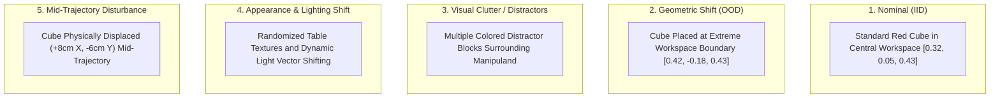
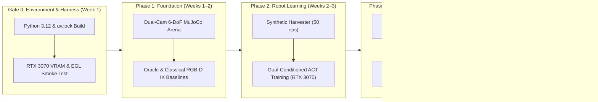

# Embodied AI Technical Dossier 01: Agentic Manipulation Benchmark
## Hierarchical Embodied Reasoning and Learned Visuomotor Control with Hugging Face LeRobot, MuJoCo, and Gemini Robotics ER 2

---

### Executive Summary & Meta-Information
* **Document Identifier:** `DOSSIER-01-AGENTIC-MANIPULATION`
* **Target Domain:** Embodied AI, Hierarchical Robot Learning, Visuomotor Control, Imitation Learning (IL), Dual-Rate Supervisory Agents
* **Author / Role:** Embodied AI & Robotics Lead Researcher / PDEng Scholar
* **Primary Stack (Locked Specification):**
  - **Python:** `3.12` (authoritative dependency resolution via committed `uv.lock`)
  - **Robot Learning Framework:** Hugging Face `lerobot==0.6.1` (standardizing on `LeRobotDataset v3.0` and `PolicyProcessorPipeline`)
  - **Physics Engine:** DeepMind `mujoco==3.12.0` (Headless Hardware-Accelerated EGL Rendering)
  - **Deep Learning Framework:** PyTorch & torchvision (version compatibility contract `torch>=2.7.0,<2.12.0` and `torchvision>=0.22.0,<0.27.0` matching LeRobot 0.6.1; validated and locked in Gate 0)
  - **Cognitive Vision-Language Tier:** Google `google-genai>=2.0.0` targeting `gemini-robotics-er-2-preview` (fixed model; no silent fallbacks)
* **Target Hardware Profile:** Edge/Local Workstation (NVIDIA GeForce RTX 3070 8GB VRAM, Ampere) + Cloud Cognitive Tier (Google Gemini Robotics ER Managed API)
* **Central Research Question:**
  > *"How much does agentic embodied reasoning and closed-loop failure recovery improve the robustness of learned visuomotor policies under geometric, visual, clutter, and physical disturbance shifts?"*
  *(Note: Task-level semantic generalization across novel tool classes is intentionally scoped as follow-up research to maintain empirical rigor within the exchange project envelope).*

---

## 1. SOTA Status: Frontier Analysis in Embodied AI

### 1.1 The Paradigm Shift: From Monolithic VLAs to Hierarchical Dual-Rate Systems
Robotic manipulation has transitioned from classical hand-crafted motion planners toward **End-to-End Imitation Learning (IL)** and **Vision-Language-Action (VLA) Foundation Models**. However, deploying monolithic foundation models presents severe operational trade-offs:
1. **Frequency Incompatibility:** Large multimodal models (7B+ parameters) execute inference at 1–5 Hz, whereas dynamic mechanical contact and grasp stabilization strictly require 20–50 Hz control loops.
2. **Spatial Hallucination & Compounding Drift:** Open-loop VLM planning suffers when visual occlusions occur or when grasps slip mid-trajectory.

The 2025–2026 frontier has stabilized around **Hierarchical Dual-Rate Embodied Orchestration**:
* A **Slow Cognitive Supervisory Tier (target cadence approximately 0.5–2 Hz or event-triggered, measured empirically)** running multimodal physical reasoning (Google Gemini Robotics ER 2) for zero-shot 2D spatial grounding, task decomposition, progress verification, and anomaly detection.
* A **Fast Visuomotor Execution Tier (50 Hz, $\Delta t = 20\,\text{ms}$)** running local policies (Hugging Face LeRobot ACT / Diffusion) for fluid, low-latency trajectory generation.

```
+---------------------------------------------------------------------------------------------------+
|                        1. COGNITIVE SUPERVISORY THREAD (Cloud API, Async)                         |
|                             Google gemini-robotics-er-2-preview                                  |
|   - Target Cadence: ~0.5 - 2 Hz / Event-Triggered (Empirically Measured, Cloud Decoupled)        |
|   - Zero-shot 2D spatial grounding & affordance boxes [ymin, xmin, ymax, xmax] in [0, 1000]       |
|   - Multi-step task decomposition: "reach_cube", "grasp_cube", "lift_cube", "transport_to_zone"  |
|   - Online progress assessment: success verification vs. grasp slippage / displacement            |
|   - Anomaly recovery: triggers atomic plan update + low-level policy queue reset                  |
+-------------------------------------------------+-------------------------------------------------+
                                                  | Updates Shared State (Non-Blocking)
                                                  v
+---------------------------------------------------------------------------------------------------+
|                              ATOMIC PLAN STATE (Thread-Safe Shared Memory)                        |
|   - Active Subgoal ID (One-Hot)                                                                   |
|   - Target 3D Point (Unprojected via Calibrated Depth)                                            |
|   - Destination 3D Point (Unprojected via Calibrated Depth)                                       |
|   - Replanning / Recovery Flag (Versioned Stamp)                                                 |
+-------------------------------------------------+-------------------------------------------------+
                                                  | Reads Latest Plan (Zero Network Wait)
                                                  v
+---------------------------------------------------------------------------------------------------+
|                        2. VISUOMOTOR EXECUTION THREAD (Deterministic 50 Hz, Local)                |
|                                Hugging Face LeRobot Policy Engine                                 |
|                                                                                                   |
|   +------------------------------------+   +--------------------------------------------------+   |
|   |  Goal-Conditioned ACT Policy       |   |  Classical Baseline (System A: RGB-D + IK)       |   |
|   |  - Dual ResNet18 (Top + Wrist)     |   |  - Calibrated Camera Ray Unprojection            |   |
|   |  - Proprioception (7-DoF)          |   |  - Color/Mask Segmentation                       |   |
|   |  - Goal Conditioning Vector g_t    |   |  - MuJoCo 6-DoF Jacobian DLS IK + PD             |   |
|   |  - PolicyProcessorPipeline         |   |                                                  |   |
|   |  - Action Queue Reset on Replan    |   |  [Oracle Baseline: Simulator State -> DLS IK]    |   |
|   +-----------------+------------------+   +------------------------+-------------------------+   |
|                     |                                               |                             |
|                     +-----------------------+-----------------------+                             |
|                                             | Joint Position Targets q* (50 Hz)                   |
|                                             v                                                     |
+---------------------------------------------------------------------------------------------------+
                                              | Actuator Commands (Position Servos)
                                              v
+---------------------------------------------------------------------------------------------------+
|                        3. PHYSICS SIMULATION TIER (DeepMind MuJoCo 3.12+)                         |
|   - Articulated 6-DoF Robotic Arm + Parallel Gripper (Single-Actuated Sliding Finger + Opposing Fixed Finger) |
|   - Rigid-body dynamics & contact solver running at 500 Hz (dt=0.002s, 10 substeps per step)      |
|   - Dual Synchronized Cameras: Static Overhead (Top) + In-Hand Wrist (Attached to End-Effector)   |
|   - Calibrated Pinhole Optics (Field of View fovy, Dynamic Intrinsics K, Extrinsics T_world_cam)  |
|   - Headless Hardware-Accelerated EGL Rendering (Zero X11 / Display Server Overhead)              |
|   - Perturbation & Distribution Shift Injection Engine                                            |
+---------------------------------------------------------------------------------------------------+
```

### 1.2 The Role of Key Technologies

#### Why Hugging Face `lerobot` (v0.6+)?
LeRobot has established itself as the modern standard across robotics learning:
* **Hardware-Agnostic Paradigm:** A modular pipeline covering `Teleoperate -> Record -> Train -> Deploy`.
* **Standardized Dataset Schema (`LeRobotDataset v3.0`):** Streaming Parquet metadata, timestamped action/state tensors, and chunked MP4 video streams.
* **Separation of Policy and Normalization (`PolicyProcessorPipeline`):** In LeRobot 0.6+, normalization statistics are moved outside policy weights into explicit preprocessor and postprocessor pipelines (`policy_preprocessor.json` and `policy_postprocessor.json`). This eliminates silent normalization mismatches between training and evaluation.
* **Production-Grade Implementations:** Standardized implementations of Action Chunking with Transformers (ACT) and Diffusion Policy with native `safetensors` and `accelerate` support.

#### Why DeepMind `mujoco`?
* **Physics Precision:** SOTA contact dynamics, dry friction, and constraint stabilization without the heavy simulation overhead of Omniverse/Isaac Sim.
* **Research Reproducibility:** Minimal dependency tree, fast headless CPU/EGL rendering, and cross-platform determinism make it the standard for robotic learning benchmarks.
* **Authentic Kinematic Chains:** Supports full multi-link articulated manipulators, position actuators, and calibrated camera sensors.

#### Why Gemini Robotics ER 2?
Google's Gemini Robotics ER 2 (`gemini-robotics-er-2-preview`) is purpose-built for physical reasoning:
* **2D Spatial Grounding:** Emits normalized `[y, x]` 2D points, normalized 2D bounding boxes `[ymin, xmin, ymax, xmax]`, and temporal video object tracking. These 2D groundings are converted to metric 3D coordinates via calibrated depth map unprojection.
* **Structured Semantic Schemas:** Emits schema-constrained Pydantic outputs paired with application-level semantic validation (bounds checking, coordinate sanity, and workspace bounding).
* **Multi-Step Task Decomposition:** Decomposes complex natural language goals into sequential subgoals with explicit progress tracking, enabling closed-loop anomaly detection and dynamic replanning.

---

## 2. Core Project Priority & Scope Boundaries

To guarantee high engineering depth and prevent the scope creep typical of short exchange projects, tasks are strictly categorized:

| Priority Tier | Component / Objective | Compute Target | Exchange Status |
| :--- | :--- | :--- | :---: |
| **MUST** | Reproducible environment validation via `uv.lock` & hardware sanity test | RTX 3070 | **Gate 0** |
| **MUST** | MuJoCo 6-DoF robotic manipulation arena with dual cameras (`overhead_cam` + in-hand `wrist_cam`) | CPU / EGL | **Gate 1** |
| **MUST** | Kinematic Baselines: Oracle (ground-truth state $\to$ IK) and System A (RGB-D unprojection $\to$ IK) | CPU | **Gate 1** |
| **MUST** | Automated demonstration harvester collecting 50 episodes in `LeRobotDataset v3.0` format | RTX 3070 | **Gate 2** |
| **MUST** | ACT training pipeline (dual ResNet18 + CVAE Transformer + `PolicyProcessorPipeline`) | RTX 3070 (8GB) | **Gate 3** |
| **MUST** | Gemini Robotics ER asynchronous supervisor with structured spatial grounding | Cloud API | **Gate 4** |
| **MUST** | 5-system quantitative benchmark (Oracle, A, B, C, D) across 5 distribution shifts ($N=20$ paired seeds) | RTX 3070 | **Gate 5** |
| **MUST** | Product-grade GitHub repository with telemetry HUD videos, manifest logs, and Wilson CIs | Clean Docs | **Gate 5** |
| **SHOULD** | Online closed-loop disturbance detection and autonomous queue-reset replanning | Cloud + 3070 | **High-Value Polish** |
| **STRETCH** | SmolVLA (450M) evaluation and inference comparison | RTX 3070 | Optional Upside |
| **FUTURE** | Physical arm deployment (SO-101 / LeKiwi), ROS2 bridge, $\pi_0$ / OpenVLA LoRA | Cluster / Hardware | Post-Exchange |

---

## 3. Academic Literature & Algorithmic Formulations

### 3.1 Landmark Research Papers

1. **ACT (Action Chunking with Transformers):**
   * *Authors:* Tony Z. Zhao, Vikash Kumar, Sergey Levine, Chelsea Finn (Stanford University)
   * *Venue:* RSS 2023. [arXiv:2304.13705]
   * *Insight:* Overcomes compounding error in behavioral cloning by predicting $K$-step future action chunks $\mathbf{A}_t \in \mathbb{R}^{K \times d}$ using a CVAE transformer encoder-decoder with temporal ensembling.

2. **Hierarchical VLA Orchestration:**
   * *Paper:* "What Matters in Orchestrating Robot Policies: A Systematic Study of Hierarchical VLA Agents"
   * *Venue:* arXiv:2606.10267 (2026); see also arXiv:2602.10983.
   * *Insight:* Demonstrates that decomposing high-level semantic planning from low-level continuous control provides superior generalization compared to monolithic end-to-end VLAs, especially when online verification is applied.

3. **Visuomotor Diffusion Policy:**
   * *Authors:* Cheng Chi, Siyuan Feng, Yilun Du, et al. (Columbia University & TRI)
   * *Venue:* RSS 2023 / IJRR 2024. [arXiv:2303.04137]
   * *Insight:* Formulates action trajectory generation as conditional denoising diffusion, effectively modeling multimodal operator behaviors.

4. **VoxPoser:**
   * *Authors:* Wenlong Huang, Chen Wang, Ruohan Zhang, et al. (Stanford University)
   * *Venue:* CoRL 2023. [arXiv:2307.05973]
   * *Insight:* Employs foundation models to ground 3D value maps for synthesis of robot trajectories without policy retraining.

---

### 3.2 Deep Mathematical Formulations

#### A. Action Chunking with CVAE (ACT) & Goal Conditioning Interface
Traditional Behavioral Cloning minimizes forward KL divergence:
$$\min_\theta \mathbb{E}_{(s_t, a_t) \sim \mathcal{D}} \left[ -\log \pi_\theta(a_t \mid s_t) \right]$$
Single-step autoregression accumulates drift $\mathcal{O}(T^2)$. ACT predicts continuous action chunks $\mathbf{A}_t = [a_t, a_{t+1}, \dots, a_{t+K-1}] \in \mathbb{R}^{K \times d_a}$.

A Conditional VAE with encoder $q_\phi(z \mid \mathbf{A}_t, s_t, g_t)$ and decoder $\pi_\theta(s_t, g_t, z)$ handles demonstration multimodality:
$$\mathcal{L}_{\text{ACT}}(\theta, \phi) = \mathbb{E}_{z \sim q_\phi(z \mid \mathbf{A}_t, s_t, g_t)} \left[ \sum_{k=0}^{K-1} \| a_{t+k} - \pi_\theta(s_t, g_t, z)_k \|_1 \right] + \beta D_{\text{KL}}\left( q_\phi(z \mid \mathbf{A}_t, s_t, g_t) \,\parallel\, p(z) \right)$$
where $p(z) = \mathcal{N}(0, \mathbf{I})$. At inference, the latent variable is fixed to the mean $z = 0$.

##### Explicit Goal Conditioning Vector $\mathbf{g}_t$ (System C & D)
To mathematically distinguish System B (pure observation-conditioned ACT) from System C/D (agentic goal-conditioned ACT), the policy receives an explicit goal vector:
$$\mathbf{g}_t = \begin{bmatrix} \mathbf{p}_{\text{target}}^{3D} \\ \mathbf{p}_{\text{dest}}^{3D} \\ \mathbf{e}_{\text{subgoal}} \end{bmatrix} \in \mathbb{R}^{11}$$
* $\mathbf{p}_{\text{target}}^{3D} \in \mathbb{R}^3$: Cartesian coordinates of the active manipuland target, unprojected from Gemini 2D bounding boxes using calibrated depth.
* $\mathbf{p}_{\text{dest}}^{3D} \in \mathbb{R}^3$: Cartesian coordinates of the target drop receptacle (fixed at $[0.32, -0.15, 0.43]\,\text{m}$ from calibrated layout).
* $\mathbf{e}_{\text{subgoal}} \in \{0, 1\}^5$: One-hot indicator of the active phase (`reach`, `grasp`, `lift`, `transport`, `recover`).

```
Gemini Robotics ER 2
        │
        ├── target_point_3d (unprojected from 2D grounding box)
        ├── destination_point_3d (calibrated receptacle position)
        └── subgoal_id
        │
        ▼
Goal Conditioning Vector (g_t in R^13)
        │
        ┌─────────┴──────────┐
        │                    │
  observations              environment_state (FeatureType.ENV)
  top RGB + wrist RGB    target xyz (3)
  proprioception (7)     destination xyz (3)
                         subgoal one-hot (7)
        │                    │
        └──────────┬─────────┘
                   ▼
       Stock LeRobot ACT Policy
  (encoder_env_state_input_proj)
```

> **Native Stock ACT Compatibility (Zero Fork Requirement):** Rather than creating custom observation keys (`observation.goal`) that stock LeRobot ignores, $\mathbf{g}_t$ is passed directly through stock LeRobot ACT's native `observation.environment_state` feature (`FeatureType.ENV` of dimension 13). In LeRobot 0.6.1, `ACTPolicy` natively provisions `encoder_env_state_input_proj` whenever `observation.environment_state` is present, embedding the supervisory goal tokens into the transformer stream alongside proprioceptive and visual tokens. The 7 one-hot categories represent the canonical primitives: `["reach", "grasp", "lift", "transport", "place", "retreat", "recover"]`.

> **Critical Training Requirement:** The synthetic demonstrations collected for training System C and D MUST record and contain this identical goal representation $\mathbf{g}_t$ in `observation.environment_state` alongside the image and proprioception streams. Goal conditioning cannot be retrofitted solely at inference time.

##### LeRobot ACT Inference Mode: Queue / Receding Horizon
LeRobot ACT supports two distinct inference topologies:
1. **Queue / Receding Horizon (Primary Benchmark Mode):** The policy predicts a chunk of $K = 50$ steps, executes $n = 10$ steps from its internal FIFO queue at 50 Hz, and replans at $\approx 5\,\text{Hz}$ ($\Delta t = 200\,\text{ms}$). This guarantees ample computational margin on consumer GPUs (NVIDIA RTX 3070 8GB) and provides clean, unambiguous recovery semantics:
   - When an anomaly or disturbance occurs, `policy.reset()` flushes the remaining queued actions and triggers immediate re-inference from the updated state.
2. **Temporal Ensembling (Secondary Ablation):** Infers a new chunk every single 50 Hz control step ($20\,\text{ms}$) and blends overlapping predictions via Exponential Moving Average (EMA). This is maintained as an optional secondary ablation, but is not the primary benchmark loop to prevent GPU compute saturation.

##### LeRobot 0.6+ PolicyProcessorPipeline Architecture
Following LeRobot 0.6+ standards, normalization must not be hardcoded as ad-hoc division (`/ 255.0`). The system strictly routes data through the standardized pipeline restored via `make_pre_post_processors(policy_cfg=..., pretrained_path=...)`:
$$\text{Raw MuJoCo Obs} \xrightarrow{} \text{Env Processor} \xrightarrow{} \text{Policy Preprocessor} \xrightarrow{} \text{ACT } \texttt{select\_action()} \xrightarrow{} \text{Policy Postprocessor} \xrightarrow{} \text{Actuator Cmd}$$
The environment boundary produces unbatched tensors `(C, H, W)`, `(7,)`, `(13,)`, leaving batch dimension ownership strictly to the LeRobot preprocessor pipeline (`AddBatchDimensionProcessorStep`).

#### B. Classical Perception & Kinematics Baselines (Rigorous Geometry)

##### 1. Dynamic Camera Calibration & 2D-to-3D Metric Unprojection
Rather than hardcoding arbitrary focal lengths or table offsets, camera intrinsics $\mathbf{K}$ are derived dynamically from the MuJoCo model's vertical field of view ($\texttt{fovy}$) and pixel buffer dimensions ($W, H$):
$$f_y = \frac{H}{2 \tan(\text{fovy} / 2)}, \quad f_x = \frac{W}{2 \tan(\text{fovx} / 2)} = f_y \quad (\text{square pixels})$$
$$c_x = \frac{W}{2}, \quad c_y = \frac{H}{2}, \quad \mathbf{K} = \begin{bmatrix} f_x & 0 & c_x \\ 0 & f_y & c_y \\ 0 & 0 & 1 \end{bmatrix}$$

Given 2D pixel coordinate $(u_c, v_c)$ and sampled depth $D(u_c, v_c)$:
* If $D(u_c, v_c) \le 0.01\,\text{m}$ or exceeds sensor clipping limits, the routine raises an explicit `INVALID_DEPTH` exception. Fabricating heuristic default depth values (e.g., $0.6\,\text{m}$) is strictly prohibited in formal benchmarks.
* Optical ray in camera coordinates:
  $$\mathbf{P}_C = D(u_c, v_c) \cdot \mathbf{K}^{-1} \begin{bmatrix} u_c \\ v_c \\ 1 \end{bmatrix}$$
* World frame transformation using MuJoCo camera extrinsics ($\mathbf{t}_{WC} = \texttt{data.cam\_xpos[cam\_id]}$, $\mathbf{R}_{WC} = \texttt{data.cam\_xmat[cam\_id]}$):
  $$\mathbf{P}_W = \mathbf{t}_{WC} + \mathbf{R}_{WC} \mathbf{P}_C$$

##### 2. Differential Inverse Kinematics (Damped Least Squares / Levenberg-Marquardt)
Given end-effector Cartesian position error $\mathbf{e} = \mathbf{x}_{\text{target}} - \mathbf{x}_{\text{current}} \in \mathbb{R}^3$, the joint velocity correction $\Delta \mathbf{q} \in \mathbb{R}^6$ is computed using the end-effector site translation Jacobian $\mathbf{J}_{\text{arm}}(\mathbf{q}) \in \mathbb{R}^{3 \times 6}$:
$$\Delta \mathbf{q} = \mathbf{J}_{\text{arm}}^T \left( \mathbf{J}_{\text{arm}} \mathbf{J}_{\text{arm}}^T + \lambda^2 \mathbf{I} \right)^{-1} \mathbf{e}$$
where $\lambda = 0.05$ is a damping coefficient preventing numerical singularity divergence.

##### 3. Low-Level Position Servo Control
Joint targets $\mathbf{q}^* = \mathbf{q} + \text{clip}(\Delta \mathbf{q}, -\Delta \mathbf{q}_{\max}, \Delta \mathbf{q}_{\max})$ are tracked via MuJoCo position actuators:
$$\boldsymbol{\tau} = \mathbf{K}_p (\mathbf{q}^* - \mathbf{q}) - \mathbf{K}_d \dot{\mathbf{q}}$$

---

## 4. Hardware Feasibility & Realistic VRAM Budgets

### 4.1 Planning Envelopes on RTX 3070 (8GB VRAM)

Consumer GPU benchmarking requires establishing empirical planning envelopes before training. Below is the hardware planning envelope for local and cloud execution:

```
====================================================================================================================
MODEL FAMILY             TRAINING VRAM (PLANNING)     INFERENCE VRAM (FP16)    FEASIBILITY ON RTX 3070 (8GB)
====================================================================================================================
ACT (Dual ResNet18)      ~3.5 - 5.5 GB (Batch=8/16)   ~1.2 GB (50 Hz)          Target Envelope (Validate in Gate 0)
ACT (DINOv2 ViT-B)       ~8.5 - 12.0 GB (Batch=8)     ~2.4 GB (35 Hz)          Inference Only (OOM on Train)
Diffusion Policy         ~8.0 - 14.0 GB (Batch=32)    ~1.8 GB (50 Hz)          Inference Only (Requires >8GB Train)
SmolVLA-450M             ~10.0 - 16.0 GB (Full/BF16)  ~1.5 GB (4-bit/FP16)     Inference OK (Train on Cloud/4090)
pi_0 / pi_0-FAST         ~24.0 - 40.0 GB              ~6.0 GB (BF16)           Out of Scope for 8GB
OpenVLA-7B (LoRA)        ~27.0 - 32.0 GB (A100 min)   ~4.8 GB (NF4 Quantized)  Out of Scope for 8GB
====================================================================================================================
```

### 4.2 Engineering Discipline: Bounded Memory Budget (<6.0 GB Envelope)
1. **Memory Budget Planning:** Training ACT with dual ResNet18 visual backbones (`top` overhead camera + in-hand `wrist` camera) consumes an estimated **~4.2 GB VRAM** under PyTorch mixed precision (`torch.cuda.amp.autocast`), leaving a safe buffer on the 8GB RTX 3070.
2. **Empirical Gate 0 Validation:** Rather than assuming static memory figures, the researcher logs empirical hardware metrics during Gate 0:
   * `peak_vram_mb`: Monitored via `torch.cuda.max_memory_allocated()`.
   * `steps_per_second`: Effective batch processing throughput.
   * `training_duration`: Wall-clock time across 50 demonstration episodes.
   * `inference_p50` & `inference_p99`: 50 Hz control loop latency percentiles.
3. **Local Visuomotor Execution:** Motor execution runs 100% locally at 50 Hz. Only the supervisory layer calls the Gemini API at ~0.5–2 Hz asynchronously.

---

## 5. Research Question & Benchmark Methodology

Instead of asking *"Can we get a robot to move with Gemini and LeRobot?"*, this project investigates:

> **"Under which distribution shifts does hierarchical semantic reasoning provide measurable benefits over pure imitation learning, and how much does closed-loop anomaly replanning recover failed tasks?"**

### 5.1 The Evaluated Systems (Clear Separation of Baselines)

To maintain scientific clarity, the benchmark evaluates five distinct system configurations:

| System ID | Perception & Reasoning Tier | Low-Level Controller | Control Paradigm | Goal Conditioning Vector |
| :--- | :--- | :--- | :--- | :--- |
| **Oracle** | Ground-truth MuJoCo state (`data.xpos`) | Jacobian DLS IK + PD | Kinematic Upper Bound | Direct analytical pose |
| **System A (Classical)** | RGB-D unprojection + color segmentation | Jacobian DLS IK + PD | Classical Vision-Guided | None (local geometric) |
| **System B (Pure ACT)** | Dual RGB (`top` + `wrist`) + Proprioception | LeRobot ACT Policy (50 Hz) | Unconditioned Visuomotor IL | None (implicit visual) |
| **System C (Agentic ACT)** | Gemini ER 2 (Async ~0.5–2 Hz) $\to$ $\mathbf{g}_t$ | LeRobot ACT Policy (50 Hz) | Hierarchical Open-Loop | Explicit $\mathbf{g}_t \in \mathbb{R}^{11}$ |
| **System D (Agentic + Recovery)**| Gemini ER 2 Online Verification $\to$ Replanning | LeRobot ACT + `policy.reset()` | Hierarchical Closed-Loop | Dynamically Replanned $\mathbf{g}_t$ |

### 5.2 The 5 Evaluation Conditions (Stress-Testing Generalization)



### 5.3 Empirical Metric Protocol & Statistical Rigor

To guarantee scientific credibility and statistical reproducibility, all evaluations adhere to the following protocol:
* **Paired Scenario Seeds:** Evaluated across $N=20$ randomized rollouts per condition. Every system (Oracle, A, B, C, D) receives the exact identical environment state and disturbance vector per seed (`seed 001` .. `seed 020`).
* **Confidence Intervals:**
  - For binary success proportions (Grasp Success, Task Completion, Disturbance Recovery), report **Wilson 95% Score Confidence Intervals**:
    $$w = \frac{\hat{p} + \frac{z^2}{2N} \pm z \sqrt{\frac{\hat{p}(1-\hat{p})}{N} + \frac{z^2}{4N^2}}}{1 + \frac{z^2}{N}}, \quad z = 1.96$$
  - For continuous metrics, report sample mean $\pm$ sample standard deviation along with non-parametric **Bootstrap 95% CIs** (10,000 resamples).
* **Metrics:**
  - **Grasp Success Rate (%):** Object lifted $>5\,\text{cm}$ above the table plane.
  - **Task Completion Rate (%):** Object deposited cleanly within the target drop zone.
  - **Disturbance Recovery Rate (%):** Successful task completion following mid-trajectory disturbance injection.
  - **Mean Trajectory Jerk ($\text{rad}/\text{s}^3$):** Proxy for motion smoothness and aggressive actuator command variation:
    $$j = \frac{1}{T} \sum_{t=1}^T \left\| \frac{\mathbf{q}_t - 3\mathbf{q}_{t-1} + 3\mathbf{q}_{t-2} - \mathbf{q}_{t-3}}{\Delta t^3} \right\|_2$$
    *(Direct mechanical wear/stress assessment requires physical motor current/torque instrumentation on hardware).*
  - **Control Loop Latency (ms):** Mean and 99th-percentile inference latency for the 50 Hz execution thread.
* **Scenario Manifest Logging (`scenario_manifest.jsonl`):**
  Every rollout automatically writes a comprehensive provenance record containing:
  `seed`, `cube_initial_pose`, `target_zone_pose`, `distractor_poses`, `texture_seed`, `lighting_vector`, `disturbance_time_step`, `disturbance_displacement`, `model_name`, `checkpoint_sha256`, `git_commit_hash`.

---

## 6. Architectural Reference Scaffold: `agentic_manipulation_benchmark.py`

This module provides the architectural reference scaffold defining:
1. Authentic 6-DoF articulated robot arm + single-actuated parallel gripper with opposing fixed finger MJCF with attached `ee_site` and in-hand `wrist_cam`.
2. Asynchronous concurrency: Cognitive supervisor thread decoupled from the deterministic 50 Hz control thread via a thread-safe `AtomicPlanState`.
3. Dynamic camera calibration and ray unprojection with explicit `INVALID_DEPTH` error handling.
4. Schema-constrained Pydantic supervisor with application-level validation and fixed `gemini-robotics-er-2-preview` model routing (no silent fallback).
5. Goal-conditioned ACT policy interface with LeRobot 0.6+ `PolicyProcessorPipeline` scaffolding and explicit `policy.reset()` queue flushing upon disturbance recovery.
6. Unified benchmark dispatch executing Oracle, System A, System B, System C, and System D.

*(Note: Regard this implementation as an architectural reference scaffold to guide repository development; full empirical validation occurs across Gates 0–5).*

```python
"""
agentic_manipulation_benchmark.py
Architectural Reference Scaffold:
- DeepMind MuJoCo: 6-DoF Articulated Robot Arm + Gripper + Dual Cameras (Overhead & In-Hand Wrist)
- Dynamic Camera Calibration: FOV-derived K matrix + world unprojection (INVALID_DEPTH guarded)
- Cognitive Supervisory Tier: Asynchronous Gemini Robotics ER 2 (~0.5-2 Hz) with Thread-Safe Shared State
- Visuomotor Policy Tier: 50 Hz Goal-Conditioned ACT with LeRobot PolicyProcessorPipeline & policy.reset()
- Full Benchmark Dispatch: Oracle, System A (Classical), System B (ACT), System C (Agentic), System D (Recovery)
"""

import os
import sys
import time
import threading
from typing import List, Optional, Tuple, Dict, Any, Literal
import numpy as np
import cv2
import torch
import mujoco
from pydantic import BaseModel, Field, field_validator
from google import genai
from google.genai import types

# Enforce EGL headless rendering before MuJoCo contexts initialize
os.environ.setdefault("MUJOCO_GL", "egl")

# -----------------------------------------------------------------------------
# 1. Authentic Articulated 6-DoF Robot Arm Model (MJCF)
# -----------------------------------------------------------------------------
REFERENCE_ARM_MJCF = """
<mujoco model="embodied_6dof_arm">
    <compiler angle="radian" coordinate="local"/>
    <option gravity="0 0 -9.81" timestep="0.002" integrator="implicitfast"/>
    <visual>
        <global offwidth="640" offheight="480"/>
    </visual>
    
    <asset>
        <texture type="skybox" builtin="gradient" rgb1="0.3 0.5 0.7" rgb2="0 0 0" width="512" height="512"/>
        <texture name="grid" type="2d" builtin="checker" width="512" height="512" rgb1="0.2 0.3 0.4" rgb2="0.1 0.15 0.2"/>
        <material name="grid" texture="grid" texrepeat="1 1" texuniform="true" reflectance="0.2"/>
    </asset>

    <worldbody>
        <light directional="true" pos="0 0 3" dir="0 0 -1" diffuse="0.8 0.8 0.8" specular="0.3 0.3 0.3"/>
        <geom name="floor" type="plane" size="1.2 1.2 0.1" material="grid"/>
        <geom name="table" type="box" pos="0.3 0 0.2" size="0.4 0.5 0.2" rgba="0.85 0.85 0.88 1"/>
        
        <!-- 6-DoF Articulated Robot Arm: qpos[0:6] = joints 1..6, qpos[6] = finger_joint1 -->
        <body name="base" pos="0 0 0.4">
            <geom name="base_link" type="cylinder" size="0.06 0.02" rgba="0.25 0.25 0.28 1"/>
            <body name="link1" pos="0 0 0.04">
                <joint name="joint1" type="hinge" axis="0 0 1" range="-3.1416 3.1416" damping="1.5" armature="0.05"/>
                <geom name="l1" type="capsule" fromto="0 0 0 0 0 0.1" size="0.035" rgba="0.2 0.45 0.75 1" mass="0.8"/>
                <body name="link2" pos="0 0 0.1">
                    <joint name="joint2" type="hinge" axis="0 1 0" range="-1.5708 1.5708" damping="1.5" armature="0.05"/>
                    <geom name="l2" type="capsule" fromto="0 0 0 0 0 0.16" size="0.03" rgba="0.2 0.45 0.75 1" mass="0.6"/>
                    <body name="link3" pos="0 0 0.16">
                        <joint name="joint3" type="hinge" axis="0 1 0" range="-1.5708 1.5708" damping="1.0" armature="0.03"/>
                        <geom name="l3" type="capsule" fromto="0 0 0 0 0 0.16" size="0.025" rgba="0.2 0.45 0.75 1" mass="0.4"/>
                        <body name="gripper_base" pos="0 0 0.16">
                            <joint name="joint4" type="hinge" axis="0 0 1" range="-3.1416 3.1416" damping="0.5" armature="0.02"/>
                            <joint name="joint5" type="hinge" axis="0 1 0" range="-1.5708 1.5708" damping="0.5" armature="0.02"/>
                            <joint name="joint6" type="hinge" axis="1 0 0" range="-3.1416 3.1416" damping="0.5" armature="0.02"/>
                            <geom name="palm" type="box" size="0.025 0.035 0.015" rgba="0.15 0.15 0.18 1" mass="0.2"/>
                            
                            <!-- End-Effector Kinematic Site Attached to End-Effector -->
                            <site name="ee_site" pos="0 0 0.04" size="0.008" rgba="0 1 0 1"/>
                            
                            <!-- In-Hand Wrist Camera Attached to Gripper Base -->
                            <camera name="wrist_cam" pos="0 0.035 0.02" euler="0 0.5 1.5708"/>
                            
                            <!-- Single-Actuated Parallel Gripper (Sliding finger_joint1 + opposing fixed finger) -->
                            <body name="finger_left" pos="0 0.025 0.035">
                                <joint name="finger_joint1" type="slide" axis="0 1 0" range="-0.025 0.025" damping="0.5" armature="0.01"/>
                                <geom name="f1" type="box" size="0.006 0.006 0.025" rgba="0.9 0.75 0.1 1" mass="0.05" friction="1.5 0.01 0.001"/>
                            </body>
                            <body name="finger_right" pos="0 -0.025 0.035">
                                <geom name="f2" type="box" size="0.006 0.006 0.025" rgba="0.9 0.75 0.1 1" mass="0.05" friction="1.5 0.01 0.001"/>
                            </body>
                        </body>
                    </body>
                </body>
            </body>
        </body>

        <!-- Manipuland Cube (Freejoint, dynamic indexing safe) -->
        <body name="target_cube" pos="0.32 0.05 0.43">
            <freejoint name="cube_joint"/>
            <geom name="cube_geom" type="box" size="0.022 0.022 0.022" rgba="0.92 0.15 0.15 1" mass="0.05" friction="1.2 0.005 0.0001"/>
        </body>

        <!-- Receptacle Target Zone -->
        <body name="target_zone" pos="0.32 -0.15 0.401">
            <geom name="zone_marker" type="cylinder" size="0.06 0.002" rgba="0.1 0.8 0.2 0.6"/>
        </body>

        <!-- Overhead Static Camera Attached to Worldbody -->
        <camera name="overhead_cam" pos="0.65 0 0.9" euler="0 0.75 1.5708"/>
    </worldbody>

    <!-- Robot Actuator Interface (Position Servos) -->
    <actuator>
        <position name="act_j1" joint="joint1" kp="60"/>
        <position name="act_j2" joint="joint2" kp="60"/>
        <position name="act_j3" joint="joint3" kp="50"/>
        <position name="act_j4" joint="joint4" kp="30"/>
        <position name="act_j5" joint="joint5" kp="30"/>
        <position name="act_j6" joint="joint6" kp="30"/>
        <position name="act_gripper" joint="finger_joint1" kp="30"/>
    </actuator>
</mujoco>
"""

# -----------------------------------------------------------------------------
# 2. Dynamic Camera Geometry & Calibrated 3D Metric Unprojection
# -----------------------------------------------------------------------------
class InvalidDepthError(Exception):
    """Raised when sampled depth violates operational camera bounds."""
    pass

class CameraGeometry:
    """
    Derives intrinsic matrix K and extrinsic transformation T_world_cam dynamically
    from MuJoCo camera parameters, performing metric unprojection with bound checks.
    """
    def __init__(self, model: mujoco.MjModel, camera_name: str, width: int = 640, height: int = 480):
        self.model = model
        self.camera_name = camera_name
        self.camera_id = mujoco.mj_name2id(model, mujoco.mjtObj.mjOBJ_CAMERA, camera_name)
        if self.camera_id == -1:
            raise ValueError(f"Camera '{camera_name}' not found in MuJoCo model.")
        self.width = width
        self.height = height

        # Derive intrinsics from vertical field of view (fovy)
        fovy_rad = np.deg2rad(self.model.cam_fovy[self.camera_id])
        self.fy = (height / 2.0) / np.tan(fovy_rad / 2.0)
        self.fx = self.fy  # Standard square pixels
        self.cx = width / 2.0
        self.cy = height / 2.0
        self.K = np.array([
            [self.fx, 0.0, self.cx],
            [0.0, self.fy, self.cy],
            [0.0, 0.0, 1.0]
        ], dtype=np.float64)
        self.inv_K = np.linalg.inv(self.K)

    def unproject_pixel_to_world(
        self,
        u: float,
        v: float,
        depth: float,
        data: mujoco.MjData,
        min_depth: float = 0.05,
        max_depth: float = 2.5
    ) -> np.ndarray:
        """
        Unprojects a 2D pixel coordinate (u, v) and metric depth into 3D world coordinates.
        Raises InvalidDepthError if depth reading is outside valid physical range.
        """
        if not (min_depth <= depth <= max_depth) or np.isnan(depth):
            raise InvalidDepthError(f"INVALID_DEPTH: Sampled depth {depth:.4f}m outside [{min_depth}, {max_depth}]m")

        # Camera frame optical ray
        p_cam = depth * (self.inv_K @ np.array([u, v, 1.0], dtype=np.float64))

        # Extrinsics from MuJoCo data (cam_xpos and cam_xmat)
        cam_pos = data.cam_xpos[self.camera_id]
        cam_rot = data.cam_xmat[self.camera_id].reshape(3, 3)

        # MuJoCo camera coordinate convention: +X right, +Y up, -Z optical axis
        # Standard robotics optical frame: +X right, +Y down, +Z optical axis
        r_mujoco_optical = np.array([
            [1.0,  0.0,  0.0],
            [0.0, -1.0,  0.0],
            [0.0,  0.0, -1.0]
        ], dtype=np.float64)

        p_world = cam_pos + cam_rot @ (r_mujoco_optical @ p_cam)
        return p_world

# -----------------------------------------------------------------------------
# 3. Cognitive Supervisory Tier & Thread-Safe Concurrency
# -----------------------------------------------------------------------------
class SpatialGroundingPlan(BaseModel):
    """Structured spatial grounding plan emitted by Gemini Robotics ER 2.
    Note on safety: should_halt is a supervisory software request; physical hardware
    must enforce safety-rated emergency stop, joint limits, and watchdogs below this layer.
    """
    sub_goal: Literal["reach", "grasp", "lift", "transport", "place", "retreat", "recover"] = Field(
        description="Canonical active sub-task primitive"
    )
    target_object: str = Field(description="Identified manipuland name, e.g. 'red_cube'")
    target_box_2d: List[int] = Field(description="Normalized [ymin, xmin, ymax, xmax] in [0, 1000]")
    destination_box_2d: Optional[List[int]] = Field(default=None, description="Receptacle [ymin, xmin, ymax, xmax]")
    task_progress: Literal["in_progress", "completed", "failure_detected"] = Field(
        default="in_progress", description="'in_progress', 'completed', or 'failure_detected'"
    )
    requires_replanning: bool = Field(default=False, description="True if anomaly or grasp failure detected")
    replan_id: int = Field(default=0, description="Monotonically increasing identifier for anomaly recovery events")
    confidence_score: float = Field(default=1.0, ge=0.0, le=1.0)
    should_halt: bool = Field(default=False, description="Supervisory software halt request if anomaly detected")
    decision_note: Optional[str] = Field(default="", description="Short operational observation, e.g. 'target shifted', 'grasp verified'")

    @field_validator("target_box_2d", "destination_box_2d")
    @classmethod
    def validate_box(cls, v: Optional[List[int]]) -> Optional[List[int]]:
        if v is None:
            return v
        if len(v) != 4:
            raise ValueError("Bounding box must contain exactly 4 normalized coordinates.")
        if not (0 <= v[0] < v[2] <= 1000 and 0 <= v[1] < v[3] <= 1000):
            raise ValueError("Bounding box coordinates must satisfy 0 <= min < max <= 1000.")
        return v

class SupervisorAPIError(Exception):
    """Raised when cognitive API calls fail after exhaustive retries."""
    pass

class CognitiveSupervisor:
    """
    Cognitive supervisor running on gemini-robotics-er-2-preview.
    Enforces application-level semantic validation and exponential backoff retry.
    Never silently falls back to a different model.
    """
    def __init__(self, api_key: Optional[str] = None, model_name: str = "gemini-robotics-er-2-preview"):
        self.api_key = api_key or os.environ.get("GEMINI_API_KEY")
        self.client = genai.Client(api_key=self.api_key) if self.api_key else None
        self.model_name = model_name

    def analyze_scene(
        self,
        rgb_image: np.ndarray,
        task_instruction: str,
        current_subgoal: str = "initial",
        max_retries: int = 2
    ) -> SpatialGroundingPlan:
        if not self.client:
            raise RuntimeError("GEMINI_API_KEY is not set. Cannot run remote CognitiveSupervisor.")

        _, buffer = cv2.imencode(".jpg", cv2.cvtColor(rgb_image, cv2.COLOR_RGB2BGR))
        image_bytes = buffer.tobytes()

        prompt = f"""
        You are the cognitive supervisory brain for an articulated 6-DoF robotic manipulator.
        Task Goal: "{task_instruction}"
        Current Phase: "{current_subgoal}"

        Instructions:
        1. Identify the target manipuland box in normalized coordinates [ymin, xmin, ymax, xmax] in 0-1000.
        2. Identify destination receptacle box if appropriate.
        3. Assess progress: if the cube slipped, was displaced, or is unreachable, set requires_replanning=True.
        4. Emit next actionable subgoal: 'reach', 'grasp', 'lift', 'transport', or 'recover'.
        """

        last_err = None
        for attempt in range(max_retries + 1):
            try:
                response = self.client.models.generate_content(
                    model=self.model_name,
                    contents=[types.Part.from_bytes(data=image_bytes, mime_type="image/jpeg"), prompt],
                    config=types.GenerateContentConfig(
                        response_mime_type="application/json",
                        response_schema=SpatialGroundingPlan,
                        temperature=0.1
                    )
                )
                plan = SpatialGroundingPlan.model_validate_json(response.text)
                return plan
            except Exception as e:
                last_err = e
                if attempt < max_retries:
                    time.sleep(0.5 * (2 ** attempt))

        raise SupervisorAPIError(f"CognitiveSupervisor failed on {self.model_name} after {max_retries} retries: {last_err}")

class LatestFrameBuffer:
    """
    Thread-safe frame buffer completely decoupling MuJoCo simulation from
    the asynchronous cloud supervisory thread.
    Only the simulation thread ever touches MuJoCo rendering contexts.
    """
    def __init__(self):
        self._lock = threading.Lock()
        self.rgb_overhead: Optional[np.ndarray] = None
        self.depth_overhead: Optional[np.ndarray] = None
        self.rgb_wrist: Optional[np.ndarray] = None
        self.step_idx: int = 0

    def push(
        self,
        rgb_overhead: np.ndarray,
        depth_overhead: Optional[np.ndarray] = None,
        rgb_wrist: Optional[np.ndarray] = None,
        step_idx: int = 0
    ):
        with self._lock:
            self.rgb_overhead = rgb_overhead.copy()
            self.depth_overhead = depth_overhead.copy() if depth_overhead is not None else None
            self.rgb_wrist = rgb_wrist.copy() if rgb_wrist is not None else None
            self.step_idx = step_idx

    def get_latest(self) -> Tuple[Optional[np.ndarray], Optional[np.ndarray], Optional[np.ndarray], int]:
        with self._lock:
            if self.rgb_overhead is None:
                return None, None, None, 0
            return (
                self.rgb_overhead.copy(),
                self.depth_overhead.copy() if self.depth_overhead is not None else None,
                self.rgb_wrist.copy() if self.rgb_wrist is not None else None,
                self.step_idx
            )

class AtomicPlanState:
    """Thread-safe shared state container for asynchronous supervisory communication."""
    def __init__(self):
        self._lock = threading.Lock()
        self.plan: Optional[SpatialGroundingPlan] = None
        self.target_pos_world: Optional[np.ndarray] = None
        self.dest_pos_world: Optional[np.ndarray] = None
        self.subgoal_id: int = 0
        self.version: int = 0
        self.latest_replan_id: int = 0

    def update(
        self,
        plan: SpatialGroundingPlan,
        target_pos_world: Optional[np.ndarray] = None,
        dest_pos_world: Optional[np.ndarray] = None,
        subgoal_id: int = 0
    ):
        with self._lock:
            self.plan = plan
            self.target_pos_world = target_pos_world
            self.dest_pos_world = dest_pos_world
            self.subgoal_id = subgoal_id
            self.version += 1
            if plan.requires_replanning:
                if plan.replan_id > 0:
                    self.latest_replan_id = plan.replan_id
                else:
                    self.latest_replan_id += 1

    def get_snapshot(self) -> Tuple[Optional[SpatialGroundingPlan], Optional[np.ndarray], Optional[np.ndarray], int, int]:
        with self._lock:
            return self.plan, self.target_pos_world, self.dest_pos_world, self.subgoal_id, self.version

    def check_and_consume_replan(self, last_consumed_id: int) -> Tuple[bool, int]:
        """Edge-triggered recovery: True only if a new recovery event occurred."""
        with self._lock:
            if self.latest_replan_id > last_consumed_id:
                return True, self.latest_replan_id
            return False, last_consumed_id

# -----------------------------------------------------------------------------
# 4. Classical Robotics Baselines (Oracle & System A)
# -----------------------------------------------------------------------------
class ClassicalIKController:
    """
    Jacobian Damped Least Squares (DLS) Inverse Kinematics controller for 6-DoF arm
    with downward-constrained gripper orientation and 7-stage Pick-and-Place state machine.
    """
    def __init__(self, model: mujoco.MjModel, data: mujoco.MjData, damping: float = 0.05):
        self.model = model
        self.data = data
        self.damping = damping
        self.ee_site_id = mujoco.mj_name2id(model, mujoco.mjtObj.mjOBJ_SITE, "ee_site")
        self.arm_joint_names = ["joint1", "joint2", "joint3", "joint4", "joint5", "joint6"]
        self.arm_qpos_indices = [self.model.jnt_qposadr[self.model.joint(j).id] for j in self.arm_joint_names]
        self.gripper_qpos_idx = self.model.jnt_qposadr[self.model.joint("finger_joint1").id]

        # 7-stage Pick-and-Place state machine tracking
        self.stage: str = "PREGRASP"
        self.stage_timer: int = 0

    def reset_state_machine(self):
        self.stage = "PREGRASP"
        self.stage_timer = 0

    def clip_action(self, action: np.ndarray) -> np.ndarray:
        """Applies actuator-specific command limits (arm: [-pi, pi], gripper: [-0.025, 0.025])."""
        clipped = action.copy()
        clipped[:6] = np.clip(clipped[:6], -3.14159, 3.14159)
        if len(clipped) > 6:
            clipped[6] = np.clip(clipped[6], -0.025, 0.025)
        return clipped

    def solve_ik_step(
        self,
        target_pos_world: np.ndarray,
        target_rot_world: Optional[np.ndarray] = None,
        gripper_cmd: float = 0.02,
        orientation_weight: float = 0.15
    ) -> np.ndarray:
        """
        Computes 7-element actuator target position vector [q1..q6, q_grip] via 6D Pose IK.
        Supports explicit SO(3) target orientation or positional IK with downward nullspace posture.
        """
        current_ee_pos = self.data.site_xpos[self.ee_site_id] if self.ee_site_id != -1 else self.data.xpos[self.model.body("gripper_base").id]
        pos_error = target_pos_world - current_ee_pos

        jac_pos = np.zeros((3, self.model.nv))
        jac_rot = np.zeros((3, self.model.nv))
        if self.ee_site_id != -1:
            mujoco.mj_jacSite(self.model, self.data, jac_pos, jac_rot, self.ee_site_id)
        else:
            mujoco.mj_jacBody(self.model, self.data, jac_pos, jac_rot, self.model.body("gripper_base").id)

        j_pos_arm = jac_pos[:, :6]
        j_rot_arm = jac_rot[:, :6]

        if target_rot_world is not None:
            current_ee_mat = self.data.site_xmat[self.ee_site_id].reshape(3, 3) if self.ee_site_id != -1 else self.data.xmat[self.model.body("gripper_base").id].reshape(3, 3)
            rot_error = 0.5 * (
                np.cross(current_ee_mat[:, 0], target_rot_world[:, 0]) +
                np.cross(current_ee_mat[:, 1], target_rot_world[:, 1]) +
                np.cross(current_ee_mat[:, 2], target_rot_world[:, 2])
            )
            w = orientation_weight
            j_6d = np.vstack([j_pos_arm, w * j_rot_arm])
            e_6d = np.concatenate([pos_error, w * rot_error])
            lambda_sq = (self.damping ** 2) * np.eye(6)
            dq = j_6d.T @ np.linalg.inv(j_6d @ j_6d.T + lambda_sq) @ e_6d
        else:
            lambda_sq = (self.damping ** 2) * np.eye(3)
            j_pinv = j_pos_arm.T @ np.linalg.inv(j_pos_arm @ j_pos_arm.T + lambda_sq)
            dq_pos = j_pinv @ pos_error
            pan = np.arctan2(target_pos_world[1], target_pos_world[0])
            q_posture = np.array([pan, 0.6, 0.6, 0.0, 0.8, 0.0])
            current_q = np.array([self.data.qpos[idx] for idx in self.arm_qpos_indices])
            n_proj = np.eye(6) - j_pinv @ j_pos_arm
            dq = dq_pos + n_proj @ (0.4 * (q_posture - current_q))

        current_q = np.array([self.data.qpos[idx] for idx in self.arm_qpos_indices])
        target_arm_q = current_q + np.clip(dq, -0.08, 0.08)
        raw_action = np.concatenate([target_arm_q, [gripper_cmd]])
        return self.clip_action(raw_action)

    def step_pick_and_place(
        self,
        cube_pos: np.ndarray,
        receptacle_pos: np.ndarray = np.array([0.32, -0.15, 0.43])
    ) -> Tuple[np.ndarray, str, bool]:
        """
        Executes one 50 Hz control step of the 7-stage finite-state machine:
        PREGRASP -> APPROACH -> GRASP -> LIFT -> TRANSPORT -> PLACE -> RETREAT
        Returns (action_7d, active_stage_name, is_task_completed).
        """
        self.stage_timer += 1
        current_ee_pos = self.data.site_xpos[self.ee_site_id] if self.ee_site_id != -1 else self.data.xpos[self.model.body("gripper_base").id]
        is_completed = False

        if self.stage == "PREGRASP":
            target = cube_pos + np.array([0.0, 0.0, 0.08])
            action = self.solve_ik_step(target, gripper_cmd=0.02)
            if np.linalg.norm(current_ee_pos - target) < 0.02 or self.stage_timer > 40:
                self.stage = "APPROACH"
                self.stage_timer = 0

        elif self.stage == "APPROACH":
            target = cube_pos + np.array([0.0, 0.0, 0.01])
            action = self.solve_ik_step(target, gripper_cmd=0.02)
            if np.linalg.norm(current_ee_pos - target) < 0.015 or self.stage_timer > 30:
                self.stage = "GRASP"
                self.stage_timer = 0

        elif self.stage == "GRASP":
            target = cube_pos + np.array([0.0, 0.0, 0.01])
            action = self.solve_ik_step(target, gripper_cmd=-0.02)
            if self.stage_timer > 25:
                self.stage = "LIFT"
                self.stage_timer = 0

        elif self.stage == "LIFT":
            target = cube_pos + np.array([0.0, 0.0, 0.12])
            action = self.solve_ik_step(target, gripper_cmd=-0.02)
            if current_ee_pos[2] > cube_pos[2] + 0.06 or self.stage_timer > 35:
                self.stage = "TRANSPORT"
                self.stage_timer = 0

        elif self.stage == "TRANSPORT":
            target = receptacle_pos + np.array([0.0, 0.0, 0.08])
            action = self.solve_ik_step(target, gripper_cmd=-0.02)
            if np.linalg.norm(current_ee_pos[:2] - target[:2]) < 0.03 or self.stage_timer > 50:
                self.stage = "PLACE"
                self.stage_timer = 0

        elif self.stage == "PLACE":
            target = receptacle_pos + np.array([0.0, 0.0, 0.02])
            action = self.solve_ik_step(target, gripper_cmd=0.02)  # Open gripper
            if self.stage_timer > 25:
                self.stage = "RETREAT"
                self.stage_timer = 0

        elif self.stage == "RETREAT":
            target = np.array([0.25, 0.0, 0.55])
            action = self.solve_ik_step(target, gripper_cmd=0.02)
            is_completed = True

        else:
            action = np.array([self.data.qpos[idx] for idx in self.arm_qpos_indices] + [0.02])

        return action, self.stage, is_completed

# -----------------------------------------------------------------------------
# 5. Visuomotor Policy Tier: LeRobot ACT with Processors & Goal Conditioning
# -----------------------------------------------------------------------------
SUBGOAL_MAP = {"reach": 0, "grasp": 1, "lift": 2, "transport": 3, "place": 4, "retreat": 5, "recover": 6}

class GoalConditionedACTPolicyExecutor:
    """
    Integrates Hugging Face LeRobot ACTPolicy conforming to the LeRobot 0.6+ processing flow:
    raw MuJoCo observation -> environment processor -> LeRobot policy preprocessor ->
    ACT select_action() -> LeRobot postprocessor -> environment/action adapter -> MuJoCo actuator.
    
    Primary Benchmark Execution Mode:
    - Queue / Receding Horizon (chunk_size=50, n_action_steps=10, temporal_ensemble_coeff=None)
    - Control frequency: 50 Hz, nominal inference cadence: ~5 Hz (every 10 steps).
    - Recovery: policy.reset() flushes cached action queue and triggers immediate inference.
    - Stock ACT environment state vector observation.environment_state in R^13 (target xyz, dest xyz, one-hot subgoal)
    - Checkpoint-restored pre/post processors via make_pre_post_processors
    - Unbatched observation boundary tensors (LeRobot pipeline owns batch dimension)
    - Actuator-specific command clipping (arm: [-pi, pi], gripper: [-0.025, 0.025])
    """
    def __init__(
        self,
        pretrained_policy_path: Optional[str] = None,
        chunk_size: int = 50,
        n_action_steps: int = 10,
        device: str = "cuda" if torch.cuda.is_available() else "cpu"
    ):
        self.device = torch.device(device)
        self.chunk_size = chunk_size
        self.n_action_steps = n_action_steps
        self.policy = None
        self.preprocessor = None
        self.postprocessor = None

        if pretrained_policy_path and os.path.exists(pretrained_policy_path):
            try:
                from lerobot.policies.act import ACTPolicy
                self.policy = ACTPolicy.from_pretrained(pretrained_policy_path).to(self.device)
                self.policy.eval()
                self.policy.reset()

                # LeRobot 0.6+ official factory for restoring checkpoint pre/post-processors
                try:
                    from lerobot.policies.factory import make_pre_post_processors
                    self.preprocessor, self.postprocessor = make_pre_post_processors(
                        policy_cfg=self.policy.config,
                        pretrained_path=pretrained_policy_path,
                    )
                    print(f"[PolicyExecutor] Restored pre/post processors from {pretrained_policy_path}")
                except Exception as e:
                    raise RuntimeError(
                        f"Failed to load policy pre/post-processors from checkpoint {pretrained_policy_path}: {e}"
                    ) from e

                print(f"[PolicyExecutor] Loaded LeRobot ACTPolicy from {pretrained_policy_path}")
            except Exception as e:
                print(f"[PolicyExecutor] LeRobot checkpoint load notice: {e}. Defaulting to scaffold.")

    def reset(self):
        """Flushes LeRobot internal action queue buffer during replanning."""
        if self.policy is not None and hasattr(self.policy, "reset"):
            self.policy.reset()

    def environment_processor(
        self,
        rgb_top: np.ndarray,
        rgb_wrist: np.ndarray,
        proprioception: np.ndarray,
        goal_vector: Optional[np.ndarray] = None
    ) -> Dict[str, torch.Tensor]:
        """
        Stage 1: Raw MuJoCo observation -> Environment Processor.
        Produces UNBATCHED tensors:
        - images: (C, H, W)
        - state: (7,)
        - environment_state: (13,)
        The LeRobot preprocessor pipeline owns batching (via AddBatchDimensionProcessorStep).
        """
        batch = {
            "observation.images.top": torch.from_numpy(rgb_top).permute(2, 0, 1).to(self.device),
            "observation.images.wrist": torch.from_numpy(rgb_wrist).permute(2, 0, 1).to(self.device),
            "observation.state": torch.from_numpy(proprioception).float().to(self.device)
        }
        if goal_vector is not None:
            # Stock ACT encoder_env_state_input_proj consumes FeatureType.ENV (13-DoF)
            batch["observation.environment_state"] = torch.from_numpy(goal_vector).float().to(self.device)
        return batch

    def environment_action_adapter(self, action: Any) -> np.ndarray:
        """
        Stage 5: Environment / Action Adapter -> MuJoCo actuator command.
        Converts postprocessed tensor to numpy joint command with actuator-specific clipping:
        Arm joints 1..6 clip to [-pi, pi], gripper finger clips to [-0.025, 0.025].
        """
        if isinstance(action, torch.Tensor):
            if action.dim() > 1:
                action_np = action.squeeze(0).detach().cpu().numpy()
            else:
                action_np = action.detach().cpu().numpy()
        else:
            action_np = np.asarray(action)
        clipped = np.copy(action_np)
        clipped[:6] = np.clip(clipped[:6], -3.14159, 3.14159)
        if len(clipped) > 6:
            clipped[6] = np.clip(clipped[6], -0.025, 0.025)
        return clipped

    def select_action(
        self,
        rgb_top: np.ndarray,
        rgb_wrist: np.ndarray,
        proprioception: np.ndarray,
        goal_vector: Optional[np.ndarray] = None
    ) -> np.ndarray:
        """
        Executes full LeRobot 0.6+ pipeline at 50 Hz:
        raw MuJoCo obs -> env processor -> policy preprocessor -> ACT select_action() -> postprocessor -> action adapter.
        """
        if self.policy is not None:
            batch = self.environment_processor(rgb_top, rgb_wrist, proprioception, goal_vector)
            if self.preprocessor is not None:
                batch = self.preprocessor(batch)
            else:
                batch["observation.images.top"] = (batch["observation.images.top"].float() / 255.0).unsqueeze(0)
                batch["observation.images.wrist"] = (batch["observation.images.wrist"].float() / 255.0).unsqueeze(0)
                batch["observation.state"] = batch["observation.state"].unsqueeze(0)
                if "observation.environment_state" in batch:
                    batch["observation.environment_state"] = batch["observation.environment_state"].unsqueeze(0)

            with torch.no_grad():
                raw_action = self.policy.select_action(batch)

            if self.postprocessor is not None:
                processed_action = self.postprocessor(raw_action)
            else:
                processed_action = raw_action

            return self.environment_action_adapter(processed_action)

        return proprioception

# -----------------------------------------------------------------------------
# 6. Simulation Arena & Multi-System Benchmark Execution
# -----------------------------------------------------------------------------
class MuJoCoManipulationArena:
    """MuJoCo simulation arena wrapping 6-DoF arm, dual cameras, and physics stepping."""
    def __init__(self):
        self.model = mujoco.MjModel.from_xml_string(REFERENCE_ARM_MJCF)
        self.data = mujoco.MjData(self.model)
        self.renderer = mujoco.Renderer(self.model, height=480, width=640)

        # Dynamic camera geometry helpers
        self.cam_overhead = CameraGeometry(self.model, "overhead_cam", width=640, height=480)
        self.cam_wrist = CameraGeometry(self.model, "wrist_cam", width=640, height=480)

        # Joint & actuator indexing
        self.arm_joint_names = ["joint1", "joint2", "joint3", "joint4", "joint5", "joint6", "finger_joint1"]
        self.arm_qpos_indices = [self.model.jnt_qposadr[self.model.joint(j).id] for j in self.arm_joint_names]
        self.cube_body_id = self.model.body("target_cube").id

        self.reset()

    def reset(self):
        mujoco.mj_resetData(self.model, self.data)
        neutral_qpos = np.array([0.0, -0.4, 0.8, 0.0, 0.4, 0.0, 0.02], dtype=np.float64)
        for idx, val in zip(self.arm_qpos_indices, neutral_qpos):
            self.data.qpos[idx] = val
        self.data.ctrl[:len(neutral_qpos)] = neutral_qpos
        mujoco.mj_forward(self.model, self.data)

    def render_overhead_rgbd(self) -> Tuple[np.ndarray, np.ndarray]:
        self.renderer.disable_depth_rendering()
        self.renderer.update_scene(self.data, camera="overhead_cam")
        rgb = self.renderer.render()

        self.renderer.enable_depth_rendering()
        self.renderer.update_scene(self.data, camera="overhead_cam")
        depth = self.renderer.render()
        return rgb, depth

    def render_wrist_rgb(self) -> np.ndarray:
        self.renderer.disable_depth_rendering()
        self.renderer.update_scene(self.data, camera="wrist_cam")
        return self.renderer.render()

    def get_proprioception(self) -> np.ndarray:
        return np.array([self.data.qpos[idx] for idx in self.arm_qpos_indices], dtype=np.float32)

    def get_cube_ground_truth_pos(self) -> np.ndarray:
        return np.array(self.data.xpos[self.cube_body_id], dtype=np.float64)

    def apply_disturbance(self):
        """Applies deterministic mid-trajectory state displacement perturbation (+8cm X, -6cm Y)."""
        cube_joint_id = self.model.joint("cube_joint").id
        qadr = self.model.jnt_qposadr[cube_joint_id]
        self.data.qpos[qadr] += 0.08      # +8cm X displacement
        self.data.qpos[qadr + 1] -= 0.06  # -6cm Y displacement
        mujoco.mj_forward(self.model, self.data)
        print("💥 [Disturbance Injected] Cube displaced (+8cm X, -6cm Y) via deterministic state perturbation!")

    def step(self, action: np.ndarray):
        """Advances physics by 10 substeps (dt=0.002s * 10 = 20ms = 50 Hz) with per-actuator clipping."""
        clipped = np.copy(action)
        clipped[:6] = np.clip(clipped[:6], -3.14159, 3.14159)
        if len(clipped) > 6:
            clipped[6] = np.clip(clipped[6], -0.025, 0.025)
        self.data.ctrl[:len(clipped)] = clipped
        for _ in range(10):
            mujoco.mj_step(self.model, self.data)

def run_benchmark_episode(system_id: str = "system_d", has_disturbance: bool = True):
    """
    Executes a benchmark episode for one of:
    - 'oracle': Ground-truth state -> 7-stage Pick-and-Place FSM -> DLS IK
    - 'system_a': Classical RGB-D perception -> calibrated unprojection -> 7-stage FSM -> DLS IK
    - 'system_b': Pure unconditioned ACT policy
    - 'system_c': Hierarchical open-loop: Gemini ER 2 initial plan -> Goal-conditioned ACT
    - 'system_d': Hierarchical closed-loop: Gemini ER 2 async monitoring + edge-triggered policy.reset() recovery
    """
    print(f"\n================ Running Benchmark: {system_id.upper()} (Disturbance={has_disturbance}) ================")
    arena = MuJoCoManipulationArena()
    ik_controller = ClassicalIKController(arena.model, arena.data)
    policy_executor = GoalConditionedACTPolicyExecutor()
    shared_plan_state = AtomicPlanState()
    frame_buffer = LatestFrameBuffer()

    goal_instruction = "Grasp the red cube and place it into the green receptacle zone."
    receptacle_pos = np.array([0.32, -0.15, 0.43])  # Calibrated destination receptacle
    stop_event = threading.Event()

    # Push initial frame into decoupled buffer
    rgb_init, depth_init = arena.render_overhead_rgbd()
    rgb_wrist_init = arena.render_wrist_rgb()
    frame_buffer.push(rgb_init, depth_init, rgb_wrist_init, step_idx=0)

    # -------------------------------------------------------------------------
    # Asynchronous Cognitive Supervisory Loop (Decoupled from MuJoCo Context)
    # -------------------------------------------------------------------------
    def supervisor_worker():
        if not os.environ.get("GEMINI_API_KEY"):
            return
        try:
            supervisor = CognitiveSupervisor()
        except Exception as err:
            print(f"[Supervisor] Init failed: {err}")
            return

        while not stop_event.is_set():
            rgb_snap, depth_snap, _, _ = frame_buffer.get_latest()
            if rgb_snap is None or depth_snap is None:
                time.sleep(0.02)
                continue

            current_plan, _, _, _, _ = shared_plan_state.get_snapshot()
            curr_subgoal = current_plan.sub_goal if current_plan else "reach"

            try:
                plan = supervisor.analyze_scene(rgb_snap, goal_instruction, current_subgoal=curr_subgoal)

                # Unproject 2D box to metric 3D using calibrated camera geometry
                ymin, xmin, ymax, xmax = plan.target_box_2d
                u_center = int(np.clip((xmin + xmax) / 2000.0 * 640, 0, 639))
                v_center = int(np.clip((ymin + ymax) / 2000.0 * 480, 0, 479))
                d_val = float(depth_snap[v_center, u_center])

                target_3d = arena.cam_overhead.unproject_pixel_to_world(u_center, v_center, d_val, arena.data)
                subgoal_idx = SUBGOAL_MAP.get(plan.sub_goal, 0)

                shared_plan_state.update(plan, target_3d, receptacle_pos, subgoal_idx)
                print(f"[Supervisor Async] Subgoal: {plan.sub_goal} | Replan Needed: {plan.requires_replanning} | Replan ID: {plan.replan_id}")
            except (InvalidDepthError, SupervisorAPIError) as err:
                print(f"[Supervisor Async Error] {err}")

            time.sleep(0.5)  # Measured empirical target cadence (~2 Hz)

    # Concurrency Dispatch: System D has continuous online recovery; System C is open-loop
    supervisor_thread = threading.Thread(target=supervisor_worker, daemon=True)
    if system_id == "system_d":
        supervisor_thread.start()
    elif system_id == "system_c":
        if os.environ.get("GEMINI_API_KEY"):
            try:
                sup = CognitiveSupervisor()
                init_plan = sup.analyze_scene(rgb_init, goal_instruction, current_subgoal="reach")
                ymin, xmin, ymax, xmax = init_plan.target_box_2d
                u_c = int((xmin + xmax) / 2000.0 * 640)
                v_c = int((ymin + ymax) / 2000.0 * 480)
                d_c = float(depth_init[v_c, u_c])
                t3d = arena.cam_overhead.unproject_pixel_to_world(u_c, v_c, d_c, arena.data)
                shared_plan_state.update(init_plan, t3d, receptacle_pos, SUBGOAL_MAP.get(init_plan.sub_goal, 0))
            except Exception as e:
                print(f"[System C Init Plan Notice] {e}")

    last_consumed_replan = 0
    sim_steps = 750  # 15.0 seconds at 50 Hz control rate (timeout threshold)
    termination_reason = "timeout"

    for step in range(sim_steps):
        tick_start = time.perf_counter()
        t_sec = step * 0.02
        proprio = arena.get_proprioception()
        rgb_top, depth_top = arena.render_overhead_rgbd()
        rgb_wrist = arena.render_wrist_rgb()

        # Push frame to buffer for non-blocking supervisor consumption
        frame_buffer.push(rgb_top, depth_top, rgb_wrist, step_idx=step)

        # Inject deterministic mid-trajectory state displacement perturbation at t = 2.0s
        if step == 100 and has_disturbance:
            arena.apply_disturbance()

        # Read latest asynchronous plan state without blocking control thread
        plan, target_3d, dest_3d, subgoal_idx, _ = shared_plan_state.get_snapshot()

        # Edge-Triggered Dynamic Recovery Queue Reset for System D
        if system_id == "system_d":
            needs_recovery, new_replan_id = shared_plan_state.check_and_consume_replan(last_consumed_replan)
            if needs_recovery:
                last_consumed_replan = new_replan_id
                print(f"[{t_sec:.2f}s] 🔄 [Recovery] Edge-triggered event {new_replan_id} detected! Resetting LeRobot action queue...")
                policy_executor.reset()

        # Multi-condition early termination checks
        if plan is not None and plan.should_halt:
            print(f"[{t_sec:.2f}s] 🛑 [Software Halt] Supervisor requested halt: {plan.decision_note}")
            termination_reason = "software_halt"
            break

        cube_pos = arena.get_cube_ground_truth_pos()
        if cube_pos[2] < 0.2:  # Cube dropped below workspace
            print(f"[{t_sec:.2f}s] ❌ [Failure] Cube dropped below workspace (z={cube_pos[2]:.3f}m).")
            termination_reason = "unrecoverable_failure"
            break

        dist_to_zone = np.linalg.norm(cube_pos[:2] - receptacle_pos[:2])
        if dist_to_zone < 0.03 and cube_pos[2] < 0.44 and (plan and plan.sub_goal in ("place", "retreat")):
            print(f"[{t_sec:.2f}s] ✅ [Success] Task complete! Cube successfully placed in target zone.")
            termination_reason = "task_complete"
            break

        # ---------------------------------------------------------------------
        # 50 Hz Controller Dispatch
        # ---------------------------------------------------------------------
        if system_id == "oracle":
            # Oracle: Ground-truth cube position -> 7-stage Pick-and-Place FSM -> DLS IK
            gt_cube_pos = arena.get_cube_ground_truth_pos()
            action, stage, completed = ik_controller.step_pick_and_place(gt_cube_pos, receptacle_pos)
            if step % 25 == 0:
                print(f"[{t_sec:.2f}s] [Oracle] Stage: {stage} | Completed: {completed}")

        elif system_id == "system_a":
            # System A: Classical RGB-D perception -> calibrated unprojection -> 7-stage FSM -> DLS IK
            hsv = cv2.cvtColor(rgb_top, cv2.COLOR_RGB2HSV)
            mask = cv2.inRange(hsv, np.array([0, 120, 70]), np.array([10, 255, 255]))
            coords = np.argwhere(mask > 0)
            if len(coords) > 10:
                v_c, u_c = np.mean(coords, axis=0)
                d_c = float(depth_top[int(v_c), int(u_c)])
                try:
                    p_target = arena.cam_overhead.unproject_pixel_to_world(u_c, v_c, d_c, arena.data)
                except InvalidDepthError as err:
                    print(f"[{t_sec:.2f}s] ⚠️ [System A INVALID_DEPTH] {err}")
                    p_target = None
            else:
                p_target = None

            if p_target is not None:
                action, stage, completed = ik_controller.step_pick_and_place(p_target, receptacle_pos)
            else:
                action = proprio  # Safe pose holding on perception failure

        elif system_id == "system_b":
            # System B: Pure unconditioned ACT policy
            action = policy_executor.select_action(rgb_top, rgb_wrist, proprio, goal_vector=None)

        elif system_id in ["system_c", "system_d"]:
            # System C & D: Goal-conditioned ACT policy with 13-DoF environment_state (target xyz, dest xyz, 7-class one-hot)
            if target_3d is not None and dest_3d is not None:
                subgoal_one_hot = np.zeros(7, dtype=np.float32)
                subgoal_one_hot[subgoal_idx] = 1.0
                goal_vec = np.concatenate([target_3d.astype(np.float32), dest_3d.astype(np.float32), subgoal_one_hot])
            else:
                goal_vec = np.zeros(13, dtype=np.float32)

            action = policy_executor.select_action(rgb_top, rgb_wrist, proprio, goal_vector=goal_vec)

        else:
            action = proprio

        # Advance physics at 50 Hz
        arena.step(action)

        # 50 Hz Real-Time Wall-Clock Pacing for Systems C & D (Cloud-in-the-Loop)
        if system_id in ["system_c", "system_d"]:
            elapsed = time.perf_counter() - tick_start
            if elapsed < 0.02:
                time.sleep(0.02 - elapsed)

    stop_event.set()
    print(f"Benchmark Episode Completed for {system_id.upper()} after {step + 1} steps | Reason: {termination_reason}.")

if __name__ == "__main__":
    run_benchmark_episode(system_id="system_d", has_disturbance=True)
```

---

## 7. Product-Grade Repository Architecture

To establish an exceptional portfolio asset that signals commercial engineering readiness within 20 seconds, the codebase is structured as a modular product:

```
agentic-manipulation/
├── README.md                      # Problem -> Architecture -> 30s Video -> Benchmark Table -> Reproduction
├── pyproject.toml                 # Modern PEP 621 packaging with uv support
├── uv.lock                        # Authoritative deterministic dependency lockfile
├── configs/                       # Hydra / YAML policy, environment & evaluation configs
│   ├── act_default.yaml
│   └── benchmark_shifts.yaml
├── src/
│   └── lerobot_agentic/
│       ├── sim/                   # MuJoCo MJCF arenas, 6-DoF arm, dual cameras, disturbance injection
│       ├── controllers/           # Classical baseline: SE(3) unprojection & Jacobian DLS IK
│       ├── policy/                # LeRobot ACT wrappers with PolicyProcessorPipeline & reset()
│       ├── cognitive/             # Gemini Robotics ER 2 supervisor, thread-safe plan state & replanner
│       └── utils/                 # Video recorder, telemetry HUD, scenario manifest logger
├── scripts/
│   ├── record_dataset.py          # Harvester collecting 50 episodes in LeRobotDataset format
│   ├── train_policy.py            # Local ACT training on RTX 3070 with PyTorch AMP
│   ├── evaluate.py                # 5-system comparative evaluation CLI across 5 shifts
│   └── record_hud_video.py        # Side-by-side dual-camera telemetry MP4 generator
├── tests/                         # Unit tests (Kinematics, EGL rendering, schemas, offline CV)
├── outputs/
│   ├── benchmarks/                # Machine-readable evaluation outputs (eval_results.json, CSV, manifest)
│   │   └── scenario_manifest.jsonl
│   └── videos/                    # High-resolution H.264 benchmark rollout recordings
├── DATASET_CARD.md                # Hugging Face format dataset provenance, features, and metadata
├── MODEL_CARD.md                  # Policy weights, hyperparameters, loss curves, and limitations
└── REPORT.md                      # Formal research writeup with LaTeX math, figures, and findings
```

---

## 8. Strategic 5-Phase Implementation Roadmap & Frozen Architectural Contract

The roadmap incorporates a preliminary **Gate 0** to lock dependencies and verify hardware before algorithmic development begins:



### Gate 0: Reproducible Environment & Verification Harness (Week 1)
* [ ] Python 3.12 environment builds deterministically from locked specification (`uv.lock`).
* [ ] CUDA acceleration verified on RTX 3070 (`torch.cuda.is_available() == True`).
* [ ] MuJoCo EGL headless rendering produces valid RGB and depth buffers for both cameras.
* [ ] Hugging Face `lerobot` imports without deprecation warnings.
* [ ] LeRobot `PolicyProcessorPipeline` (preprocessor $\to$ policy $\to$ postprocessor) smoke test passes.
* [ ] One dummy forward pass of `ACTPolicy` executes within the RTX 3070 memory envelope ($<5.5\,\text{GB}$).
* [ ] Gemini Robotics ER 2 API call succeeds with `gemini-robotics-er-2-preview`.
* [ ] Schema validation passes with application-level spatial checks (`validate_box`).
* [ ] Unit test suite passes 100% (`pytest tests/`).

### Phase 1: Robotics Foundation & Kinematics Baselines (Weeks 1–2)
* Establish dual-camera MuJoCo arena (`overhead_cam` + in-hand `wrist_cam` on `gripper_base`).
* Implement and unit test the analytical 3D unprojection and MuJoCo Jacobian DLS IK controller on the 6-DoF arm.
* Verify Oracle baseline (ground-truth state $\to$ IK) and System A baseline (RGB-D segmentation $\to$ IK).

### Phase 2: Robot Learning & Imitation Pipeline (Weeks 2–3)
* Construct an algorithmic oracle to record 50 validated pick-and-place episodes.
* Stream episodes into standard `LeRobotDataset v3.0` format with synchronized MP4 video, joint trajectories, and goal vectors $\mathbf{g}_t$.
* Train local ACT policy (`ACTPolicy`) on RTX 3070 using PyTorch mixed precision (`torch.cuda.amp`), logging `peak_vram_mb` and verifying convergence in $<1\,\text{hour}$.

### Phase 3: Agentic Supervisory Tier & Anomaly Recovery (Weeks 3–4)
* Connect Google `gemini-robotics-er-2-preview` to provide structured spatial grounding (`SpatialGroundingPlan`).
* Build thread-safe `AtomicPlanState` decoupling the asynchronous supervisor loop (~0.5–2 Hz) from the 50 Hz execution loop.
* Implement closed-loop anomaly detection: when an object slips or is perturbed, the supervisor flags `requires_replanning=True`, triggering `policy.reset()` and dynamic replanning.

### Phase 4: Research Benchmarking & Productized Portfolio (Weeks 4–5)
* Execute the full comparative benchmark across all 5 systems and 5 distribution shifts ($N=20$ paired seeds per condition).
* Generate machine-readable benchmark reports (`eval_results.json`, CSV summaries, and `scenario_manifest.jsonl`).
* Calculate Wilson 95% Score CIs for success proportions and bootstrap CIs for continuous metrics.
* Render split-screen telemetry HUD videos (`[Overhead Cam | Wrist Cam]` with live joint jerk, active subgoal, and state indicators).
* Finalize `DATASET_CARD.md`, `MODEL_CARD.md`, and `REPORT.md`.

---

### Recommended Frozen Research & Architectural Contract

```
NATURAL LANGUAGE TASK
        │
        ▼
Google Gemini Robotics ER 2 (Async Supervisory Loop, ~0.5–2 Hz)
        │ Target 2D Point / Subgoal / Progress Status
        ▼
ATOMIC PLAN STATE (Thread-Safe Shared Memory)
        │
        ├─────────────────────────────────────────────────┐
        │                                                 │
        ▼                                                 ▼
System A: Classical RGB-D Pipeline                System C/D: Goal-Conditioned ACT
- Local Color/Mask Segmentation                   - Dual RGB: Overhead + In-Hand Wrist
- Calibrated Ray Unprojection (INVALID_DEPTH)     - Proprioception (7-DoF)
- MuJoCo 6-DoF Jacobian DLS IK                    - Goal Conditioning Vector g_t in R^11
        │                                         - LeRobot PolicyProcessorPipeline
        │                                                 │
        └────────────────────────┬────────────────────────┘
                                 │
                                 ▼
                    MuJoCo 6-DoF Arm + Gripper
                                 │
                                 │ 50 Hz Control Rate (dt=20ms)
                                 │ Multi-Camera Observations
                                 ▼
                     Gemini Online Verification
                                 │
                                 ├── [Nominal] -> Continue Execution
                                 │
                                 └── [Disturbance Detected]
                                         │
                                         ▼
                                  Update Goal State
                                         │
                                         ▼
                                  Reset ACT Queue (policy.reset())
                                         │
                                         ▼
                                  Execute Recovery Replan
```

#### Final Benchmark Scope Matrix
1. **Oracle:** Ground-truth simulation state $\to$ Jacobian DLS IK $\to$ PD (Kinematic Upper Bound)
2. **System A:** Classical RGB-D vision $\to$ Calibrated 3D unprojection $\to$ Jacobian DLS IK $\to$ PD
3. **System B:** Pure Visuomotor ACT (Dual RGB + Proprioception, unconditioned)
4. **System C:** Agentic ACT (Gemini Robotics ER 2 async supervisory grounding $\to$ goal vector $\mathbf{g}_t \to$ ACT)
5. **System D:** Agentic ACT + Closed-Loop Online Anomaly Recovery (`policy.reset()` queue flushing upon replanning)

### Optional Stretch & Future Scope (Post-Phase 4)
* **Stretch Goal 1:** SmolVLA (450M) inference and evaluation comparison against ACT.
* **Future Extension 1:** Deploying the compiled policy to physical open-hardware arms (SO-101 / LeKiwi) over low-latency USB serial, empirically measuring the sim-to-real transfer gap.
* **Future Extension 2:** Interfacing the policy adapter with ROS2 nodes on commercial industrial manipulators.
