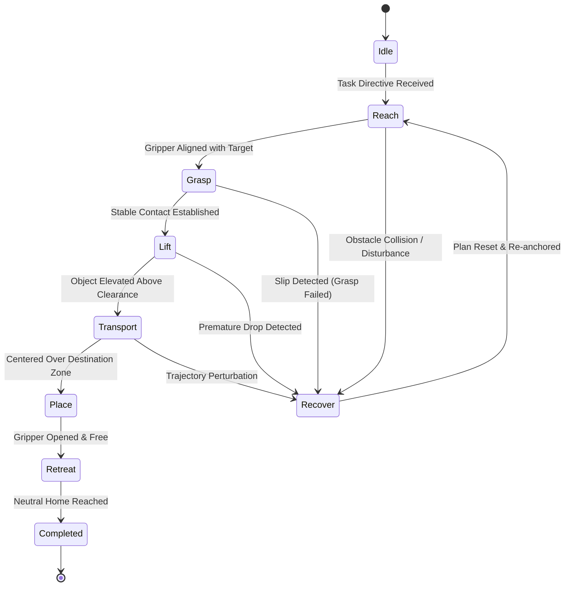
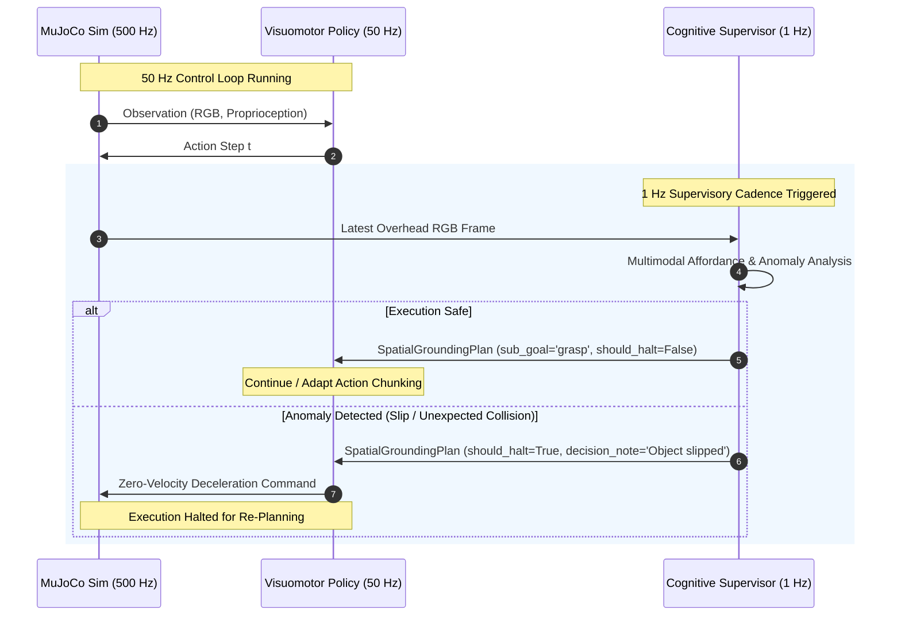

# Subsystem 01: Cognitive Supervisory Tier

The **Cognitive Supervisory Tier** constitutes the high-level semantic reasoning and spatial grounding engine of `lerobot-agentic`. Operating asynchronously at **1–2 Hz** ($\Delta t = 500\text{--}1000\,\text{ms}$), this subsystem bridges unconstrained natural language instructions with low-level continuous robotic actions by continuously parsing visual scenes, grounding objects in 2D normalized coordinate spaces, decomposing goals into atomic stages, and verifying physical execution safety.

---

## 1. Architectural Role & Design Principles

End-to-end visuomotor policies (e.g., ACT, Diffusion Policy) exhibit remarkable precision at high frequencies (50 Hz), but lack open-world semantic generalization, commonsense spatial reasoning, and dynamic recovery capabilities. Conversely, large Vision-Language Models (VLMs) excel at semantic reasoning and zero-shot grounding, but cannot directly emit 50 Hz motor commands without severe latency and kinematic instability.

The Cognitive Supervisory Tier decouples these competencies:
1. **Semantic Abstraction**: Translates high-level human directives (e.g., *"Grasp the red cube and lift it into the workspace"*) into structured, type-safe intermediate representations.
2. **Spatial Affordance Grounding**: Regresses 2D bounding boxes for target manipulands and destination receptacles in normalized image space $[0, 1000]$.
3. **Discrete Stage Decomposition**: Maintains an atomic state machine across execution phases (`reach`, `grasp`, `lift`, `transport`, `place`).
4. **Safety & Closed-Loop Anomaly Verification**: Monopolizes emergency intervention by identifying visual anomalies, slips, or kinematic deviations and asserting execution halts (`should_halt = True`).

```
+-------------------------------------------------------------------------------------------------+
|                                    COGNITIVE SUPERVISORY TIER                                    |
|                                                                                                 |
|   Natural Language Directive                         Overhead RGB Frame (480x640x3)             |
|                │                                                    │                           |
|                ▼                                                    ▼                           |
|   ┌───────────────────────────┐                      ┌───────────────────────────┐              |
|   │ Task Semantic Parser      │                      │ Multi-Modal Vision Buffer │              |
|   └────────────┬──────────────┘                      └──────────────┬────────────┘              |
|                │                                                    │                           |
|                └─────────────────────────┬──────────────────────────┘                           |
|                                          ▼                                                      |
|                       ┌─────────────────────────────────────┐                                   |
|                       │ Gemini Robotics ER Engine           │                                   |
|                       │ (gemini-robotics-er-2-preview)      │                                   |
|                       │ Fixed Model; Deterministic Retries  │                                   |
|                       └──────────────────┬──────────────────┘                                   |
|                                          ▼                                                      |
|                       ┌─────────────────────────────────────┐                                   |
|                       │ Structured Pydantic Serialization   │                                   |
|                       │ (SpatialGroundingPlan)              │                                   |
|                       └──────────────────┬──────────────────┘                                   |
|                                          │                                                      |
|        ┌─────────────────────────────────┴─────────────────────────────────┐                    |
|        ▼                                 ▼                                 ▼                    |
| ┌──────────────┐                 ┌──────────────┐                  ┌──────────────┐             |
| │ Atomic       │                 │ Normalized   │                  │ Safety &     │             |
| │ Sub-Goal     │                 │ Bounding Box │                  │ Anomaly Flag │             |
| └──────┬───────┘                 └──────┬───────┘                  └──────┬───────┘             |
+--------│--------------------------------│---------------------------------│---------------------+
         ▼                                ▼                                 ▼
   To Policy Tier                   To Policy Tier                    To Execution Loop
   (Stage Selector)                 (Affordance Target)               (Emergency Halt)
```

---

## 2. Multi-Modal Perception & Model Hierarchy

The Cognitive Supervisor implements a multi-tier model cascade to balance reasoning depth, token latency, and local availability:

### 2.1 Primary Reasoning Engine: `gemini-robotics-er-2-preview`
The primary engine leverages Google's frontier Embodied Reasoning model (`gemini-robotics-er-2-preview`). Specially trained on robotic manipulation trajectories, coordinate geometry, and spatial affordances, it performs direct bounding box regression and multi-step reasoning over input camera frames:
- **Input Modality**: Overhead workspace camera RGB image (JPEG-compressed byte buffer) + task context prompt.
- **Inference Mode**: Direct structured JSON generation via `google-genai` SDK with strict Pydantic schema enforcement.
- **Latency Target**: Planning target of $\sim 450\text{--}800\,\text{ms}$ per round-trip query, to be empirically profiled during Gate 0.

### 2.2 Fixed Supervisory Protocol & Deterministic Retry
To maintain scientific experimental rigor (preventing silent mutation of the independent variable), the system strictly fixes the cognitive model to `gemini-robotics-er-2-preview` across Systems C and D.
- **Predetermined Retry Policy:** Transient network or rate limit errors trigger an immediate exponential backoff retry (up to 2 retries with interval $0.5 \times 2^{\text{attempt}}$ seconds).
- **Episode Invalidation Protocol:** If the cloud API remains unreachable after exhausted retries, the system raises an explicit `SupervisorAPIError`, logging the episode seed for invalidation and scheduled re-execution. Silently falling back to a different language model during benchmark rollouts is prohibited.

### 2.3 Local Heuristic & OpenCV Fallback
If `GEMINI_API_KEY` is completely omitted from the environment, the supervisory tier falls back to a deterministic local perception pipeline:
- Color segmentation and contour centroid analysis in HSV color space (`cv2.inRange`, `cv2.findContours`).
- Default centered spatial priors ($[450, 480, 550, 560]$ in normalized coordinates).
- Step-indexed state machine transition across the 7 canonical primitives.

---

## 3. The Pydantic Contract: `SpatialGroundingPlan`

All outputs from the Cognitive Supervisory Tier conform to a strongly-typed Pydantic model (`lerobot_agentic.cognitive.schemas.SpatialGroundingPlan`). This contract guarantees deterministic serialization between cloud LLM responses and local downstream motor execution.

> [!IMPORTANT]
> **Supervisory Software Request vs. Hardware E-Stop**: The `should_halt` flag is an advisory software-level abort request checked by the high-frequency control loop. It must NOT be confused with or substituted for a certified, hardware-interlocked safety Emergency Stop (E-Stop).

```python
class SpatialGroundingPlan(BaseModel):
    """Structured spatial grounding and high-level cognitive plan emitted by Gemini Robotics ER."""
    sub_goal: Literal[
        "reach", "grasp", "lift", "transport", "place", "retreat", "recover"
    ] = Field(
        description="Active atomic manipulation primitive from the 7 canonical stages"
    )
    target_object: str = Field(description="Target object name, e.g., 'red_cube'")
    target_box_2d: list[int] = Field(description="[ymin, xmin, ymax, xmax] normalized bounding box coordinates in [0, 1000]")
    destination_box_2d: list[int] | None = Field(default=None, description="[ymin, xmin, ymax, xmax] target drop receptacle box in [0, 1000]")
    task_progress: Literal["in_progress", "completed", "failure_detected"] = Field(
        default="in_progress", description="'in_progress', 'completed', or 'failure_detected'"
    )
    requires_replanning: bool = Field(default=False, description="Emergency or disturbance trigger: True if object was displaced or grasp failed")
    replan_id: int = Field(default=0, description="Monotonically increasing identifier for anomaly recovery events")
    confidence_score: float = Field(default=1.0, ge=0.0, le=1.0, description="Confidence in spatial detection and affordance")
    should_halt: bool = Field(
        default=False,
        description="Advisory software stop flag; halts high-level trajectory dispatch (not a hardware-rated safety E-stop)"
    )
    decision_note: str | None = Field(
        default="",
        description="Structured rationale summarizing spatial affordance selection or anomaly diagnostics"
    )

    @field_validator("target_box_2d", "destination_box_2d")
    @classmethod
    def validate_box(cls, box: list[int] | None) -> list[int] | None:
        if box is None:
            return box
        if len(box) != 4:
            raise ValueError(f"Box must contain exactly 4 coordinates, got {len(box)}")
        ymin, xmin, ymax, xmax = box
        for c in (ymin, xmin, ymax, xmax):
            if not (0 <= c <= 1000):
                raise ValueError(f"Coordinate {c} outside [0, 1000] range")
        if ymin >= ymax or xmin >= xmax:
            raise ValueError(f"Degenerate box dimensions: ymin={ymin}, ymax={ymax}, xmin={xmin}, xmax={xmax}")
        return box
```

### 3.1 Field Semantics & Coordinate Normalization

The coordinate system conforms to the standard Google Multimodal Bounding Box convention:
$$\text{Box} = [y_{\min}, x_{\min}, y_{\max}, x_{\max}]$$
where all coordinates are integers normalized to the range $[0, 1000]$.

To transform normalized coordinates to physical pixel space on an image of dimensions $W \times H$:
$$u_{\min} = \left\lfloor \frac{x_{\min}}{1000} \cdot W \right\rfloor, \quad v_{\min} = \left\lfloor \frac{y_{\min}}{1000} \cdot H \right\rfloor$$
$$u_{\max} = \left\lfloor \frac{x_{\max}}{1000} \cdot W \right\rfloor, \quad v_{\max} = \left\lfloor \frac{y_{\max}}{1000} \cdot H \right\rfloor$$

The centroid of the affordance target $(\bar{u}, \bar{v})$ in normalized space is:
$$\bar{x} = \frac{x_{\min} + x_{\max}}{2000} - 0.5, \quad \bar{y} = \frac{y_{\min} + y_{\max}}{2000} - 0.5$$
where $\bar{x}, \bar{y} \in [-0.5, 0.5]$ represent horizontal and vertical deviations relative to the optical center. Downstream visuomotor policies utilize these offsets directly to guide baseline trajectory interpolation.

---

## 4. Atomic Sub-Goal Decomposition State Machine

Complex manipulation instructions cannot be safely executed as single monolithic goals. The supervisory tier decomposes natural language tasks into a strictly defined discrete transition graph:



### 4.1 Canonical Sub-Goal Semantics (7 Primitives)
- **`reach`**: Moves the end-effector from neutral pose toward an approach waypoint situated $\approx 5\text{ cm}$ directly above the target object. Gripper fingers remain open.
- **`grasp`**: Descends along the vertical approach vector into the grasp corridor and drives the sliding gripper finger into contact until force/displacement thresholds are satisfied.
- **`lift`**: Accelerates vertically upward along the $+Z$ axis to verify force closure and elevate the manipuland above the table support plane ($z > 0.46\,\text{m}$).
- **`transport`**: Traverses horizontal cartesian space toward the destination receptacle coordinates specified by `destination_box_2d`.
- **`place`**: Descends end-effector into the receptacle, relaxes gripper actuators, and verifies object deposition.
- **`retreat`**: Ascends clear of the receptacle and returns the manipulator to the neutral observation configuration.
- **`recover`**: Dynamic corrective primitive triggered upon physical perturbation, slip, or displacement, flushing stale action queues via `policy.reset()` and re-establishing spatial grounding.

---

## 5. Visual Anomaly Detection & Closed-Loop Replanning

At each supervisory query step ($t_{\text{query}} = k \cdot 50$ control steps, $\approx 1\,\text{Hz}$), the Cognitive Supervisor inspects the scene for failure modes:



### 5.1 Monitored Failure Modes
1. **Object Slip / Drop During Lift**: If the target cube remains at table elevation ($z \approx 0.43\,\text{m}$) while the sub-goal is `lift` or `transport`, the supervisor flags a grasp failure, transitions the state to `recover`, and resets the policy queue.
2. **Kinematic Occlusion / Obstacle Intrusion**: If dynamic foreign bodies occlude the destination receptacle or enter the collision envelope, the supervisor emits `should_halt = True` with descriptive `decision_note`.
3. **Target Spatial Drift**: If dynamic pushing or rolling shifts the object bounding box $[y_{\min}, x_{\min}, y_{\max}, x_{\max}]$ beyond a 15% tolerance window, the downstream policy's affordance delta is re-centered immediately.

---

## 6. Implementation Reference

The Cognitive Supervisory Tier is implemented in:
- **`src/lerobot_agentic/cognitive/schemas.py`**: Pydantic schema declarations and validation rules.
- **`src/lerobot_agentic/cognitive/supervisor.py`**: `CognitiveSupervisor` class managing client initialization, multi-modal prompt construction, structured output parsing, and fallback cascading.
