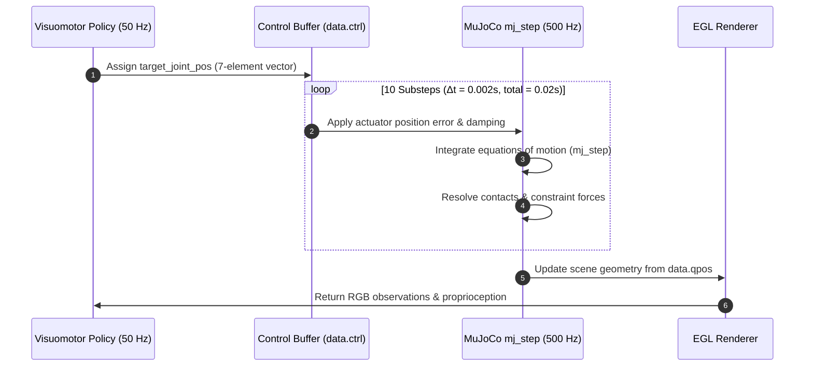

# Subsystem 03: Physics Simulation Tier

The **Physics Simulation Tier** provides the deterministic dynamical foundation for `lerobot-agentic`. Utilizing **DeepMind MuJoCo 3.x** with accelerated **EGL headless GPU rendering**, this subsystem accurately simulates multi-body contact dynamics, rigid-body kinematics, actuator dynamics, and dual optical camera rendering at **500 Hz internal physics** and **50 Hz control cadence**.

---

## 1. Architectural Role & Simulation Philosophy

Robot learning pipelines must balance physical fidelity, numerical stability, and simulation throughput. The Physics Simulation Tier implements:
1. **Deterministic Multi-Rate Stepping**: Decouples 500 Hz continuous numerical integration ($\Delta t_{\text{physics}} = 2\,\text{ms}$) from 50 Hz discrete policy control ($\Delta t_{\text{ctrl}} = 20\,\text{ms}$).
2. **GPU-Accelerated Headless EGL Rendering**: Eliminates the requirement for active X11 display servers, enabling high-throughput visual rendering on Linux compute clusters.
3. **Safe Kinematic Addressing**: Employs named joint address resolution (`jnt_qposadr`) to protect against state corruption caused by floating-base freejoints.
4. **Physical Contact Modeling**: Implements non-penetrating contact constraints with Coulomb friction cones, supporting realistic grasping and non-prehensile manipulation.

```
+-------------------------------------------------------------------------------------------------+
|                                    PHYSICS SIMULATION TIER                                      |
|                                                                                                 |
|   Target Control Action a_t ∈ ℝ^7 (From 50 Hz Policy)                                           |
|                           │                                                                     |
|                           ▼                                                                     |
|   ┌─────────────────────────────────────────────────────────┐                                   |
|   │ Control Setpoint Application: data.ctrl[:7] = a_t       │                                   |
|   └───────────────────────┬─────────────────────────────────┘                                   |
|                           │                                                                     |
|                           ▼                                                                     |
|   ┌─────────────────────────────────────────────────────────┐                                   |
|   │ 10 x Numerical Sub-Steps (500 Hz Integrator)            │                                   |
|   │   • mujoco.mj_step(model, data)                         │                                   |
|   │   • Δt = 0.002s (implicitfast solver)                   │                                   |
|   │   • Contact resolution, Coriolis, and Joint Limits      │                                   |
|   └───────────────────────┬─────────────────────────────────┘                                   |
|                           │                                                                     |
|                           ▼                                                                     |
|   ┌─────────────────────────────────────────────────────────┐                                   |
|   │ EGL GPU Render Pipeline (OpenGL Headless Context)       │                                   |
|   │   • Overhead Camera (640x480 RGB @ 50 Hz)               │                                   |
|   │   • Wrist Camera    (640x480 RGB @ 50 Hz)               │                                   |
|   └───────────────────────┬─────────────────────────────────┘                                   |
|                           │                                                                     |
|                           ▼                                                                     |
|   ┌─────────────────────────────────────────────────────────┐                                   |
|   │ State & Sensor Extraction                               │                                   |
|   │   • Proprioception qpos via jnt_qposadr lookup          │                                   |
|   │   • Cartesian Cartesian positions (cube, palm)          │                                   |
|   └───────────────────────┬─────────────────────────────────┘                                   |
+---------------------------│---------------------------------------------------------------------+
                            ▼
              Emitted Observation Dictionary to Policy & Supervisor
```

---

## 2. Multi-Rate Integration & Stepping Topology

The simulation establishes a strict 10:1 ratio between physics integration and control execution:



### 2.1 Physics Integrator Parameters
The MJCF model (`embodied_arm.xml`) configures:
- **`timestep="0.002"`**: 2 ms integration step ensures numerical stability during high-impact finger-object collisions without stiffness singularities.
- **`integrator="implicitfast"`**: MuJoCo's implicit Euler formulation with quadratic convergence, offering exceptional damping stability for stiff position-controlled PD actuators.
- **`gravity="0 0 -9.81"`**: Standard earth-normal gravitational field along the global $-Z$ axis.

---

## 3. Robot Arm Kinematics & Actuation Model

The simulated manipulator is a 6-DoF articulated arm equipped with a single-actuated parallel gripper with an opposing fixed finger ($d_a = 7$).

### 3.1 Kinematic Chain & Limits
```
Base Link (z=0.4m) ──► Joint 1 (Yaw, ±π) ──► Joint 2 (Pitch, ±π/2) ──► Joint 3 (Pitch, ±π/2)
                                                                             │
Palm / Gripper Base ◄── Joint 6 (Roll, ±π) ◄── Joint 5 (Pitch, ±π/2) ◄── Joint 4 (Yaw, ±π)
       │
       ├──► Active Sliding Finger (finger_joint1, slide, range: [-0.025m, 0.025m])
       └──► Opposing Fixed Finger (finger_right, rigid opposing contact geometry)
```

| Joint Name | Type | Axis | Physical Range | PD Gain ($k_p$) | Joint Damping | Joint Armature |
| :--- | :--- | :---: | :---: | :---: | :---: | :---: |
| `joint1` | Hinge | `[0, 0, 1]` | $[-\pi, \pi]\,\text{rad}$ | $60\,\text{N}\cdot\text{m/rad}$ | $1.5\,\text{N}\cdot\text{s/m}$ | $0.05\,\text{kg}\cdot\text{m}^2$ |
| `joint2` | Hinge | `[0, 1, 0]` | $[-\pi/2, \pi/2]\,\text{rad}$ | $60\,\text{N}\cdot\text{m/rad}$ | $1.5\,\text{N}\cdot\text{s/m}$ | $0.05\,\text{kg}\cdot\text{m}^2$ |
| `joint3` | Hinge | `[0, 1, 0]` | $[-\pi/2, \pi/2]\,\text{rad}$ | $50\,\text{N}\cdot\text{m/rad}$ | $1.0\,\text{N}\cdot\text{s/m}$ | $0.03\,\text{kg}\cdot\text{m}^2$ |
| `joint4` | Hinge | `[0, 0, 1]` | $[-\pi, \pi]\,\text{rad}$ | $30\,\text{N}\cdot\text{m/rad}$ | $0.5\,\text{N}\cdot\text{s/m}$ | $0.02\,\text{kg}\cdot\text{m}^2$ |
| `joint5` | Hinge | `[0, 1, 0]` | $[-\pi/2, \pi/2]\,\text{rad}$ | $30\,\text{N}\cdot\text{m/rad}$ | $0.5\,\text{N}\cdot\text{s/m}$ | $0.02\,\text{kg}\cdot\text{m}^2$ |
| `joint6` | Hinge | `[1, 0, 0]` | $[-\pi, \pi]\,\text{rad}$ | $30\,\text{N}\cdot\text{m/rad}$ | $0.5\,\text{N}\cdot\text{s/m}$ | $0.02\,\text{kg}\cdot\text{m}^2$ |
| `finger_joint1` | Slide | `[0, 1, 0]` | $[-0.025, 0.025]\,\text{m}$ | $30\,\text{N/m}$ | $0.5\,\text{N}\cdot\text{s/m}$ | $0.01\,\text{kg}$ |

### 3.2 Actuator Control Formulation
Actuators operate in position control mode using MuJoCo's native `<position>` tags:
$$\tau_{\text{motor}} = k_p (q_{\text{target}} - q) - k_d \dot{q}$$
where damping $k_d$ is incorporated directly into the joint definitions, eliminating velocity chatter.

---

## 4. Safe Joint Indexing Architecture (`jnt_qposadr`)

A prevalent failure mode in robotic simulations is assuming joint angles map directly to contiguous indices in `data.qpos` (e.g., `data.qpos[:7]`). In scenes with floating objects (such as `target_cube`), MuJoCo allocates a `<freejoint>`, which requires **7 generalized coordinates** (3 translational coordinates $[x, y, z]$ + 4 unit quaternion parameters $[w, x, y, z]$) and **6 degrees of freedom** in `qvel`.

If the XML structure changes or floating bodies are reordered, naive array slicing corrupts the robot state.

### 4.1 Canonical Resolution Pattern
`lerobot-agentic` enforces explicit joint address resolution via `model.jnt_qposadr`:

```python
# Cache joint addresses during environment initialization
self.arm_joint_names = [
    "joint1", "joint2", "joint3",
    "joint4", "joint5", "joint6",
    "finger_joint1"
]
self.arm_qpos_indices = [
    self.model.jnt_qposadr[self.model.joint(name).id] 
    for name in self.arm_joint_names
]

# Safe proprioception extraction
def get_proprioception(self) -> np.ndarray:
    return np.array([self.data.qpos[idx] for idx in self.arm_qpos_indices], dtype=np.float32)

# Safe initial pose assignment
def reset(self) -> Dict[str, Any]:
    mujoco.mj_resetData(self.model, self.data)
    neutral_qpos = np.array([0.0, -0.4, 0.8, 0.0, 0.4, 0.0, 0.02], dtype=np.float64)
    for idx, val in zip(self.arm_qpos_indices, neutral_qpos):
        self.data.qpos[idx] = val
    mujoco.mj_forward(self.model, self.data)
```

---

## 5. Contact Physics & Friction Dynamics

To ensure stable physical grasping without penetration artifacts:

1. **Manipuland Properties (`target_cube`)**:
   - Geometry: Box with half-extents $0.022\,\text{m}$ (edge length $4.4\,\text{cm}$).
   - Mass: $0.05\,\text{kg}$.
   - Friction: Tangential friction $\mu_t = 1.2$, torsional friction $\mu_{\text{rot}} = 0.005$, rolling friction $\mu_{\text{roll}} = 0.0001$.
2. **Gripper Finger Pads (`f1`, `f2`)**:
   - Geometry: Box contact surfaces with high tangential friction ($\mu_t = 1.5$) to prevent slip under dynamic loads.
   - Restitution: Low coefficient of restitution to dampen bounce upon impact.

---

## 6. Optical Camera Sensor Mount Points & EGL Setup

The simulation mounts two hardware-aligned optical camera sensors directly in the MJCF tree:

```xml
<!-- Overhead Perspective Camera (Mounted in worldbody) -->
<camera name="overhead_cam" pos="0.65 0 0.9" euler="0 0.75 1.5708"/>

<!-- Wrist-Mounted Eye-in-Hand Camera (Attached to wrist_link body) -->
<camera name="wrist_cam" pos="0 0.035 0.02" euler="0 0.5 1.5708"/>
```

### 6.1 Camera Specifications
1. **`overhead_cam`**:
   - Location: Positioned above and in front of the workspace, angled downward at $43^\circ$ ($0.75\,\text{rad}$) with a $90^\circ$ yaw alignment.
   - Resolution: $640 \times 480 \times 3$ RGB.
   - Purpose: Workspace overview for Gemini Cognitive Supervisor and ACT top camera input.
2. **`wrist_cam`**:
   - Location: Rigidly referenced along the forearm kinematic chain, looking down the gripper axis.
   - Resolution: $640 \times 480 \times 3$ RGB.
   - Purpose: Fine-grained visual alignment during the final 5 cm of approach and grasp verification.

### 6.2 Headless EGL GPU Acceleration
Before importing OpenGL or MuJoCo rendering contexts, the environment exports:
```python
if "MUJOCO_GL" not in os.environ:
    os.environ["MUJOCO_GL"] = "egl"
```
This forces MuJoCo to allocate offscreen framebuffers using NVIDIA EGL drivers, targeting high rendering throughput (>200 FPS) on an RTX 3070 without requiring a virtual X11 server (Xvfb), to be empirically benchmarked during Gate 0.

---

## 7. Implementation Reference

The Physics Simulation Tier is implemented in:
- **`src/lerobot_agentic/sim/models/embodied_arm.xml`**: MJCF XML definition of kinematics, geoms, materials, cameras, and actuators.
- **`src/lerobot_agentic/sim/env.py`**: `MuJoCoRobotEnv` class managing simulation lifecycle, sub-stepping, camera rendering, safe indexing, and observation generation.
