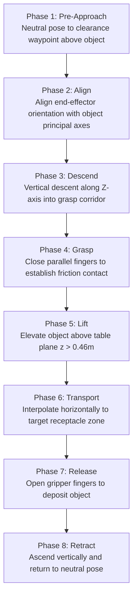

# Subsystem 04: Dataset & Evaluation Tier

The **Dataset & Evaluation Harness Tier** provides end-to-end data lifecycle management, algorithmic demonstration harvesting, and standardized benchmarking for `lerobot-agentic`. By combining an algorithmic **minimum-jerk inverse kinematics (IK) demonstration harvester** with the **Hugging Face LeRobotDataset v2.0 standard** and an **automated multi-metric evaluation harness**, this subsystem ensures reproducible training and rigorous verification of embodied policies.

---

## 1. Architectural Role & Pipeline Overview

Robust robot learning demands both high-quality demonstration datasets and quantitative closed-loop evaluation metrics. The Dataset & Evaluation Tier bridges synthetic demonstration generation, dataset formatting, model training, and policy benchmarking:

```
+-------------------------------------------------------------------------------------------------+
|                                DATASET & EVALUATION HARNESS TIER                                |
|                                                                                                 |
|   ┌─────────────────────────────────────────────────────────┐                                   |
|   │ 1. Synthetic Demonstration Harvester                    │                                   |
|   │    • 500 FPS headless MuJoCo rollout engine             │                                   |
|   │    • Algorithmic minimum-jerk IK affordance solver      │                                   |
|   │    • Automated 8-phase manipulation state machine       │                                   |
|   └───────────────────────────┬─────────────────────────────┘                                   |
|                               │ Raw Trajectories τ = {(o_t, a_t)}                               |
|                               ▼                                                                 |
|   ┌─────────────────────────────────────────────────────────┐                                   |
|   │ 2. LeRobotDataset v2.0 Hub Packaging                    │                                   |
|   │    • Apache Parquet tables (state, action, indices)     │                                   |
|   │    • Chunked H.264 MP4 videos (top, wrist streams)      │                                   |
|   │    • Z-score normalization statistics (meta/stats.json) │                                   |
|   └───────────────────────────┬─────────────────────────────┘                                   |
|                               │ Standardized Streaming Dataset                                  |
|                               ▼                                                                 |
|   ┌─────────────────────────────────────────────────────────┐                                   |
|   │ 3. Offline Policy Training Pipeline                     │                                   |
|   │    • ACT / SmolVLA-450M / Diffusion Policy              │                                   |
|   │    • Mixed-precision BF16 / FP16 on NVIDIA RTX 3070/4090│                                   |
|   └───────────────────────────┬─────────────────────────────┘                                   |
|                               │ Checkpoint (.safetensors)                                       |
|                               ▼                                                                 |
|   ┌─────────────────────────────────────────────────────────┐                                   |
|   │ 4. Automated Benchmark Evaluator                        │                                   |
|   │    • Grasp Success Rate (GSR)                           │                                   |
|   │    • Placement Rate (PR)                                │                                   |
|   │    • Time-to-Completion (TTC)                           │                                   |
|   │    • Joint Jerk Smoothness Index (𝒥)                    │                                   |
|   │    • Telemetry HUD Overlay & Video Artifact Generation  │                                   |
|   └─────────────────────────────────────────────────────────┘                                   |
+-------------------------------------------------------------------------------------------------+
```

---

## 2. Synthetic Demonstration Harvester

Rather than relying on labor-intensive, error-prone manual teleoperation, `lerobot-agentic` features a high-throughput algorithmic demonstration synthesizer. Running in headless MuJoCo at $\approx 500\,\text{FPS}$, it generates 50 complete expert episodes in under 2 minutes.

### 2.1 Eight-Phase Manipulation State Machine
The synthesizer decomposes the pick-and-place task into eight distinct geometric phases:



### 2.2 Minimum-Jerk Affordance Solver
Each phase transition generates smooth joint trajectories using quintic polynomial interpolation:
$$s(\tau) = 10\tau^3 - 15\tau^4 + 6\tau^5, \quad \tau \in [0, 1]$$

Initial and terminal velocity and acceleration boundary conditions are constrained to zero:
$$\dot{s}(0) = \dot{s}(1) = 0, \quad \ddot{s}(0) = \ddot{s}(1) = 0$$

Target joint configurations for Cartesian positions are resolved via differential inverse kinematics:
$$\Delta q = \mathbf{J}^{\dagger} \Delta \mathbf{x} = \mathbf{J}^T (\mathbf{J} \mathbf{J}^T + \lambda^2 \mathbf{I})^{-1} \Delta \mathbf{x}$$
where $\mathbf{J}$ is the manipulator Jacobian and $\lambda \approx 10^{-3}$ is a damping factor preventing singularity divergence.

---

## 3. Hugging Face `LeRobotDataset` Specification (v2.0 / v3.0)

Data storage strictly conforms to the Hugging Face `LeRobotDataset` schema (supporting v2.0 and v3.0 chunked formats), ensuring seamless compatibility with Hugging Face Hub streaming, `accelerate`, and LeRobot training tools.

### 3.1 Directory Layout
```text
data/lerobot_embodied_arm/
├── meta/
│   ├── info.json              # Dataset metadata, fps, feature shapes, total frames
│   ├── stats.json             # Normalization statistics (mean, std, min, max)
│   └── episodes.jsonl         # Episode lengths, task indices, completion flags
├── data/
│   └── chunk-000/
│       ├── episode_000000.parquet
│       ├── episode_000001.parquet
│       └── ...
└── videos/
    └── chunk-000/
        ├── observation.images.top.mp4
        └── observation.images.wrist.mp4
```

### 3.2 Tensor Schema
| Key | Type | Shape | Meaning |
| :--- | :--- | :--- | :--- |
| `observation.images.top` | Video (H.264) | `(480, 640, 3)` | Overhead table workspace camera |
| `observation.images.wrist` | Video (H.264) | `(480, 640, 3)` | Forearm wrist-mounted camera |
| `observation.state` | Vector (Float32) | `(7,)` | Joint angles $q_{1\dots6}$ (rad) + gripper width $q_7$ (m) |
| `observation.environment_state` | Vector (Float32) | `(11,)` | Goal vector: $[\mathbf{p}_{\text{target}}^{3D}, \mathbf{p}_{\text{dest}}^{3D}, \mathbf{e}_{\text{subgoal}}]$ (`FeatureType.ENV`) |
| `action` | Vector (Float32) | `(7,)` | Target actuator position setpoints for step $t+1$ |
| `task_index` | Scalar (Int64) | `()` | Task identifier (e.g., $0$ for pick-and-place) |
| `timestamp` | Scalar (Float32) | `()` | Timestamp relative to episode onset ($t \times 0.02\,\text{s}$) |
| `frame_index` | Scalar (Int64) | `()` | Monotonically increasing frame index |

### 3.3 Normalization Statistics (`meta/stats.json`)
Before policy ingestion, states and actions are standardized using empirical dataset statistics:
$$\tilde{s} = \frac{s - \mu_s}{\sigma_s + 10^{-8}}, \quad \tilde{a} = \frac{a - \mu_a}{\sigma_a + 10^{-8}}$$

This prevents joints with large numerical ranges (e.g., base yaw $[-\pi, \pi]$) from dominating gripper slide dimensions ($[-0.025, 0.025]$).

---

## 4. Automated Benchmark Evaluator

The evaluation harness measures closed-loop policy performance across a battery of simulated manipulation rollouts. Each episode is evaluated against four quantitative benchmark metrics:

### 4.1 Benchmark Metrics Suite

1. **Grasp Success Rate (GSR)**:
   Measures whether stable force closure is achieved and maintained:
   $$\mathrm{GSR} = \frac{1}{N} \sum_{i=1}^N \mathbb{I}\left( z_{\text{cube}}^{(i)}(t_{\text{lift}}) > 0.46\,\text{m} \right)$$
   where $z = 0.43\,\text{m}$ is the table plane, requiring a vertical clearance of at least $3\,\text{cm}$.

2. **Placement Rate (PR)**:
   Measures final receptacle placement accuracy:
   $$\mathrm{PR} = \frac{1}{N} \sum_{i=1}^N \mathbb{I}\left( \left\| \mathbf{p}_{\text{cube}}^{(i)}(T) - \mathbf{p}_{\text{zone}} \right\|_2 < 0.03\,\text{m} \right)$$
   requiring the cube to settle within a $3\,\text{cm}$ radius of the receptacle center.

3. **Time-to-Completion (TTC)**:
   Measures operational efficiency:
   $$\mathrm{TTC} = t_{\text{complete}} - t_0 \quad (\text{seconds})$$
   Standard benchmark timeout is capped at $T = 250$ steps ($5.0\,\text{s}$).

4. **Joint Jerk Smoothness Metric ($\mathcal{J}$)**:
   Proxy for motion smoothness and aggressive actuator-command variation:
   $$\mathcal{J} = \frac{1}{T} \sum_{t=1}^{T} \left\| \dddot{\mathbf{q}}_t \right\|_2^2 \approx \frac{1}{T} \sum_{t=2}^{T-1} \left\| \frac{\mathbf{q}_{t+1} - 3\mathbf{q}_t + 3\mathbf{q}_{t-1} - \mathbf{q}_{t-2}}{\Delta t^3} \right\|_2^2$$
   Lower jerk indicates absence of chunk boundary shudder and stable temporal ensembling. (Direct mechanical wear/stress assessment requires physical motor current/torque instrumentation on hardware).

---

## 5. Telemetry & Video Artifact Generation

The harness integrates an automated video rendering engine (`EpisodeVideoRecorder` in `lerobot_agentic.utils.recorder`):
- **HUD Overlays**: Burned directly into evaluation MP4/GIF videos:
  - Active sub-goal label (`sub_goal`)
  - Target object bounding box $[y_{\min}, x_{\min}, y_{\max}, x_{\max}]$ drawn in yellow
  - Step counter and physical elapsed time ($t \times 20\,\text{ms}$)
  - Gripper-to-object distance ($d_{\text{target}}$ in meters)
  - Lift status flag (`Cube Lifted: True/False`)
- **Artifact Destination**: Saved to `outputs/videos/rollout.mp4` and `outputs/videos/rollout.gif`.

---

## 6. Implementation Reference

The Dataset & Evaluation Tier is implemented in:
- **`scripts/run_rollout.py`**: Closed-loop evaluation runner executing policy rollouts, computing episode rewards, and logging performance.
- **`src/lerobot_agentic/utils/recorder.py`**: Telemetry and video synthesis engine with OpenCV HUD overlays.
- **`tests/test_env.py`**: Automated unit tests verifying environment lifecycle, step semantics, observation dimensions, and policy chunk outputs.
