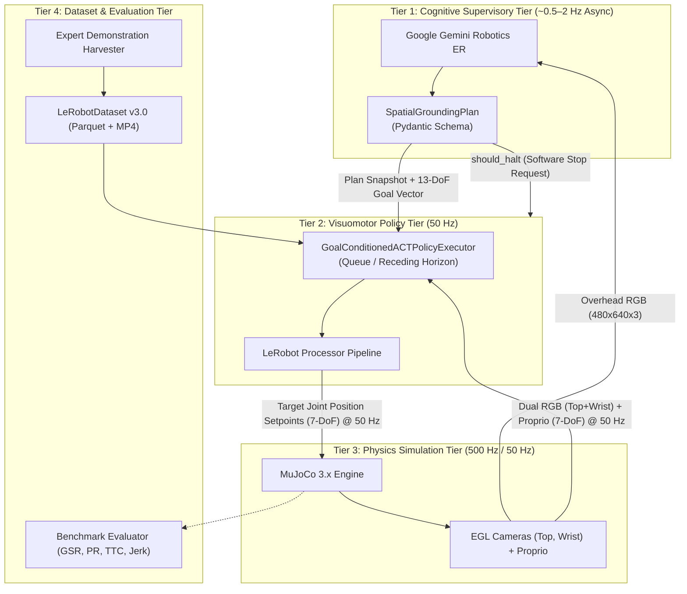

# Subsystems Architecture Index

This directory provides comprehensive, deep-dive architectural specifications for each core subsystem of **`lerobot-agentic`**.

---

## 1. Subsystems Master Index

| Subsystem | Document | Operating Cadence | Primary Technology | Core Function |
| :---: | :--- | :---: | :--- | :--- |
| **01** | [**Cognitive Supervisory Tier**](./01_cognitive_supervisory_tier.md) | ~0.5–2 Hz Async | Google `gemini-robotics-er-2-preview`, Pydantic | Semantic task decomposition, 2D normalized bounding box regression $[0, 1000]$, visual anomaly detection, closed-loop replanning. |
| **02** | [**Visuomotor Policy Tier**](./02_visuomotor_policy_tier.md) | 50 Hz | Hugging Face LeRobot (`ACTPolicy`, `SmolVLA-450M`, Diffusion) | Action chunking ($K = 50$, 1.0 s horizon), queue / receding-horizon execution, 13-DoF goal conditioning, dual-camera fusion, dynamic recovery queue reset. |
| **03** | [**Physics Simulation Tier**](./03_physics_simulation_tier.md) | 500 Hz / 50 Hz | DeepMind MuJoCo 3.x, EGL Headless GPU rendering | 6-DoF arm + single-actuated parallel gripper physics, contact dynamics, safe joint addressing (`jnt_qposadr`), overhead and wrist camera mount points. |
| **04** | [**Dataset & Evaluation Tier**](./04_dataset_and_evaluation_tier.md) | Asynchronous / Batch | Hugging Face `LeRobotDataset` v3.0, Parquet, MP4, OpenCV HUD | Synthetic expert demonstration harvester ($\approx 500\,\text{FPS}$), automated benchmarks (GSR, PR, TTC, Jerk $\mathcal{J}$), telemetry HUD video recording. |

---

## 2. Cross-Tier Interfaces & Data Contracts

The system operates across cleanly defined inter-tier boundaries:

---

## 3. Cross-Tier Data Schemas

### 3.1 Cognitive $\to$ Policy Contract (`SpatialGroundingPlan`)
Defined in [`src/lerobot_agentic/cognitive/schemas.py`](../../src/lerobot_agentic/cognitive/schemas.py):
- `sub_goal: Literal["reach", "grasp", "lift", "transport", "place", "retreat", "recover"]`: Active canonical stage primitive.
- `target_object: str`: Semantic object name (`red_cube`).
- `target_box_2d: list[int]`: 4-element normalized bounding box $[y_{\min}, x_{\min}, y_{\max}, x_{\max}]$ in $[0, 1000]$.
- `destination_box_2d: list[int] | None`: Destination receptacle bounding box in $[0, 1000]$.
- `task_progress: Literal["in_progress", "completed", "failure_detected"]`: Task lifecycle state.
- `requires_replanning: bool`: Anomaly flag indicating displacement or grasp failure.
- `replan_id: int`: Monotonically increasing counter for edge-triggered recovery.
- `confidence_score: float`: Affordance confidence in $[0.0, 1.0]$.
- `should_halt: bool`: Advisory software stop flag (halts trajectory dispatch; not a hardware-rated E-stop).
- `decision_note: str | None`: Structured rationale summarizing affordance selection or anomaly diagnostics.

### 3.2 Policy $\to$ Simulation Contract (`Action Chunk`)
Emitted by [`src/lerobot_agentic/policy/executor.py`](../../src/lerobot_agentic/policy/executor.py):
- Shape: $\mathbf{A}_t \in \mathbb{R}^{50 \times 7}$ (lookahead horizon $K = 50$ steps).
- Dispatched to actuators at each 50 Hz step as a 7-element vector $a_t = [q_1, q_2, q_3, q_4, q_5, q_6, q_7]$.
- Values: $q_{1\dots6}$ target joint positions in radians clipped to $[-\pi, \pi]$; $q_7$ target sliding finger displacement in meters clipped to $[-0.025, 0.025]$.

### 3.3 Simulation $\to$ Policy & Cognitive Contract (`Observation Dict`)
Returned by [`src/lerobot_agentic/sim/env.py`](../../src/lerobot_agentic/sim/env.py):
- `rgb`: Overhead camera frame `(480, 640, 3)` `uint8`.
- `proprioception`: 7-DoF joint state `(7,)` `float32` resolved via `jnt_qposadr`.
- `cube_pos`: Global 3D Cartesian coordinates `[x, y, z]` of target cube.
- `palm_pos`: Global 3D Cartesian coordinates `[x, y, z]` of gripper palm.

---

## 4. Multi-Rate Timing & Cadence Synchronization

| Tier | Update Rate | Period ($\Delta t$) | Compute Location | Synchronization Mechanism |
| :--- | :---: | :---: | :--- | :--- |
| **Cognitive Supervisory** | 1–2 Hz | $500\text{--}1000\,\text{ms}$ | Cloud API / Asynchronous Thread | Emits updated sub-goals and bounding boxes non-blocking every 50 simulation steps. |
| **Visuomotor Policy** | 50 Hz | $20\,\text{ms}$ | Local GPU (RTX 3070 / 4090) | Generates action chunks; smooths overlapping horizons via EMA temporal ensembling. |
| **Physics Simulation** | 500 Hz | $2\,\text{ms}$ | CPU Core / EGL Offscreen Context | Executes 10 numerical integration substeps (`mj_step`) per 20 ms policy step. |
| **Dataset & Evaluation** | Batch / Rollout | Episode-based | Disk / PyTorch / OpenCV | Logs Parquet/MP4 streams, aggregates GSR, PR, TTC, and Jerk metrics. |
